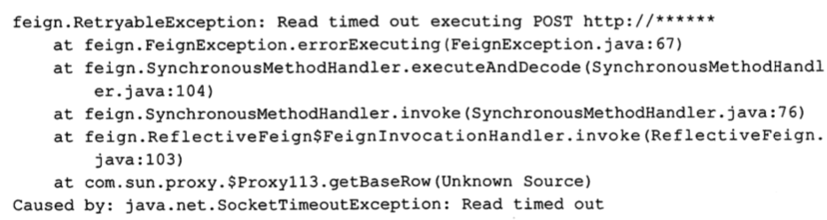
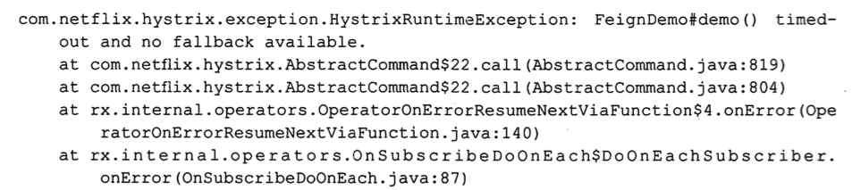
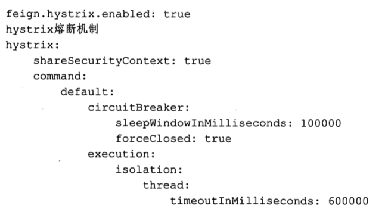

# 设置超时时间

Feign 的调用分两层,即 Ribbon 的调用和 Hystrix 的调用,高版本的 Hystrix 默认是关闭的



- 上面报错说明 Ribbon处理超时,此时设置超时时间 Ribbon

```
ribbon.ReadTimeout:120000
ribbon.ConnectTimeout:30000
```

如果开启了 Hystrix , Hystrix 的超时报错信息如下



- 上面报错说明 Hystrix 超时报错,此时设置 Hystrix 的配置信息

