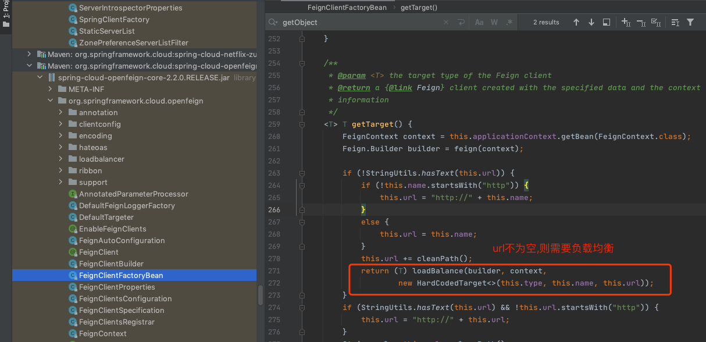

# Ribbon源码分析-集成OpenFeign

**Ribbon是RESTful HTTP客户端OpenFeign负载均衡的默认实现。**

- [OpenFeign引入Ribbon负载均衡](#OpenFeign引入Ribbon负载均衡)

## OpenFeign引入Ribbon负载均衡

FeignClientFactoryBean是创造FeignClient的工厂类，在其getObject方法中有一个分支判断，当请求URL不为空时，就会生成一个具有负载均衡的FeignClient。在这个过程中，OpenFeign就默认引入了Ribbon的负载均衡实现，OpenFegin引入Ribbon的部分代码如下所示：

```java
//FeignClientFactoryBean.java
public Object getObject() throws Exception {
    FeignContext context = applicationContext.getBean(FeignContext.class);
    Feign.Builder builder = feign(context);
    //如果url不为空，则需要负载均衡
    if (!StringUtils.hasText(this.url)) {
        String url;
        if (!this.name.startsWith("http")) {
            url = "http://" + this.name;
        }
        else {
            url = this.name;
        }
        url += cleanPath();
        return loadBalance(builder, context, new HardCodedTarget〈〉(this.type,
                this.name, url));
    }
    //....生成普通的FeignClient
}
```



如OpenFeign的源码所示，loadBalance方法会生成LoadBalancerFeignClient实例进行返回。LoadBalancerFeignClient实现了OpenFeign的Client接口，负责OpenFeign网络请求的发送和响应的接收，并带有客户端负载均衡机制。loadBalance方法实现如下所示：

```java
//FeignClientFactoryBean.java
protected 〈T〉 T loadBalance(Feign.Builder builder, FeignContext context,
        HardCodedTarget〈T〉 target) {
    //会得到'LoadBalancerFeignClient'
    Client client = getOptional(context, Client.class);
    if (client != null) {
        builder.client(client);
        Targeter targeter = get(context, Targeter.class);
        return targeter.target(this, builder, context, target);
    }
}
```

LoadBalancerFeignClient#execute方法会将普通的Request对象转化为RibbonRequest，并使用FeignLoadBalancer实例来发送RibbonRequest。execute方法会首先将Request的URL转化为对应的服务名称，然后构造出RibbonRequest对象，接着调用lbClient方法来生成FeignLoadBalancer实例，最后调用FeignLoadBalancer实例的executeWithLoadBalancer方法来处理网络请求。LoadBalancerFeignClient#execute方法的具体实现如下所示：

```java
//LoadBalancerFeignClient.java
public Response execute(Request request, Request.Options options) throws IOException {
    try {
        //负载均衡时，host就是需要调用的服务的名称
        URI asUri = URI.create(request.url());
				String clientName = asUri.getHost();
        URI uriWithoutHost = cleanUrl(request.url(), clientName);
        //构造RibbonRequest,delegate一般就是真正发送网络请求的客户端，比如说OkHttpClient和ApacheClient
        FeignLoadBalancer.RibbonRequest ribbonRequest = new FeignLoadBalancer.RibbonRequest(
                this.delegate, request, uriWithoutHost);
        IClientConfig requestConfig = getClientConfig(options, clientName);
        //executeWithLoadBalancer是进行负载均衡的关键
        return lbClient(clientName).executeWithLoadBalancer(ribbonRequest,
                requestConfig).toResponse();
    }
    catch (ClientException e) {
        IOException io = findIOException(e);
        if (io != null) {
            throw io;
        }
        throw new RuntimeException(e);
    }
}
private FeignLoadBalancer lbClient(String clientName) {
    //调用CachingSpringLoadBalancerFactory类的create方法。
    return this.lbClientFactory.create(clientName);
}
```

lbClientFactory的参数是CachingSpringLoadBalancerFactory的实例，它是带有缓存机制的FeignLoadBalancer的工厂类。
create方法的clientName参数是指HTTP请求对应的服务端名称，它会首先使用这个名称去缓存中查找是否已经存在对应的实例。如果没有，再根据系统是否支持`请求重试来创建出不同的FeignLoadBalancer实例，最后将该实例存储到缓存中，create方法的代码如下所示：

```java
//CachingSpringLoadBalancerFactory.java
public FeignLoadBalancer create(String clientName) {
    if (this.cache.containsKey(clientName)) {
        return this.cache.get(clientName);
    }
    IClientConfig config = this.factory.getClientConfig(clientName);
    ILoadBalancer lb = this.factory.getLoadBalancer(clientName);
    ServerIntrospector serverIntrospector = this.factory.getInstance(clientName, ServerIntrospector.class);
    //如果需要重试就是RetryableFeignLoadBalancer，否则是FeignLoadBalancer
    FeignLoadBalancer client = enableRetry ? new RetryableFeignLoadBalancer(lb, config, serverIntrospector,
        loadBalancedRetryPolicyFactory, loadBalancedBackOffPolicyFactory, loadBalancedRetryListenerFactory) : new FeignLoadBalancer(lb, config, serverIntrospector);
    this.cache.put(clientName, client);
    return client;
}
```

FeignLoadBalancer是OpenFeign在不需要重试机制的情况下默认的负载均衡实现。

它的execute方法的实现很简单，使用RibbonRequest对象的客户端来发送网络请求，然后将Response包装成RibbonResponse进行返回。RibbonRequest的request方法返回的对象就是构造RibbonRequest对象时传入的delegate参数。该参数是Client接口的实例，Client接口是OpenFeign真正发送网络请求的客户端，比如说OkHttpClient和ApacheClient。FeignLoadBalancer的execute方法如下所示：

```java
//FeignLoadBalancer.java
public RibbonResponse execute(RibbonRequest request, IClientConfig configOverride)
        throws IOException {
    Request.Options options;
    if (configOverride != null) {
        RibbonProperties override = RibbonProperties.from(configOverride);
        options = new Request.Options(
                override.connectTimeout(this.connectTimeout),
                override.readTimeout(this.readTimeout));
    }
    else {
        options = new Request.Options(this.connectTimeout, this.readTimeout);
    }
    Response response = request.client().execute(request.toRequest(), options);
    return new RibbonResponse(request.getUri(), response);
}

//FeignLoadBalancer.java
public RibbonResponse execute(RibbonRequest request, IClientConfig configOverride)
        throws IOException {
    Request.Options options;
    if (configOverride != null) {
        RibbonProperties override = RibbonProperties.from(configOverride);
        options = new Request.Options(
                override.connectTimeout(this.connectTimeout),
                override.readTimeout(this.readTimeout));
    }
    else {
        options = new Request.Options(this.connectTimeout, this.readTimeout);
    }
    Response response = request.client().execute(request.toRequest(), options);
    return new RibbonResponse(request.getUri(), response);
}
```

FeignLoadBalancer是AbstractLoadBalancerAwareClient的子类，其executeWithLoadBalancer方法会首先创建一个LoadBalancerCommand实例，然后在该实例的submit方法的回调中调用子类的execute方法，executeWithLoadBalancer方法如下代码所示：

```java
//AbstractLoadBalancerAwareClient.java
public T executeWithLoadBalancer(final S request, final IClientConfig requestConfig) throws ClientException {
    //创建LoadBalancerCommand
    LoadBalancerCommand〈T〉 command = buildLoadBalancerCommand(request, requestConfig);
    return command.submit(
        new ServerOperation〈T〉() {
            @Override
            public Observable〈T〉 call(Server server) {
                URI finalUri = reconstructURIWithServer(server, request.getUri());
                S requestForServer = (S) request.replaceUri(finalUri);
                try {
                    //调用子类的execute方法，进行HTTP请求的处理
                    return Observable.just(AbstractLoadBalancerAwareClient.this.execute(requestForServer, requestConfig));
                }
                catch (Exception e) {
                    return Observable.error(e);
                }
            }
        })
        .toBlocking()
        .single();
}
```

其中，buildLoadBalancerCommand方法使用了LoadBalancerCommand.Builder来创建LoadBalancerCommand实例，并将AbstractLoadBalancerAwareClient作为LoadBalancerContext接口的实例设置给LoadBalancerCommand实例，如下所示：

```java
//LoadBalancerCommand.Builder
protected LoadBalancerCommand〈T〉 buildLoadBalancerCommand(final S request, final IClientConfig config) {

RequestSpecificRetryHandler handler = getRequestSpecificRetryHandler(request, config);
        LoadBalancerCommand.Builder〈T〉 builder = LoadBalancerCommand.〈T〉builder()
                .withLoadBalancerContext(this)
                .withRetryHandler(handler)
                .withLoadBalancerURI(request.getUri());
        customizeLoadBalancerCommandBuilder(request, config, builder);
        return builder.build();
}
```

LoadBalancerCommand的submit方法使用了响应式编程的原理，创建一个Observable实例来订阅，使用通过负载均衡器选出的服务器来进行异步的网络请求。LoadBalancerCommand的submit方法的具体实现基于Observable机制，较为复杂，笔者将submit源码进行了简化，可以让读者在不了解Observable的情况下了解源码的基本原理。submit方法调用了selectServer方法来选择一个server，这里就是OpenFeign进行负载均衡的地方，代码如下所示：

```java
//LoadBalancerCommand.java
public Observable〈T〉 submit(final ServerOperation〈T〉 operation) {
    final ExecutionInfoContext context = new ExecutionInfoContext();
    // 使用loadBalancerContext通过负载均衡来选择Server
    Server server = loadBalancerContext.getServerFromLoadBalancer(loadBalancerURI, loadBalancerKey);
    context.setServer(server);
    //调用operation对象，就是调用AbstractLoadBalancerAwareClient中executeWithLoadBalancer
      方法中创建的匿名Operation对象
    return operation.call(server)；
}

上面代码中，LoadBalancerCommand的selectServer方法调用了LoadBalancerContext的getServerFromLoadBalancer方法，代码如下所示：
//LoadBalancerCommand.java
private Observable〈Server〉 selectServer() {
    return Observable.create(new OnSubscribe〈Server〉() {
        @Override
        public void call(Subscriber〈? super Server〉 next) {
            try {
                Server server = loadBalancerContext.getServerFromLoadBalancer(loadBalancerURI, loadBalancerKey);
                next.onNext(server);
                next.onCompleted();
            } catch (Exception e) {
                next.onError(e);
            }
        }
    });
}
```


LoadBalancerContext的getServerFromLoadBalancer方法调用了ILoadBalancer的chooseServer方法，从而完成了负载均衡中服务器的选择。这部分的具体实现，在下一节会进行详细描述。