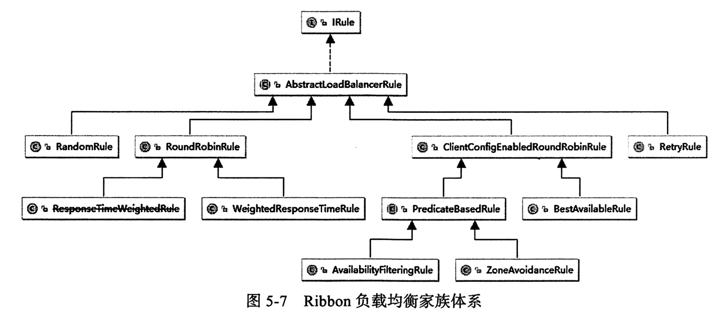
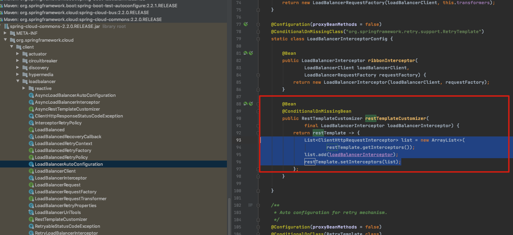
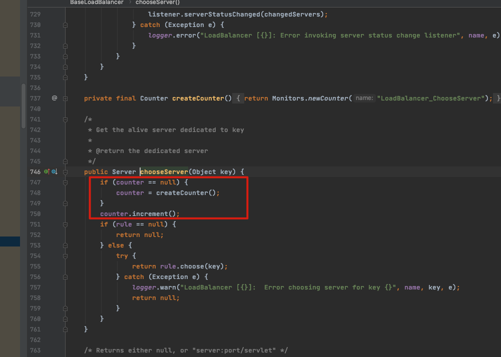

# 核心工作原理

Ribbon 作为一个 SpringCloud 微服务体系中的负载均衡器,理解器海鲜原理就显得格外重要

## IRule

#### IRule 是定义 Ribbon 负载均衡策略的父接口,所有策略都是基于它实现的




#### IRule 源码

```java
public interface IRule{
    /*
     * choose one alive server from lb.allServers or
     * lb.upServers according to key
     * 
     * @return choosen Server object. NULL is returned if none
     *  server is available 
     */
    public Server choose(Object key);
    
    public void setLoadBalancer(ILoadBalancer lb);
    		
    public ILoadBalancer getLoadBalancer();    
}
```



- 设置 RestTemplate 的拦截器,使用`LoadBalancerInterceptor`拦截器附加进去


- 传入两个参数,一个是 LoadBalancerClient ,这个就是具体的执行负载均衡的客户端

  

- 这里getServer 就是具体选取服务端的逻辑

  

