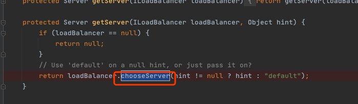

# 010-Ribbon负载均衡器-RibbonLoadBalancerClient

[TOC]

## 一言蔽之

RibbonLoadBalancerClient是LoadBalancerClient的实现类之一，它的execute方法

- 首先使用ILoadBalancer来选择服务器实例(Server)，
- 然后将该服务器实例封装成RibbonServer对象，
- 最后再调用LoadBalancerRequest的apply方法进行网络请求的处理。

## 调用流程


## Ribbin定制的LoadBalancerClient

`RibbonLoadBalancerClient`是Ribbon项目的核心类之一，可以在RestTemplate发送网络请求时替代RestTemplate进行网络调用

### LoadBalancerClient的定义

 [050-客户端负载均衡器-LoadBalancerClient.md](../../../25-SpringCloud与Commom抽象/030-SpringCloud客户端负载均衡抽象模型/005-Common负载均衡抽象/050-客户端负载均衡器-LoadBalancerClient.md) 

### ServiceInstanceChooser

 [040-服务实例选择器-ServiceInstanceChooser.md](../../../25-SpringCloud与Commom抽象/030-SpringCloud客户端负载均衡抽象模型/005-Common负载均衡抽象/040-服务实例选择器-ServiceInstanceChooser.md) 

### RibbonLoadBalancerClient

RibbonLoadBalancerClient是LoadBalancerClient的实现类之一，它的execute方法

- 首先使用ILoadBalancer来选择服务器实例(Server)，
- 然后将该服务器实例封装成RibbonServer对象，
- 最后再调用LoadBalancerRequest的apply方法进行网络请求的处理。

excute方法的具体实现如下所示：

```java
//RibbonLoadBalancerClient.java
public 〈T〉 T execute(String serviceId, LoadBalancerRequest〈T〉 request) throws IOException {
    //每次发送请求都会获取一个ILoadBalancer,会涉及负载均衡规则(IRule)、服务器列表集群(ServerList)和检验服务是否存在(IPing)等细节实现
    ILoadBalancer loadBalancer = getLoadBalancer(serviceId);
    Server server = getServer(loadBalancer);
    if (server == null) {
        throw new IllegalStateException("No instances available for " + serviceId);
    }
    RibbonServer ribbonServer = new RibbonServer(serviceId, server, isSecure(server,
            serviceId), serverIntrospector(serviceId).getMetadata(server));
    return execute(serviceId, ribbonServer, request);
}
```

#### 值得注意的是

- getLoadBalancer方法直接调用了SpringClientFactory的getLoadBalancer方法。

- SpringClientFactory是NamedContextFactory的实现类，通过它可以实现多套组件实例的管理，代码如下所示：

   [020-Ribbon客户端工厂-SpringClientFactory.md](020-Ribbon客户端工厂-SpringClientFactory.md) 

  ```java
  //RibbonLoadBalancerClient.java
  protected ILoadBalancer getLoadBalancer(String serviceId) {
      return this.clientFactory.getLoadBalancer(serviceId);
  }
  ```

- getServer方法则是直接调用了ILoadBalancer的chooseServer方法来使用负载均衡策略—从已知的服务器列表中选出一个服务器实例，其具体实现如下所示：

  ```java
  //RibbonLoadBalancerClient.java
  protected Server getServer(ILoadBalancer loadBalancer, Object hint) {
    if (loadBalancer == null) {
      return null;
    }
    // Use 'default' on a null hint, or just pass it on?
    return loadBalancer.chooseServer(hint != null ? hint : "default");
  }
  ```

- execute方法调用LoadBalancerRequest实例的apply方法，将之前根据负载均衡策略选择出来的服务器作为参数传递进去，进行真正的HTTP请求发送，代码如下所示：

  ```java
  //RibbonLoadBalancerClient.java
  public 〈T〉 T execute(String serviceId, ServiceInstance serviceInstance, LoadBalancerRequest〈T〉 request) throws IOException {
      Server server = null;
      if(serviceInstance instanceof RibbonServer) {
          server = ((RibbonServer)serviceInstance).getServer();
      }
      RibbonLoadBalancerContext context = this.clientFactory
              .getLoadBalancerContext(serviceId);
      RibbonStatsRecorder statsRecorder = new RibbonStatsRecorder(context, server);
      try {
          T returnVal = request.apply(serviceInstance);
          statsRecorder.recordStats(returnVal);
          return returnVal;
      }
  catch (IOException ex) {
      ...
      }
      return null;
  }
  ```



## 源码

#### reconstructURI 方法

- reconstructURI 方法与SpringCloudLoadBalancer 中的 BlockingLoadBalancerClient实现完全不一样
  - SCL中的直接委托给LoadBalancerUriTools#reconstructURI方法实现, 其内部使用ServiceInstance进行相应的属性替换
  - Ribbon中RibbonLoadBalancerClient内部基于 com.netfilx.loadbalancer.Server(表示一个服务实例,内部有host,port,schama,zone)

#### RibbonServer

RibbonServer 是RibbonLoadBalancerClient的内部类, 实现了ServiceInstance接口, 内部维护了一个Server(NetFlix)属性和其他三个

- ServiceId:String (服务名)
- secure:boolean(是否使用HTTPS)
- metadata:Map<String,String> 服务器实例的元数据

#### 

```java
package org.springframework.cloud.netflix.ribbon;

public class RibbonLoadBalancerClient implements LoadBalancerClient {

  private SpringClientFactory clientFactory;

  public RibbonLoadBalancerClient(SpringClientFactory clientFactory) {
    this.clientFactory = clientFactory;
  }

  @Override
  public URI reconstructURI(ServiceInstance instance, URI original) {
    //
    Assert.notNull(instance, "instance can not be null");
    String serviceId = instance.getServiceId();
    RibbonLoadBalancerContext context = this.clientFactory
      .getLoadBalancerContext(serviceId);

    URI uri;
    Server server;
    //基于 ServiceInstance 构造 Server
    if (instance instanceof RibbonServer) {
      RibbonServer ribbonServer = (RibbonServer) instance;
      server = ribbonServer.getServer();
      uri = updateToSecureConnectionIfNeeded(original, ribbonServer);
    } else {
      server = new Server(instance.getScheme(), instance.getHost(), instance.getPort());
      IClientConfig clientConfig = clientFactory.getClientConfig(serviceId);
      ServerIntrospector serverIntrospector = serverIntrospector(serviceId);
      uri = updateToSecureConnectionIfNeeded(original, clientConfig,
                                             serverIntrospector, server);
    }
    return context.reconstructURIWithServer(server, uri);
  }

  @Override
  public ServiceInstance choose(String serviceId) {
    Server server = getServer(serviceId);
    if (server == null) {
      return null;
    }
    return new RibbonServer(serviceId, server, isSecure(server, serviceId),
                            serverIntrospector(serviceId).getMetadata(server));
  }

  @Override
  public <T> T execute(String serviceId, LoadBalancerRequest<T> request) throws IOException {
    ILoadBalancer loadBalancer = getLoadBalancer(serviceId);
    Server server = getServer(loadBalancer);
    if (server == null) {
      throw new IllegalStateException("No instances available for " + serviceId);
    }
    RibbonServer ribbonServer = new RibbonServer(serviceId, server, isSecure(server,
                                                                             serviceId), serverIntrospector(serviceId).getMetadata(server));

    return execute(serviceId, ribbonServer, request);
  }

  @Override
  public <T> T execute(String serviceId, ServiceInstance serviceInstance, LoadBalancerRequest<T> request) throws IOException {
    Server server = null;
    if(serviceInstance instanceof RibbonServer) {
      server = ((RibbonServer)serviceInstance).getServer();
    }
    if (server == null) {
      throw new IllegalStateException("No instances available for " + serviceId);
    }

    RibbonLoadBalancerContext context = this.clientFactory
      .getLoadBalancerContext(serviceId);
    //每次服务调用都会使用RibbonStatsRecorder内部的ServerStats对象进行数据统计,每个实例都有独立的ServerStats对象
    RibbonStatsRecorder statsRecorder = new RibbonStatsRecorder(context, server);

    try {
      T returnVal = request.apply(serviceInstance);
      statsRecorder.recordStats(returnVal);
      return returnVal;
    }
    // catch IOException and rethrow so RestTemplate behaves correctly
    catch (IOException ex) {
      statsRecorder.recordStats(ex);
      throw ex;
    }
    catch (Exception ex) {
      statsRecorder.recordStats(ex);
      ReflectionUtils.rethrowRuntimeException(ex);
    }
    return null;
  }

  // ServerIntrospector 接口可以根据Server调用isSecure和getMetadata 方法获取secure和 metadata信息
  private ServerIntrospector serverIntrospector(String serviceId) {
    ServerIntrospector serverIntrospector = this.clientFactory.getInstance(serviceId,
                                                                           ServerIntrospector.class);
    if (serverIntrospector == null) {
      serverIntrospector = new DefaultServerIntrospector();
    }
    return serverIntrospector;
  }

  private boolean isSecure(Server server, String serviceId) {
    IClientConfig config = this.clientFactory.getClientConfig(serviceId);
    ServerIntrospector serverIntrospector = serverIntrospector(serviceId);
    return RibbonUtils.isSecure(config, serverIntrospector, server);
  }

  protected Server getServer(String serviceId) {
    return getServer(getLoadBalancer(serviceId));
  }

  protected Server getServer(ILoadBalancer loadBalancer) {
    if (loadBalancer == null) {
      return null;
    }
    return loadBalancer.chooseServer("default"); // TODO: better handling of key
  }

  protected ILoadBalancer getLoadBalancer(String serviceId) {
    return this.clientFactory.getLoadBalancer(serviceId);
  }

  public static class RibbonServer implements ServiceInstance {
    private final String serviceId;
    private final Server server;
    private final boolean secure;
    private Map<String, String> metadata;

    public RibbonServer(String serviceId, Server server) {
      this(serviceId, server, false, Collections.<String, String> emptyMap());
    }
  }
}
```

