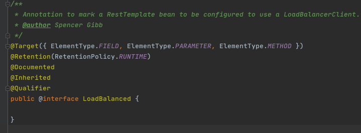

# 010-LoadBalanced注解

## 什么是LoadBalanced注解

我们如果想在SpringCloud 中使用客户端负载均衡, 我们只需要加上LoadBalanced注解即可

- RestTemplate , Spring中对Rest请求的封装
- OpenFeign(默认使用)

## 本质上就是添加拦截器

1. 给目标对象添加拦截器
2. 目标对象发送请求
3. 从服务端中获取服务列表
4. 通过负载均衡策略获取一个服务
5. 发起网络请求

## 入口

