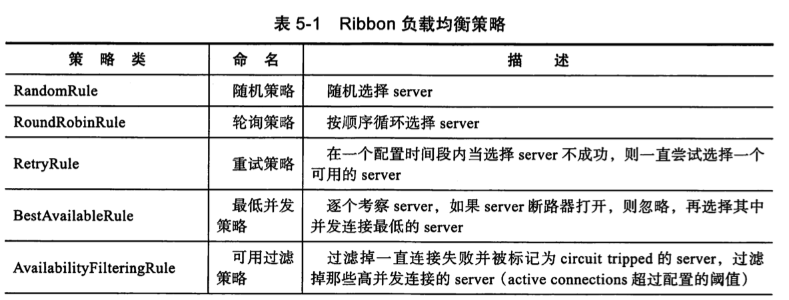
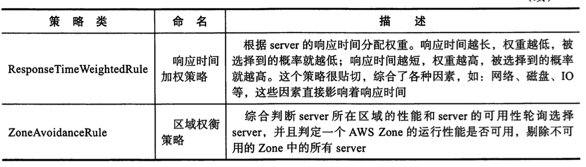

# Ribbon 中的负载均衡策略



## 自定义方式

### 全局策略设置

```
@Configuration
public class TestConfiguration {

	@Bean
	public IRule ribbonRule() {
		return new RandomRule();//设置为随机
	}
}
```

### 基于注解的策略设置

```

public @interface AvoidScan {

}
```

```
@RibbonClient(name = "client-a", configuration = TestConfiguration.class)
@ComponentScan(excludeFilters = {@ComponentScan.Filter(type = FilterType.ANNOTATION, value = {AvoidScan.class})})
```

- client 的的策略使用的是`TestConfiguration`定义的
- ComponentScan 排除`AvoidScan`注解标注的类

### 基于配置文件的配置

```yml
client-a:
  ribbon:
    ConnectTimeout: 3000
    ReadTimeout: 60000
    MaxAutoRetries: 1 #对第一次请求的服务的重试次数
    MaxAutoRetriesNextServer: 1 #要重试的下一个服务的最大数量（不包括第一个服务）
    OkToRetryOnAllOperations: true
    NFLoadBalancerRuleClassName: com.netflix.loadbalancer.RandomRule#ribbon:
eager-load: #饥饿加载
  enabled: true
  clients: client-a, client-b, client-c
    
```

