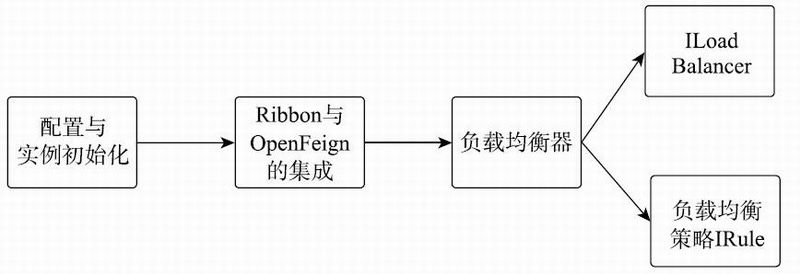
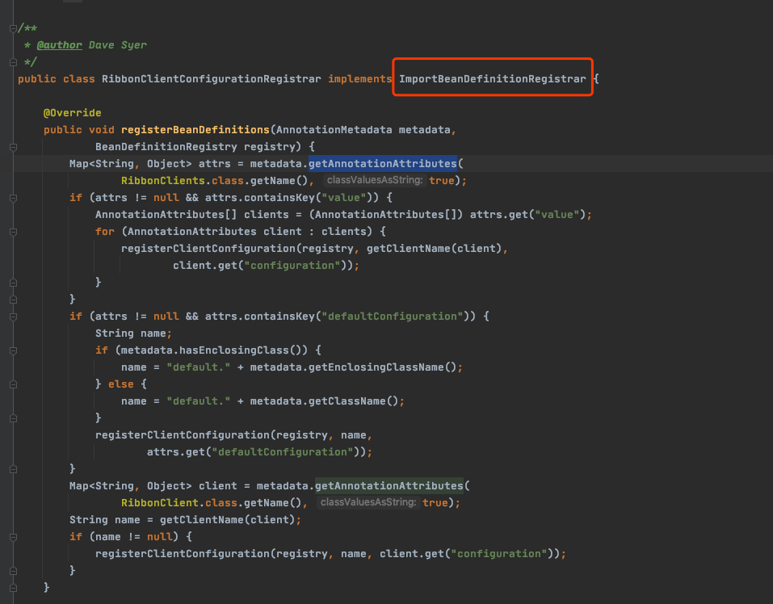
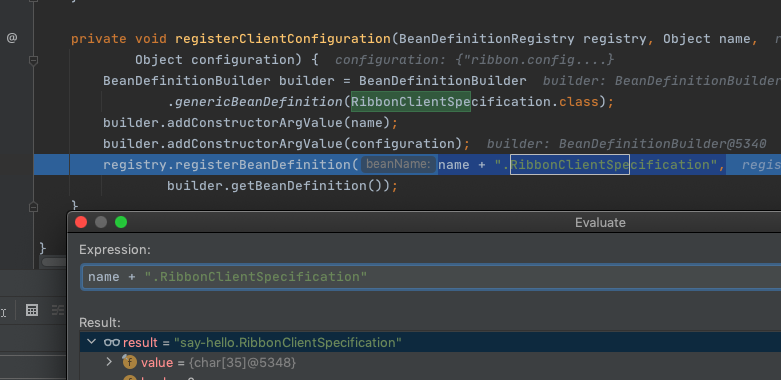
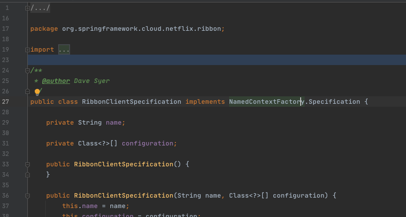

# Ribbon-源码分析-配置和实例初始化



## 目录

- [核心注解RibbonClient](#核心注解RibbonClient)
- [客户端配置注册器-ClientConfigurationRegistrar](#客户端配置注册器-ClientConfigurationRegistrar)
- [Ribbon对于组件实例的管理配置机制](#Ribbon对于组件实例的管理配置机制)

## 核心注解RibbonClient

- @RibbonClient 注解可以声明Ribbon客户端，设置Ribbon客户端的名称和配置类 
- configuration属性可以指定@Configuration的配置类，进行Ribbon相关的配置。
- @RibbonClient还会导入 Ribbon **ClientConfigurationRegistrar**类来动态注册Ribbon相关的BeanDefinition。

@RibbonClient注解的具体实现如下所示：

```java
@Import(RibbonClientConfigurationRegistrar.class)
public @interface RibbonClient {
    String value() default "";
   	 //配置Ribbon客户端名称
    
    String name() default "";

      //Ribbon客户端的自定义配置，可以配置生成客户端的各个组件，比如说ILoadBalancer、ServerListFilter和IRule。默认的配置为RibbonClientConfiguration.java 
    
     Class〈?〉[] configuration() default {};
}
```

## 客户端配置注册器-ClientConfigurationRegistrar



负责注册客户端的配置

- RibbonClientConfigurationRegistrar是ImportBeanDefinitionRegistrar的实现类

  >  ImportBeanDefinitionRegistrar是Spring动态注册BeanDefinition的接口，可以用来注册Ribbon所需的BeanDefinition，比如说Ribbon客户端实例(Ribbon Client)。

-  ImportBeanDefinitionRegistrar 的 **registerBeanDefinitions** 方法可以注册Ribbon客户端的配置类，也就是 @RibbonClient 的 configuration 属性值。registerBeanDefinitions方法的具体实现如下所示：

```java
//RibbonClientConfigurationRegistrar.java
public void registerBeanDefinitions(AnnotationMetadata metadata,
        BeanDefinitionRegistry registry) {
    ...
    //获取@RibbonClient的参数数值，获取clientName后进行configuration的注册
    Map〈String, Object〉 client = metadata.getAnnotationAttributes(
            RibbonClient.class.getName(), true);
    String name = getClientName(client);//获取RibbonClient的value或者name数值。
    if (name != null) {
        registerClientConfiguration(registry, name, client.get("configuration"));
    }
}
```

## Ribbon对于组件实例的管理配置机制

Ribbon对于组件实例的管理配置机制，都是通过 NamedContextFactory 创建带名称的**AnnotationConfigApplicationContext** 子上下文来存储并管理不同的组件实例

```java
//RibbonClientConfigurationRegistrar.java
private void registerClientConfiguration(BeanDefinitionRegistry registry, Object name, Object configuration) {
    BeanDefinitionBuilder builder = BeanDefinitionBuilder
            .genericBeanDefinition(RibbonClientSpecification.class);
    builder.addConstructorArgValue(name);
    builder.addConstructorArgValue(configuration);
    registry.registerBeanDefinition(name + ".RibbonClientSpecification",
            builder.getBeanDefinition());
}
```

如上代码所示，registerClientConfiguration方法会向BeanDefinitionRegistry注册一个 **RibbonClientSpecification** 的 **BeanDefinition** ，其名称为 RibbonClient 的名称加上`.RibbonClientSpecification` 。

>  RibbonClientSpecification是 **NamedContextFactory.Specification** 的实现类，是供 SpringClientFactory 使用的。

在 **RibbonAutoConfiguration** 里会进行 **SpringClientFactory** 实例的初始化，并将所有的 **RibbonClientSpecification** 实例都设置给 **SpringClientFactory** ，供其在初始化Ribbon相关组件实例时使用。



其名称为RibbonClient的名称加上.RibbonClientSpecification。

> 我们的代码是say-hello.RibbonClientSpecification

RibbonClientSpecification是NamedContextFactory.Specification的实现类，是供SpringClientFactory使用的。

在RibbonAutoConfiguration里会进行SpringClientFactory实例的初始化，并将所有的RibbonClientSpecification实例都设置给SpringClientFactory，供其在初始化Ribbon相关组件实例时使用。



注意这里只是注册一了一个定义,真正的实例化要在后续使用AutoConfiguration机制的时候才会使用

```java
@Configuration
@RibbonClients
@AutoConfigureAfter(name = "org.springframework.cloud.netflix.eureka.EurekaClientAutoConfiguration")
@AutoConfigureBefore({LoadBalancerAutoConfiguration.class, AsyncLoadBalancerAutoConfiguration.class})
//@AutoConfigureBefore表明该Configuration会在LoadBalancerAutoConfiguration配置类之前进行执行，因为后者会依赖前者
@EnableConfigurationProperties({RibbonEagerLoadProperties.class, ServerIntrospectorProperties.class})
public class RibbonAutoConfiguration {
    //在RibbonClientConfigurationRegistrar中注册的RibbonClientSpecification实例都会被注入到这里
    @Autowired(required = false)
    private List〈RibbonClientSpecification〉 configurations = new ArrayList〈〉();
    @Autowired
    private RibbonEagerLoadProperties ribbonEagerLoadProperties;
    //SpringCl
    @Bean
    public SpringClientFactory springClientFactory() {
        SpringClientFactory factory = new SpringClientFactory();
        factory.setConfigurations(this.configurations);
        return factory;
    }
    //LoadBalanceClient是核心的类
    @Bean
    @ConditionalOnMissingBean(LoadBalancerClient.class)
    public LoadBalancerClient loadBalancerClient() {
        return new RibbonLoadBalancerClient(springClientFactory());
    }
}
```

如上代码所示，RibbonAutoConfiguration配置类也会进行 LoadBalancerClient 接口的默认实例的初始化。loadBalancerClient方法被@ConditionalOnMissingBean 注解修饰，意味着只有当Spring容器中没有LoadBalancerClient实例时，该方法才会初始化 RibbonLoadBalancerClient 对象， 再将其作为LoadBalancerClient 的实例
