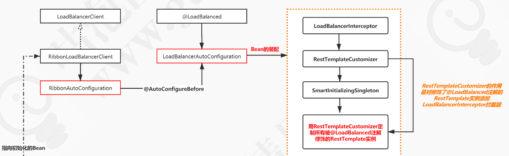

# Ribbon核心Bean的初始化

**用 RestTemplateCustomizer 定制 所有@LoadBalancer 修饰的 RestTemplate 实例** , 来达到拦截 RestTemplate 动态访问服务的结果

## 初始化做了什么

**AutoConfigureBefore 加载**

- 先加载 LoadBalancerClient

  > 因为它 RibbonAutoConfiguration 使用了 AutoConfigureBefore 优先于 LoadBalancerAutoConfuguration

-  RibbonLoadBalancerClient

  > 加载 Ribbon 的负载均衡客户端

 [LoadBalancerClient源码分析](040-LoadBalancerClient源码分析.md) 

------

**LoadBalancerAutoConfuguration 加载**

- LoadBalancerInterceptor 

  > 用于负载均衡的拦截器,一般包含了目标服务的地址列表

- RestTemplateCustomizer

  > 修饰了对 @LoadBalancered 注解的 RestTemplate 添加 LoadBalancerInterceptor 拦截器

- SmartInitializingSingleton

  >  SmartInitializingSingleton 在 Bean 初始化完毕之后调用方法将 RestTemplateCustomizer 注入到容器中

 [LoadBalancer源码分析.md](030-LoadBalancer源码分析.md) 



## 初始化流程

- [初始化拦截器](#初始化拦截器)
- [将拦截器添加到 所有被 LoadBalancer 修饰的 RestTemplate](#设置拦截器)

##  初始化拦截器

>  org.springframework.cloud.client.loadbalancer.LoadBalancerAutoConfiguration 

```java
	@Configuration
	@ConditionalOnMissingClass("org.springframework.retry.support.RetryTemplate")
	static class LoadBalancerInterceptorConfig {
    // 可以看出这里默认使用了 ribbonInterceptor
		@Bean
		public LoadBalancerInterceptor ribbonInterceptor(
				LoadBalancerClient loadBalancerClient,
				LoadBalancerRequestFactory requestFactory) {
			return new LoadBalancerInterceptor(loadBalancerClient, requestFactory);
		}


	}
```

## 设置拦截器

```java
		@Bean
		@ConditionalOnMissingBean
		public RestTemplateCustomizer restTemplateCustomizer(
				final LoadBalancerInterceptor loadBalancerInterceptor) {
			return restTemplate -> {
        //获取原有拦截器
                List<ClientHttpRequestInterceptor> list = new ArrayList<>(
                        restTemplate.getInterceptors());
        //添加自己的拦截器
                list.add(loadBalancerInterceptor);
        //设置进去
                restTemplate.setInterceptors(list);
            };
		}
```

## 初始化

```java
	@LoadBalanced
	@Autowired(required = false)
	//获取所有 LoadBalanced 修饰的 RestTemplate
	private List<RestTemplate> restTemplates = Collections.emptyList();

	@Bean
	public SmartInitializingSingleton loadBalancedRestTemplateInitializerDeprecated(
			final ObjectProvider<List<RestTemplateCustomizer>> restTemplateCustomizers) {
		return () -> restTemplateCustomizers.ifAvailable(customizers -> {
      //.获取上面定义的自定义器,然后遍历所有的 RestTemplate 然后自定义 ,实际上走的就是自定义的逻辑
            for (RestTemplate restTemplate : LoadBalancerAutoConfiguration.this.restTemplates) {
                for (RestTemplateCustomizer customizer : customizers) {
                  //
                    customizer.customize(restTemplate);
                }
            }
        });
	}
```


