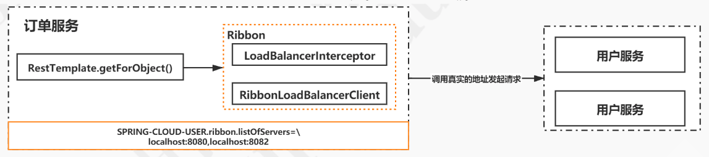
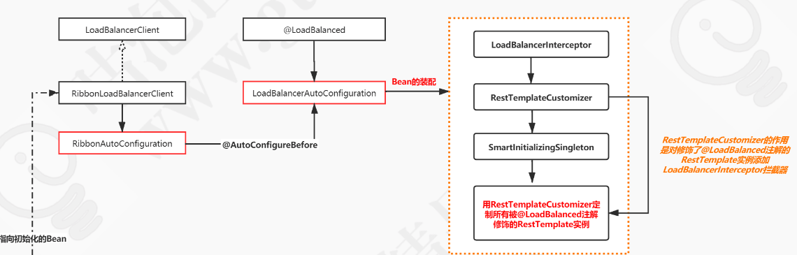
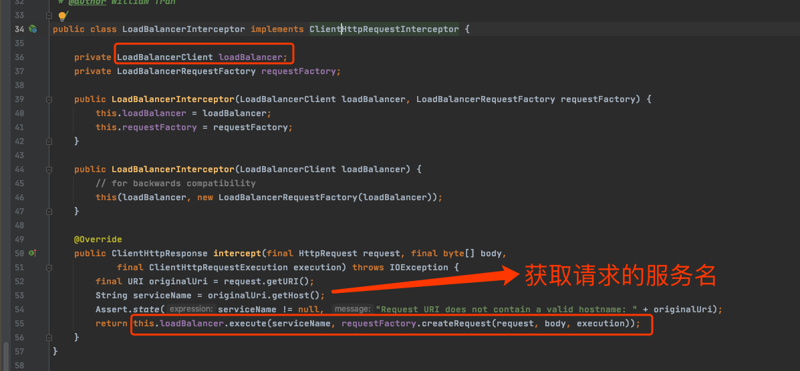

# Ribbon-源码分析-集成RestTemplate

## 目录

- [服务调用简图](#服务调用简图)
- [装配流程](#装配流程)
- 

## 服务调用简图

- 订单服务调用 RestTemplate 进行请求
- Ribbon 在发送网络请求时 替换成 RibbonLoadBalancerClient 进行调用

## 装配流程

- `LoadBalancerClient`接口在 spring-cloud-commons 项目中,定义了负载均衡客户端的抽象行为,不同的组件可以有不同的实现
- `RibbonLoadBalancerClient`是Ribbon 中的实现

RibbonLoadBalancerClient 通过使用 RibbonAutoConfiguration 配置类将注入到Spring容器中

## LoadBalancerAutoConfiguration

LoadBalancerAutoConfiguration实际上是 spring-cloud-commons包中的负载均衡配置实现,说明它是抽象的,负责初始化

- LoadBalancerInterceptor 负载均衡拦截器 , 实际上就是用它作为 RestTemplate的拦截器

- RestTemplateCustomizer 这个方法就是将拦截器添加到 restTemplate 
- SmartInitializingSingleton 将 所有的RestTemplateCustomizer 执行一遍

## LoadBalancerInterceptor

LoadBalancerInterceptor 中持有负载均衡器 [LoadBalancerClient](023-Ribbon-源码分析-LoadBalancerClient.md) 

然后使用这个负载均衡器调用

## ILoadBalancer

 [023-Ribbon-源码分析-LoadBalancerClient.md](023-Ribbon-源码分析-LoadBalancerClient.md) 

