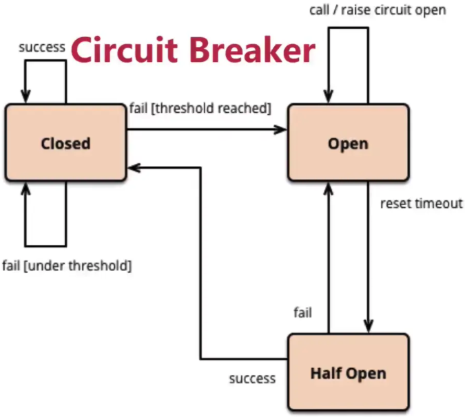

# 010-熔断器模式:让服务器健康地运行

[TOC]

## 什么是熔断器模式

当应用依赖外部API不可用,该应用一直在超时并重试,从而引发应用整体无法使用, 熔断器模式让客户端在发生多次调用失败的情况下不再重试

## 熔断器的三个状态

三个状态分别是 Closed状态, Open状态, Half-Open状态

| 状态      | 描述                                                         |
| --------- | ------------------------------------------------------------ |
| Closed    | 默认状态,Circuit Breaker内部维护了最近失败的次数(Failure count), 操作每次失败一次, 就会增加一次失败次数 当失败次数达到一定的阈值时,就会从Closed状态进入 Open状态 |
| Open      | 操作不会执行, 而是立即失败, Circuit Breaker内部维护这一个计数器, 当**时间**达到一定的阈值时, 就会从 Open状态进入 Half-Open状态 |
| Half-Open | 只要操作失败一次, 立即进入 Open状态  否则增加操作成功次数, 当成功次数达到一定阈值时, 进入 Closed状态并重置失败次数 |

