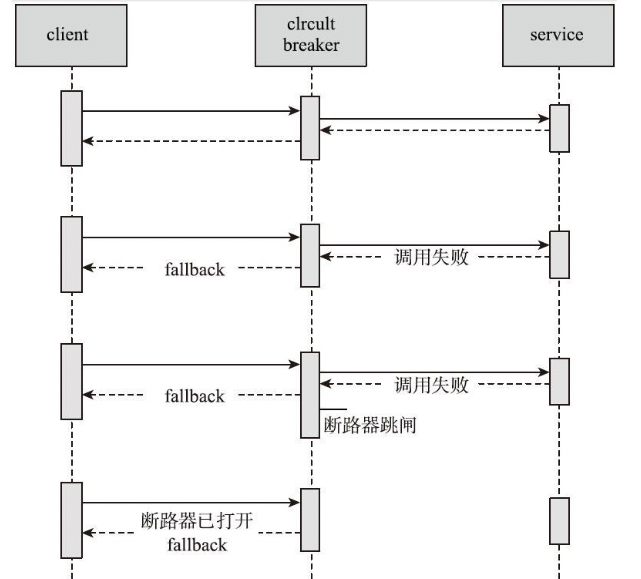

# 010-服务降级操作

[TOC]

## 一言蔽之

断路器为隔断服务调用者和异常服务提供者防止服务雪崩的现象，提供了一种保护措施。

而服务降级是为了在整体资源不够的时候，适当放弃部分服务，将主要的资源投放到核心服务中，待渡过难关之后，再重启已关闭的服务，保证了系统核心服务的稳定。

## Hystrix中的服务降级

在Hystrix中，当服务间调用发生问题时，它将采用备用的Fallback方法代替主方法执行并返回结果，对失败服务进行了服务降级。

当调用服务失败次数在一段时间内超过了断路器的阀值时，断路器将打开，不再进行真正的方法调用，而是快速失败，直接执行Fallback逻辑，服务降级，减少服务调用者的资源消耗，保护服务调用者中的线程资源



