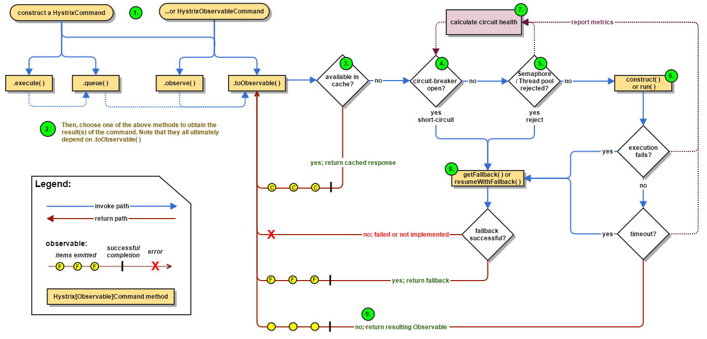

# 010-Hystrix基本运行流程

[TOC]

## 一言蔽之

## 图示

## 执行流程

1. 构造一个 HystrixCommand或 HystrixObservableCommand对象，用于封装请求，并在构造方法配置请求被执行需要的参数；
2. 执行命令，Hystrix提供了4种执行命令的方法
   1. HystrixCommand : execute
   2. HystrixCommand : queue
   3. HytrixObservableCommand : observe
   4. HystrixObservableCommand : toObservable
3. 判断是否使用缓存响应请求，若启用了缓存，且缓存可用，直接使用缓存响应请求。Hystrix支持请求缓存，但需要用户自定义启动；
4. 判断熔断器是否打开，如果打开，跳到第8步；
5. 判断**线程池/队列/信号量**是否已满，已满则跳到第8步；
6. 执行HystrixObservableCommand.construct()或HystrixCommand.run()，如果执行失败或者超时，跳到第8步；否则，跳到第9步；
7. 统计熔断器监控指标；包括信号量或者线程池消耗情况
8. 熔断器已经打开的情况下调用fallback 方法返回并结束流程, 没有实现 fallback 方法返回并结束流程 , 走Fallback备用逻辑
9. 返回请求响应