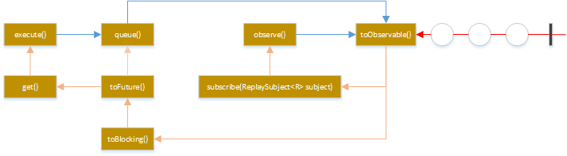

# 020-执行命令的四种方法

[TOC]

## 一言蔽之

Hystrix提供了4种执行命令的方法，

- HystrixCommand对象
  - execute()
  - queue()
- HystrixObservableCommand对象
  - observe()
  - toObservable()

## HystrixCommand对象

### execute()

以同步堵塞方式执行run()，只支持接收一个值对象。hystrix会从线程池中取一个线程来执行run()，并等待返回值。

### queue()

以异步非阻塞方式执行run()，只支持接收一个值对象。

- 调用queue()就直接返回一个Future对象。
- 可通过 Future.get()拿到run()的返回结果，但Future.get()是阻塞执行的。
  - 若执行成功，Future.get()返回单个返回值。
  - 当执行失败时，如果没有重写fallback，Future.get()抛出异常。

## HystrixObservableCommand对象

### observe()

事件注册前执行 run()/construct()，支持接收多个值对象，取决于发射源。调用observe()会返回一个hot Observable，也就是说，调用observe()自动触发执行run()/construct()，无论是否存在订阅者。

如果继承的是HystrixCommand

- hystrix会从线程池中取一个线程以非阻塞方式执行run()；

- 如果继承的是HystrixObservableCommand，将以调用线程阻塞执行construct()。

observe()使用方法：

1. 调用observe()会返回一个Observable对象
2. 调用这个Observable对象的subscribe()方法完成事件注册，从而获取结果

### toObservable()

事件注册后执行run()/construct()，支持接收多个值对象，取决于发射源。调用toObservable()会返回一个cold Observable，也就是说，调用toObservable()不会立即触发执行run()/construct()，必须有订阅者订阅Observable时才会执行。

如果继承的是HystrixCommand，hystrix会从线程池中取一个线程以非阻塞方式执行run()，调用线程不必等待run()；如果继承的是HystrixObservableCommand，将以调用线程堵塞执行construct()，调用线程需等待construct()执行完才能继续往下走。

toObservable()使用方法：

1. 调用observe()会返回一个Observable对象
2. 调用这个Observable对象的subscribe()方法完成事件注册，从而获取结果

需注意的是，HystrixCommand也支持toObservable()和observe()，但是即使将HystrixCommand转换成Observable，它也只能发射一个值对象。

只有HystrixObservableCommand才支持发射多个值对象。

## 几种方法的关系

- execute() 实际是调用了queue().get()
- queue() 实际调用了toObservable().toBlocking().toFuture()
- observe() 实际调用toObservable()获得一个cold Observable，再创建一个ReplaySubject对象订阅Observable，将源Observable转化为hot Observable。因此调用observe()会自动触发执行run()/construct()。

Hystrix总是以Observable的形式作为响应返回，不同执行命令的方法只是进行了相应的转换。

