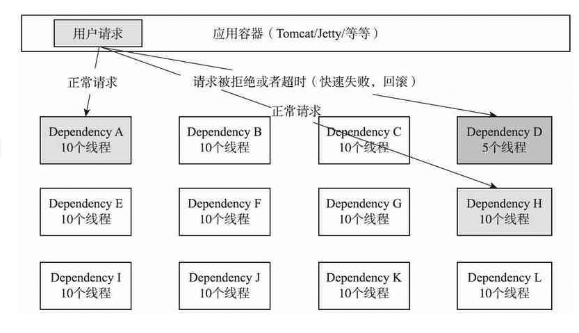

# 030-资源隔离

[TOC]

## 为什么需要资源隔离

在货船中，为了防止漏水和火灾的扩散，一般会将货仓进行分割，避免了一个货仓出事导致整艘船沉没的悲剧。

同样的，在Hystrix中，也采用了舱壁模式，将系统中的服务提供者隔离起来，一个服务提供者延迟升高或者失败，并不会导致整个系统的失败，同时也能够控制调用这些服务的并发度。

## 1.线程与线程池

Hystrix通过将调用服务线程与服务访问的执行线程分隔开来，调用线程能够空出来去做其他的工作而不至于因为服务调用的执行阻塞过长时间。

在Hystrix中，

- **将使用独立的线程池对应每一个服务提供者**，用于隔离和限制这些服务。于是，某个服务提供者的高延迟或者饱和资源受限只会发生在该服务提供者对应的线程池中。

Dependency D的调用失败或者高延迟仅会导致自身对应的线程池中的5个线程阻塞，并不会影响其他服务提供者的线程池。

系统完全与服务提供者请求隔离开来，即使服务提供者对应的线程完全耗尽，并不会影响系统中的其他请求。

注意在服务提供者的线程池被占满时，对该服务提供者的调用会被Hystrix直接进入回滚逻辑，快速失败，保护服务调用者的资源稳定。

## 2.信号量

除了线程池外，Hystrix还可以通过信号量(计数器)来限制单个服务提供者的并发量。

- 如果通过信号量来控制系统负载，将不再允许设置超时控制和异步化调用，这就表示在服务提供者出现高延迟时，其调用线程将会被阻塞，直至服务提供者的网络请求超时。
- 如果对服务提供者的稳定性有足够的信心，可以通过信号量来控制系统的负载。