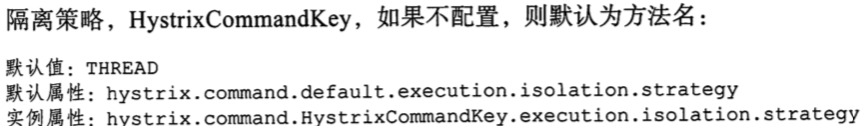
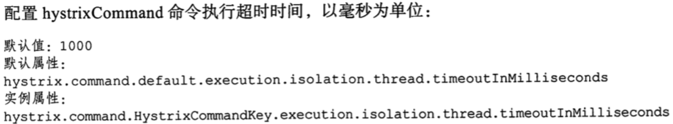
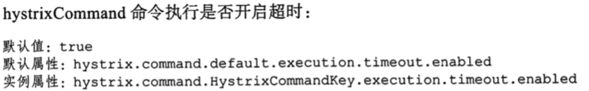
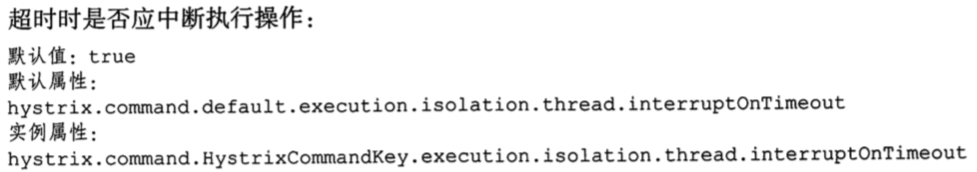
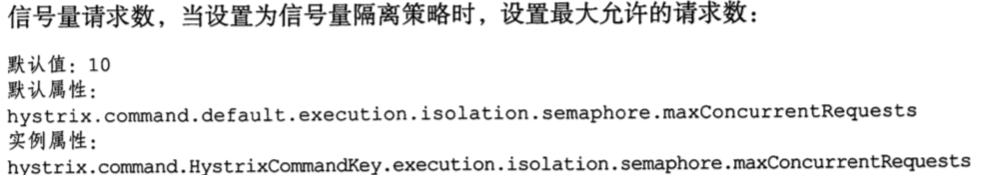
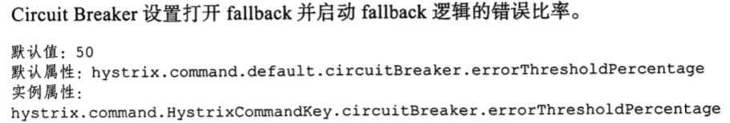
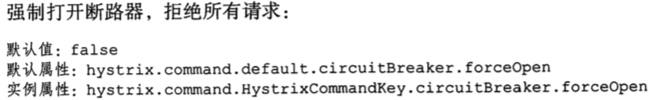
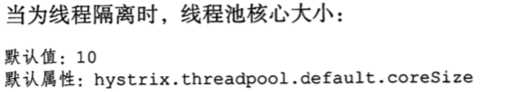
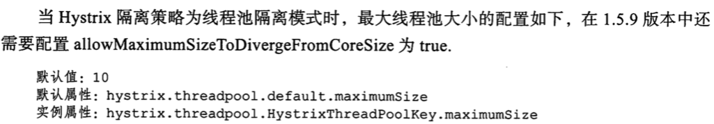
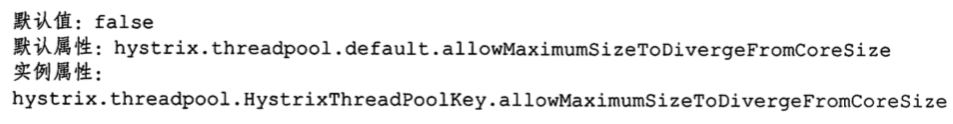

# 异常机制和处理

Hystrix 的异常处理中,有 5 种错误的情况下会被 fallback 截获,从而触发 fallback ,这些情况是

- FAILURE 执行失败,抛出异常
- TIMEOUT 执行超时
- SHORT_CIRCUITED 断路器打开
- THREAD_POOL_REJECTED : 线程池拒绝
- SEMAPHORE_REJECTED : 信号量拒绝

不会熔断,不会触发 fallback 的情况

- BAD_REQUEST 

> 会抛出 HystrixBadRequestException 这种异常一般对应的是由非法参数或者一些非系统异常引起的,对于这类可以根据相应创建对应的异常进行异常封装或者直接处理

## 值得注意的是

### 配置

#### 隔离策略



> THREAD 线程，SEMAPHORE 信号量

#### 配置hystrixCommand 超时时间,毫秒为单位



#### hystrixCommand 开启超时



#### 超时时是否应中断执行操作



#### 信号量请求数,当设置为信号量隔离策略时,设置最大允许请求数



#### Cricuit Breaker 设置打开 fallback 并启动 fallback 逻辑的错误比率



#### 强制打开断路器,拒绝所有请求



#### 当为线程隔离时,线程池核心大小



#### 当隔离策略为线程池隔离模式,最大线程池大小的配置如下



#### allowMaximumSizeToDivergeForm 为 true



## hystrix 线程调整和计算

- 默认超时时间 为 1000ms, 如果业务明显超过 1000ms,根据自己的业务进行修改
- 线程池默认为 10, 如果你知道确实要使用更多可以调整
- 金丝雀发布
- 在生产环境中运行超过 24 小时
- 如果系统有告警或者监控,那么可以依靠它们捕捉问题
- 运行 24 小时候,通过延迟百分位和流量来计算有意义的最低满足值
- 在生产或者测试环境实时修改值,通过仪表盘监控
- 如果断路器产生变化和影响,则需要再次确认这个配置

Threadpool 的大小计算推荐

```
每秒请求的峰值 * 99%的延迟百分比(请求响应时间) + 预留缓冲值
30 * 0.2s = 6 + 预留4 = 10
```


### 常用配置

> 在真实的应用过程中,一般会对超时时间,线程池大小,信号量等进行修改,具体要结合业务进行分析
>
> 默认的 Hystrix 超时时间为 1 秒,但是在实际的运用过程中,发现 1秒比较短,应该设为 5-10 s , 对于一些同步文件上传等业务则会更长,如果配置了 Ribbon 的事件,其超时时间也需要和 Ribbon 的事件配合使用,一般情况下 Ribbon 的事件应短语 Hystrix 超时时间

```
hystrix.command.default.execution.isolation.thread.timeoutInMilliseconds # 全局请求超时时间,推荐 10s
```

```
hystrix:
  threadpool:
    default:
      coreSize: 20  #全局默认核心线程池大小
      maximumSize: 50 # 全局默认核心最大线程池大小,默认是 10
      maxQueueSize: -1 #
      allowMaximumSizeToDivergeFromCoreSize: true # 该属性允许配置 coreSIze 和 maximumSize生效,默认为 false
  command:
    default:
      execution:
        timeout:
          enabled: false
        isolation:
          thread:
            interruptOnTimeout: false 
            timeoutInMilliseconds: 15000 
```


