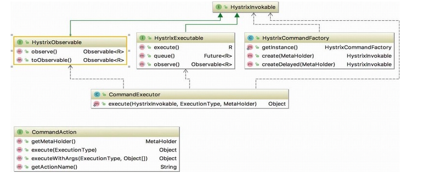

# 010-封装HystrixCommand

[TOC]



## @HystrixCommand注解

@HystrixCommand注解在基础应用中我们使用@HystrixCommand注解来包装需要保护的远程调用方法。首先查看该注解的相关属性，代码如下所示：

```java
//HystrixCommand.java
@Target({ElementType.METHOD})
@Retention(RetentionPolicy.RUNTIME)
@Inherited
@Documented
public @interface HystrixCommand {
    // 命令分组键用于报告、预警以及面板展示
    // 默认为被注解方法的运行时类名
		String groupKey() default "";
    // Hystrix的命令键，用于区分不同的注解方法
    // 默认为注解方法的名称
    String commandKey() default "";
    // 线程池键用来指定命令执行的HystrixThreadPool
    String threadPoolKey() default "";
    // 指定Fallback方法名，Fallback方法也可以被HystrixCommand注解
    String fallbackMethod() default "";
    // 自定义命令的相关配置
    HystrixProperty[] commandProperties() default {};
    // 自定义线程池的相关配置
    HystrixProperty[] threadPoolProperties() default {};
    // 定义忽略哪些异常
    Class<? extends Throwable>[] ignoreExceptions() default {};
    // 默认的fallback
    String defaultFallback() default "";
    ...
}
```
一般来说，对于HystrixCommand的配置，仅需要关注fallbackMethod方法，当然如果对命令和线程池有特定需要，可以进行额外的配置。

## @HystrixCollapser注解

除了@HystrixCommand还有一个@HystrixCollapser注解用于请求合并操作，但是需要与@HystrixCommand结合使用，批量操作的方法必须被@HystrixCommand注解。

例子如下所示：

```java
//HystrixCollapser.java
@HystrixCollapser(batchMethod = "getInstanceBuServiceIds")
public Future<Instance> getInstanceByServiceIds(String serviceId) {
    return null;
}
@HystrixCommand
public List<Instance> getInstanceBuServiceIds(List<String> serviceIds){
    List<Instance> instances = new ArrayList<>();
    for(String s : serviceIds){
        instances.add(new Instance(s, DEFAULT_HOST, DEFAULT_PORT));
    }
    return instances;
}
```

