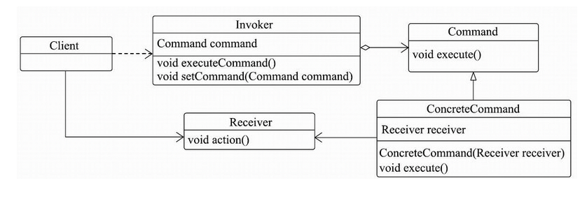

# 040-Hystrix中的命令模式

[TOC]

## 命令模式

 [02-command-pattern.md](../../../../01-design-patterns/04-behavioral-patterns/02-command-pattern.md) 

## Hystrix

通过代码和类图，会发现上述类结构中使用了设计模式中的命令模式进行设计。

- 这其中HystrixInvokable是HystrixCommand的标记接口，继承了该接口的类都是可以被执行的HystrixCommand。

- 提供具体方法的接口为HystrixExecutable，用于同步执行和异步执行命令，HystrixObservable用于异步回调执行命令，它们对应命令模式中的Command和ConcreteCommand。

- CommandExecutor将调用HystrixInvokable执行命令，相当于命令模式中的Invoker。HystrixCommandFactory将生成命令，而HystrixCommandAspect相当于命令模式中的客户端情景类Client。

- CommandAction中持有Fallback方法或者被@HystrixCommand注解的远程调用方法，相当于命令模式中的Receiver。

