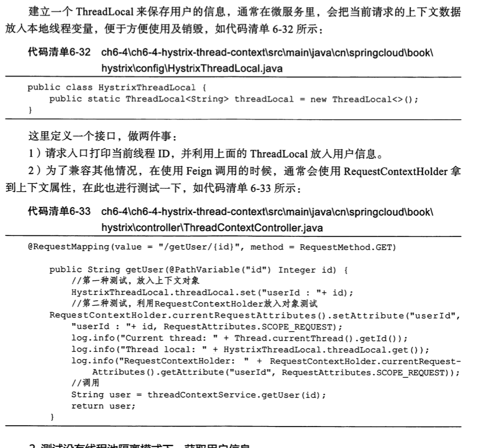
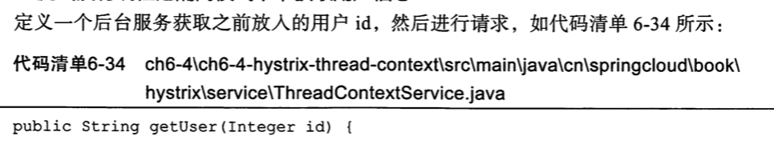
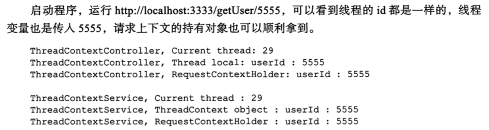
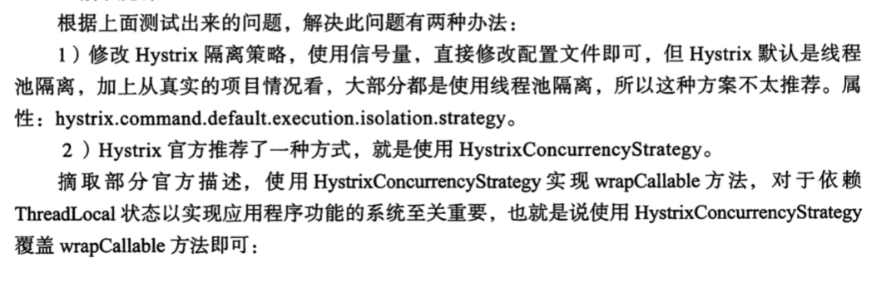
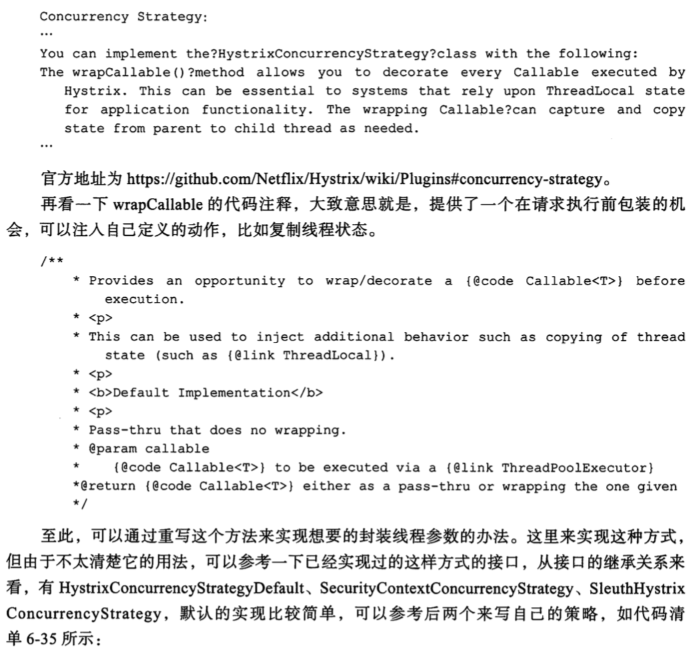
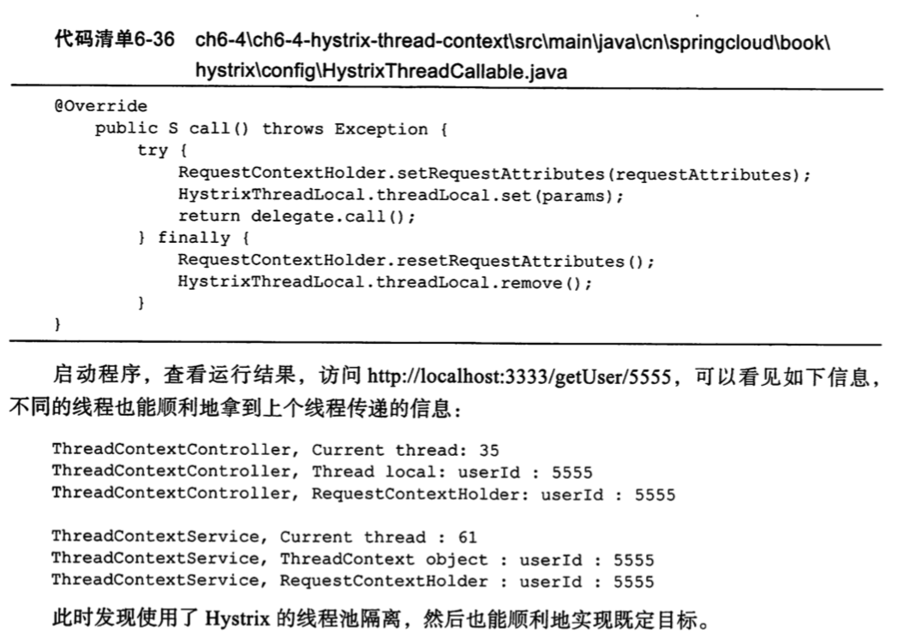

# 线程传递和并发策略

hystrix 会对请求进行封装,然后管理请求的调用,从而实现断路器等多种功能

hystrix 提供了两种隔离模式来进行请求的操作:

- 信号量

> 请求的时候会获取一个信号量,如果成功拿到,则继续进行请求,请求在一个线程中执行完毕

- 线程隔离

> 请求放入线程池中执行,这时就有可能产生线程的变化,从而导致线程 1 的上下文数据在线程池 2 里不能正常拿到

### 新建请求接口和本地线程持有对象

## 测试没有线程池隔离模式下,获取用户信息

### 测试有线程池隔离模式下,获取用户信息

#### 解决办法

