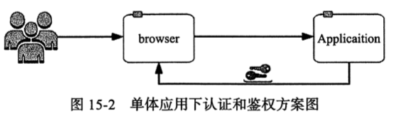
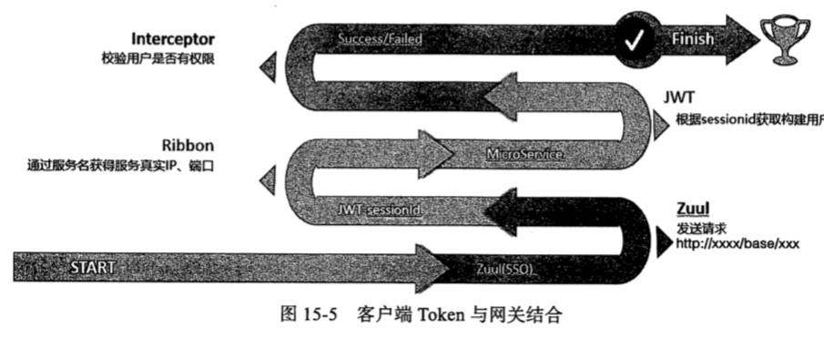

# SpringCloud 安全与权限

认证和鉴权:

- 认证 : 验证用户是谁
- 鉴权 : 验证用户能不能操作

## 单体应用下的常用方案 

- 用户请求,服务端把用户存入 Session 并生成一个 sessionID , 之后返回客户端
- 客户端可以存在 cookie 里,从而在后续的请求中顺利通过验证

## 微服务下 SSO 单点登录方案

微服务架构下,应用被拆分, 单体应用按照规则拆分成很多小的服务

- 如果每个服务都进行用户的 SSO 操作, 做用户的认证和鉴权,可能保存用户信息或者每个用户都会和鉴权服务打交道
- 每个服务都与鉴权服务打交道势必代理网络消耗和性能损耗
- 有可能会造成数据不一致

## 分布式 Session 与网关结合方案

- 用户在网关进行 SSO 登录,进行认证,检查用户是否存在和有效
- 如果认证通过,则将用户信息或数据存储在第三方组件中,如 MySQL 或者 Redis
- 后端微服务可以从共享存储中拿到用户的数据

多数情况下这种方案是推荐的,因为很方便同时可以做拓展,也可以保证高可用

但是

- 这种方案依赖第三方组件
- 如果第三方组件需要做高可用,那么需要增加安全的控制,实现有一定的复杂度

## 客户端 Token与网关结合方案

它的实现步骤和方案如下

- 客户端持有一个 Token, 通常可用 JWT 或者其他加密的算法实现自己的一种 token 
- 发起请求并携带 token,token 传到网关层后,网关层进行认证和校验
- 如果要设计用户的大量数据存放,则 token 有可能不太适合,或者和上面的分布式 Session一样,需要使用第三方组件来存储这些信息

## 网关与 Token 和服务间鉴权结合

网关适合做认证和鉴权

- 在 gateway 网关层做认证,通过对用户的校验,传递用户的信息到 header 中,后台微服务收到 header 后进行解析,解析完后查看是否有调用此服务或者某个 url 的权限,然后完成鉴权
- 从服务内部发出请求,在出去时进行拦截,把用户信息保存在 header 里,然后传出去,被调用方获取到 header 后进行解析和鉴权

