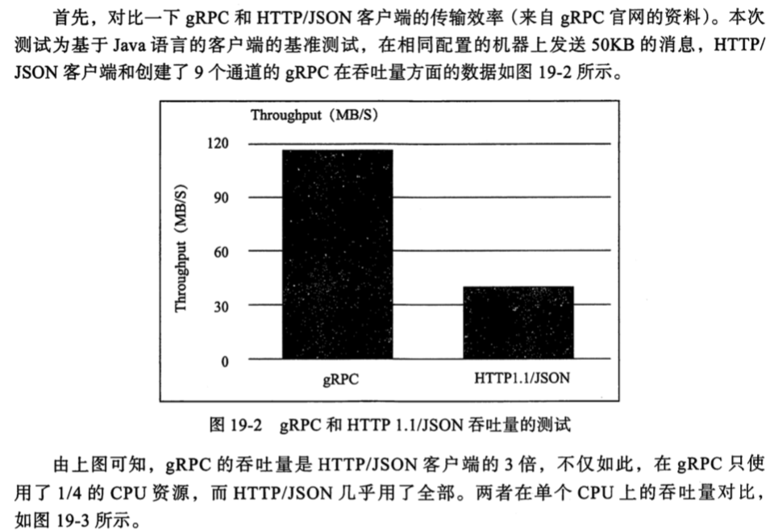
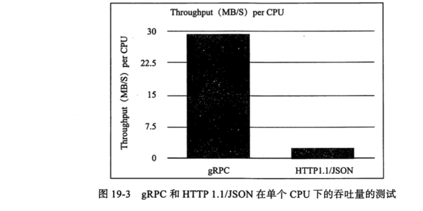

# SpringCloud 与 gRPC

## 什么是 gRPC

RPC 框架 远程过程调用框架

 [04-RPC框架通讯原理](../../14-network/04-RPC框架通讯原理) 

## SpringCloud 为什么需要 gRPC

RPC 框架目的解决 RESTful API 效率低的问题

#### 为什么效率低

通常情况下,HTTP不会开启 KeepAlive 功能, 连接为短连接,每次请求都需要建立一次 TCP 连接,这使得其在耗时非常低效

- 对外提供 RESTFul API是可以理解的,因为 JSON 序列化可读性好,便于前后端对接
- 内部服务之间进行服务调用时采用 HTTP性能就比较低下

## 对比一个 gRPC 和 HTTP/JSON 客户端的传输效率

## 为什么效率高

- gRPC 采用了 HTTP2 协议, 进行了头部信息压缩,对连接进行了复用,减少了 TCP 的连接次数

> grpc 基于 HTTP2 协议,所以 gRPC 集成了 HTTP2 的优点,带来诸如双向流,流控,头部压缩,单 TCP 连接上的多复用请求等特性
>
> 从实现和特性来说,grpc 目前更多考虑的是移动端和服务端的通信,gRPC 高效的实现了 HTTP2 的连接多路复用,Body 和 Header 的压缩,这些功能给移动端带来了非常多的好处,比如节省了流量,响应速度快,节约了 CPU资源

- gRPC 采用了 ProtoBuffer 作为序列化工具,比 JSON 性能高

>  [02-Protobuf.md](../../14-network/03-序列化和反序列化/02-Protobuf.md) 

- gRPC 采用了 Netty 作为 IO处理框架,提高了性能

>  [README.md](../../12-netty/README.md) 

