# SpringCloud 与领域驱动实践

## 领域驱动概述

DDD( Domain-Driven-Design, 领域驱动设计)

- 是针对面向对象分析和设计的一个拓展和延伸
- 对技术架构进行了分层规划
- 同时对每个类进行了策略和类型的划分

领域模型是领域驱动的核心,领域模型通过聚合(Aggregate) 组织在一起,聚合间有明显的业务边界,这些界限将领域划分为一个个 **界限上下文(Bounded Context)**

采用 DDD 的设计思想,业务逻辑不再集中在几个大型的类上,而是由大量相对小的领域对象组成,这些类具备自己的状态和行为,每个类都是相对完整的独立体,并与现实领域的业务对象映射

领域模型就是由许多这样的细粒度类组成的

基于领域驱动的数据,保证了系统的可维护性,可拓展性和复用性,在处理复杂业务逻辑方面有着先天的优势

## SpringCloud 与领域驱动

在微服务(MicroServices)架构时间中,大量借用了 DDD中的概念和设计,比如

- 一个微服务应该对应 DDD中的一个**界限上下文(Bounded Context)**
- 在微服务设计中应该首先识别出 DDD中聚合根(Aggregate Root) 
- 微服务之间集成时应该采用 DDD 中的防腐层(Anti-Corruption Layer, ACL) 

#### SpringCloud 扮演的角色

SpringCloud 基于 SpringBoot 提供了一套完善的微服务解决方案,作为微服务架构的基础设施,快速帮助企业开发者搭建微服务架构,更像是一个中间件,解决了框架层面的问题,但是业务怎么开发,业务架构怎么治理,架构怎么防腐,怎么解决应用架构的复杂性,这些问题都需要方法论去指导实践

## 为什么需要领域建模

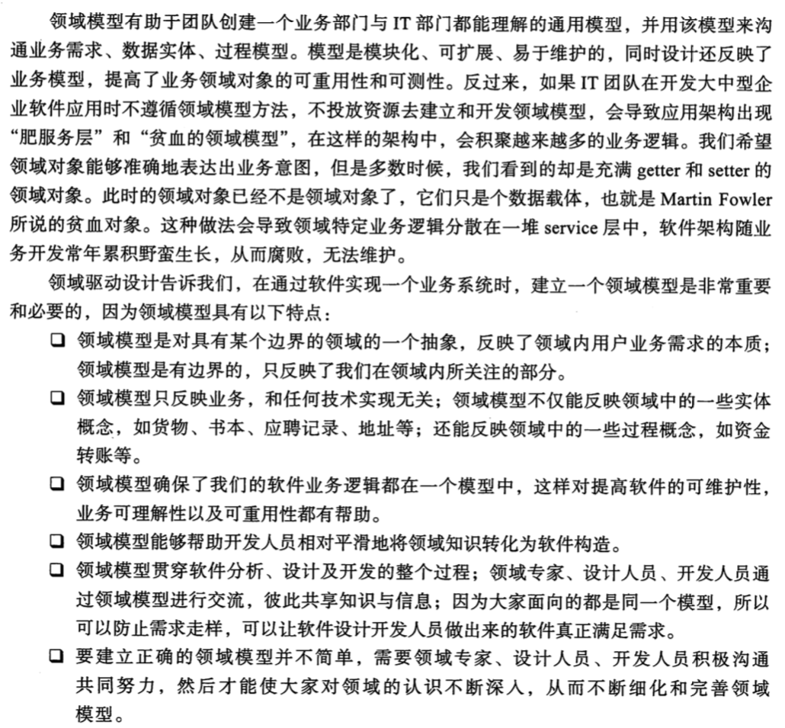

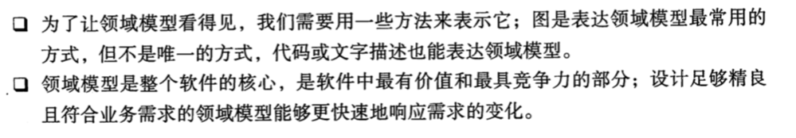

## 值对象概述

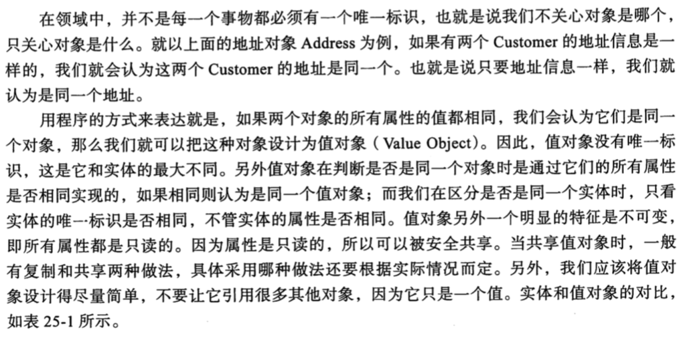

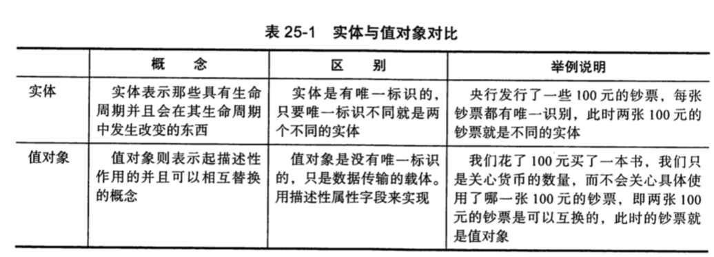

## 领域服务

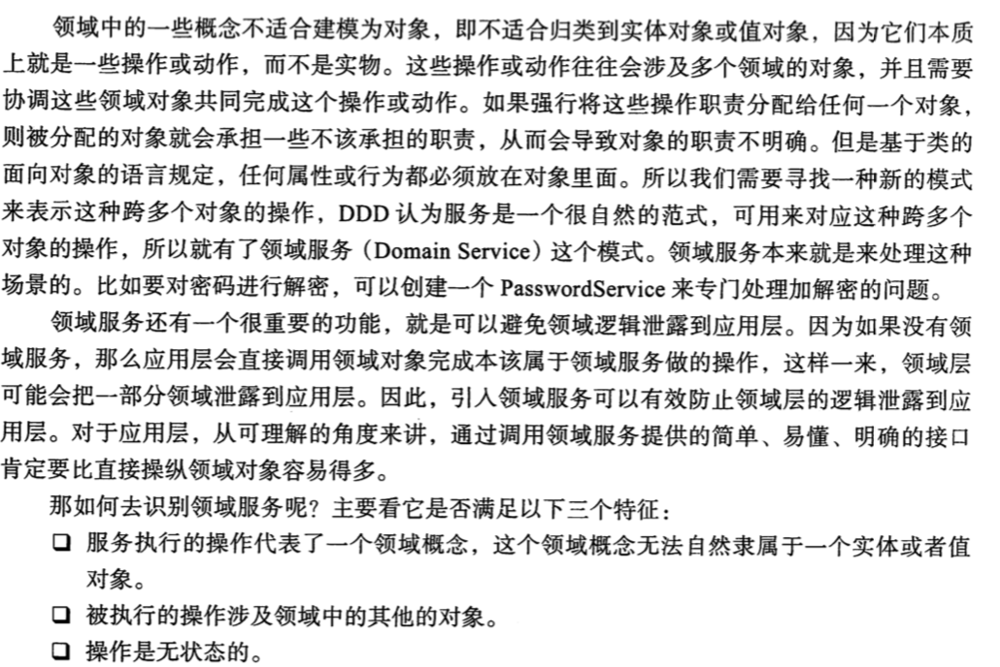

## 聚合以及聚合根

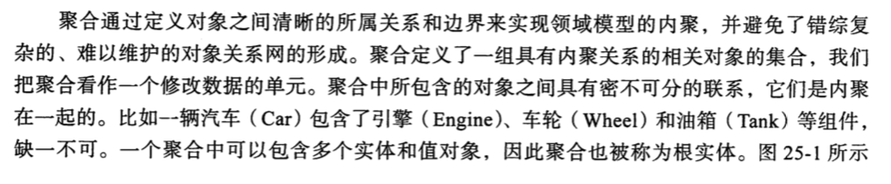

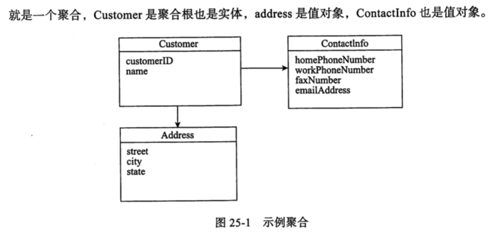

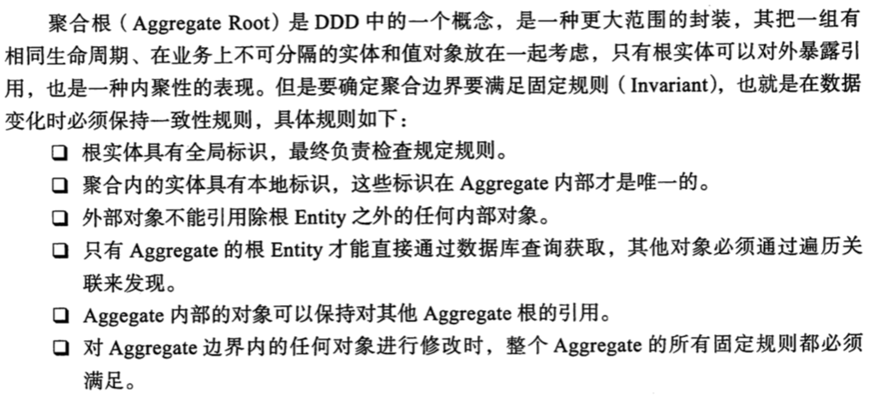

## 边界上下文

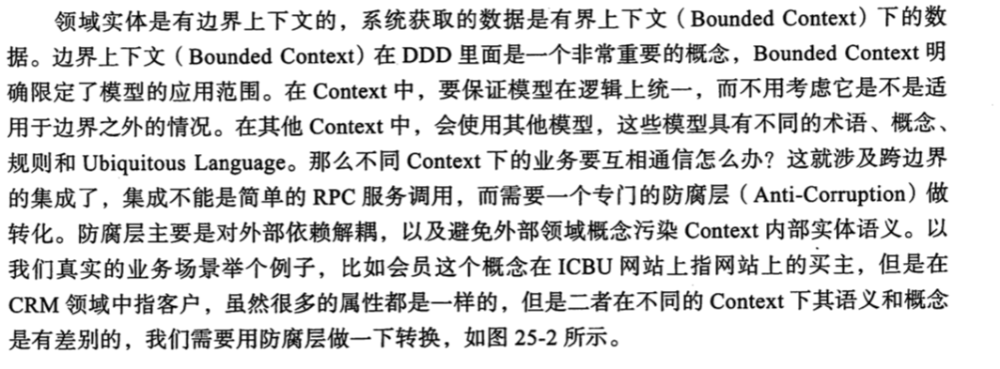

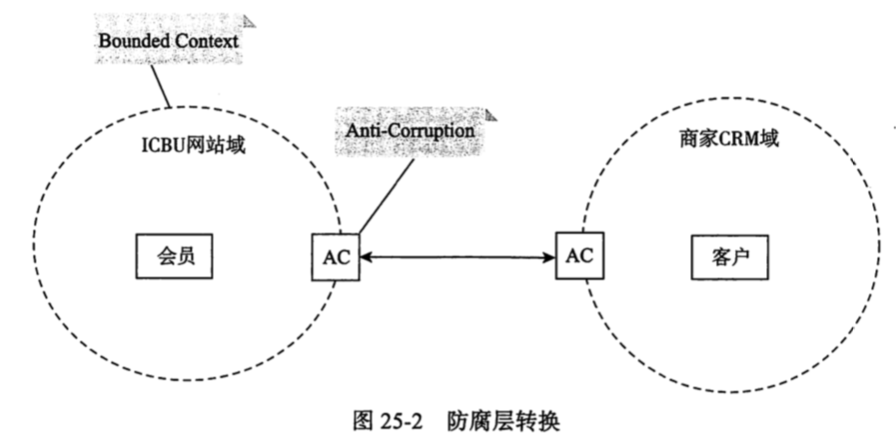

## 工厂

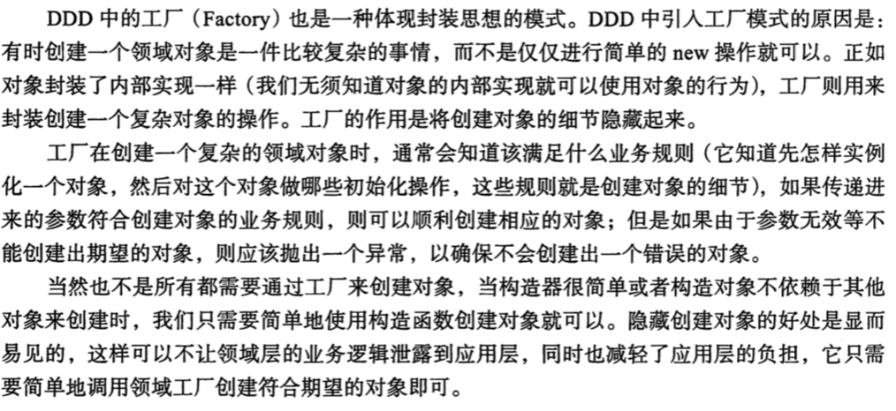

## 仓库/资源库

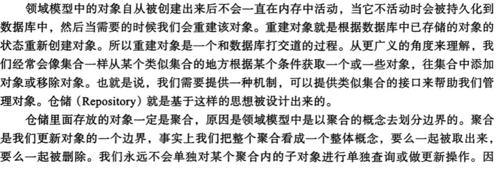

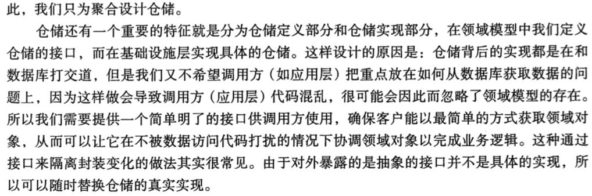

## CQRS架构

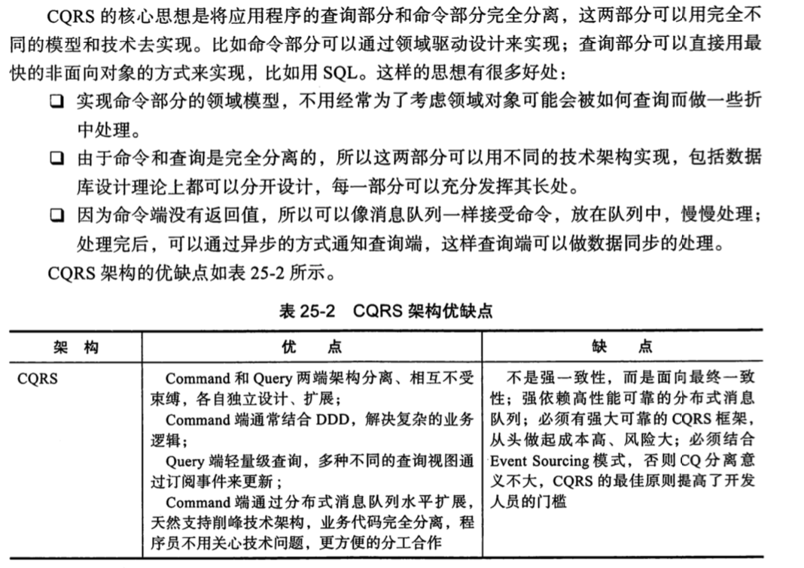

## 领域事件

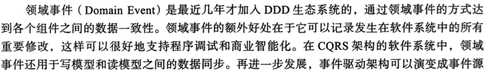

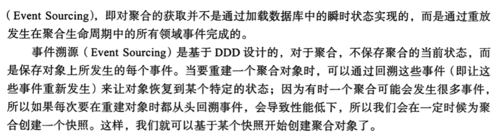

## 领域驱动模型的设计步骤

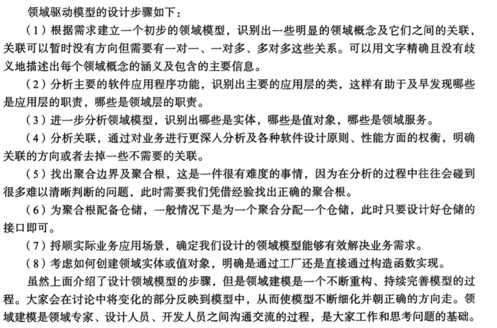