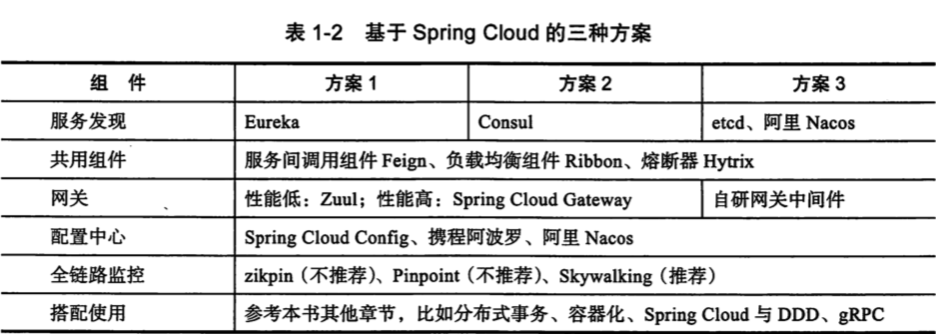

# Spring Cloud

> Building distributed systems doesn't need to be complex and error-prone. Spring Cloud offers a simple and accessible programming model to the most common distributed system patterns, helping developers build resilient, reliable, and coordinated applications. Spring Cloud is built on top of Spring Boot, making it easy for developers to get started and become productive quickly.

构建分布式系统不用特别的复杂且避免容易出现的错误。

Spring Cloud为最常见的分布式系统模式 提供了一个简单和可访问的编程模型，帮助开发人员构建弹性、可靠和协调的应用程序。SpringCloud构建在 SpringBoot之上，使开发人员很容易开始工作并迅速提高生产力。

## What is Spring Cloud 

> Spring Cloud provides tools for developers to quickly build some of the common patterns in distributed systems (e.g. configuration management, service discovery, circuit breakers, intelligent routing, micro-proxy, control bus, one-time tokens, global locks, leadership election, distributed sessions, cluster state). Coordination of distributed systems leads to boiler plate patterns, and using Spring Cloud developers can quickly stand up services and applications that implement those patterns. They will work well in any distributed environment, including the developer’s own laptop, bare metal data centres, and managed platforms such as Cloud Foundry.

Spring Cloud 为开发⼈员提供快速构建分布式系统的⼀些通⽤模式，其中包括：配置管理、服务发 现、服务短路、智能路由、微型⽹关、控制总线、⼀次性令牌、全局锁、领导选举、分布式会话和 集群状态。分布式系统间的协调导向样板模式，并且使⽤ Spring Cloud 的开发⼈员能够快速地构建 实现这些模式的服务和应⽤。这些服务和应⽤也将在任何环境下⼯作良好，⽆论是开发者的笔记本、 还是数据中⼼裸机或者管控平台。

## 目录

-  [00-code](00-code) 代码
-  [01-basic](01-basic) 基础知识
-  [02-cloud-native-application](02-cloud-native-application)  云原生应用
-  [04-spring-cloud-config](04-spring-cloud-config) 配置中心
-  [05-spring-cloud-netflix](05-spring-cloud-netflix) netflix
-  [16-spring-cloud-gateway](16-spring-cloud-gateway) 网关

## 技术分类

#### **Service Discovery** 服务发现

> A dynamic directory that enables client side load balancing and smart routing

支持客户端负载平衡和智能路由的动态目录

-  [Spring Cloud Consul Discovery](09-spring-cloud-consul/README.md) 

- Spring Cloud Netflix Eureka
  - [01-netflix-eureka.md](05-spring-cloud-netflix/01-netflix-eureka.md) 
  - [02-netfilix-eureka-client.md](05-spring-cloud-netflix/02-netfilix-eureka-client.md) 
- Spring Cloud Zookeeper Discovery

#### **Circuit Breaker**

Microservice fault tolerance with a monitoring dashboard

- Spring Cloud NetFlix Hystrix
- Spring Cloud Resilience4J
- Spring Cloud Sentinel
- Spring Retry

#### **Configuration Server**

Dynamic, centralized configuration management for your decentralized applications

#### **API Gateway**

Single entry point for API consumers (e.g., browsers, devices, other APIs)

#### **Distributed Tracing**

Automated application instrumentation and operational visibility for distributed systems

#### **OAuth2**

Support for single sign on, token relay and token exchange

#### **Consumer-Driven Contracts**

Service evolution patterns to support both HTTP-based and message-based APIs

## SpringCloud 微服务解决方案

SpringCloud  的技术选型是中立的,因此可以随着需要更换搭配使用,基于 SpringCloud 的微服务解决方案可以分成 3 种,

## SpringCloud 与中间件

中间件向下兼容异构的软硬件,网络等计算资源,向上提供应用开发,运行,维护等全生命周期的统一计算环境与管理

属于承上启下的中间连接层

**中间件本质上可以归属为技术架构**,常见的中间件有

- 服务治理中间件, 例如 doubbo 等 rpc 框架
- 配置中心
- 全链路监控
- 分布式事务
- 分布式定时任务
- 消息中间件
- API网关
- 分布式缓存
- 数据库中间件等

## SpringCloud 组件列表

#### 注册中心

| 组件名称 | 所属项目             | 组件分类 |
| -------- | -------------------- | -------- |
| Eureka   | spring-cloud-netflix | 注册中心 |
| Consul   | spring-cloud-consul  | 注册中心 |
|          |                      |          |
|          |                      |          |

#### 网关

| 组件名称 | 所属项目             | 组件分类   |
| -------- | -------------------- | ---------- |
| Zuul     | spring-cloud-netflix | 第一代网关 |
| Gateway  | spring-cloud-gateway | 第二代网关 |
|          |                      |            |
|          |                      |            |

#### 多语言

| 组件    | 所属项目             | 组件分类 |
| ------- | -------------------- | -------- |
| Sidecar | spring-cloud-netflix | 多语言   |
|         |                      |          |
|         |                      |          |

#### 负载均衡

| 组件   | 所属项目             | 组件分类 |
| ------ | -------------------- | -------- |
| Ribbon | spring-cloud-netflix | 负载均衡 |
|        |                      |          |
|        |                      |          |

#### 熔断器

| 组件    | 所属项目             | 组件分类 |
| ------- | -------------------- | -------- |
| Hystrix | spring-cloud-netflix | 熔断器   |
|         |                      |          |
|         |                      |          |

#### 集群监控

| 组件    | 所属项目             | 组件分类 |
| ------- | -------------------- | -------- |
| Turbine | spring-cloud-netflix | 集群监控 |
|         |                      |          |
|         |                      |          |

#### 声明式HTTP 客户端

| 组件  | 所属项目               | 组件分类          |
| ----- | ---------------------- | ----------------- |
| Feign | spring-cloud-openFeign | 声明式HTTP 客户端 |
|       |                        |                   |
|       |                        |                   |

#### 链路追踪

| 组件   | 所属项目            | 组件分类 |
| ------ | ------------------- | -------- |
| Sleuth | spring-cloud-seluth | 链路追踪 |
|        |                     |          |
|        |                     |          |

#### 配置中心

| 组件   | 所属项目            | 组件分类 |
| ------ | ------------------- | -------- |
| Config | spring-cloud-config | 配置中心 |
|        |                     |          |
|        |                     |          |

#### 总线

| 组件 | 所属项目         | 组件分类 |
| ---- | ---------------- | -------- |
| Bus  | spring-cloud-bus | 总线     |
|      |                  |          |
|      |                  |          |

#### 部署管道

| 组件     | 所属项目               | 组件分类 |
| -------- | ---------------------- | -------- |
| Pipeline | spring-cloud-pipelines | 部署管道 |
|          |                        |          |
|          |                        |          |

#### 数据处理

| 组件     | 所属项目              | 组件分类 |
| -------- | --------------------- | -------- |
| DataFlow | spring-cloud-dataflow | 数据处理 |
|          |                       |          |
|          |                       |          |

## SpringCloud 与服务治理中间件

服务治理中间件包括

- 服务注册于发现
- 服务路由
  - 服务上下线
  - 在线测试
  - 机房就近选择
  - A/B测试
  - 灰度发布
- 负载均衡
  - 支持目标状态和目标权重进行负载均衡
- 自我保护
  - 服务降级
  - 优雅降级
  - 流量控制
- 丰富的治理管理机制

