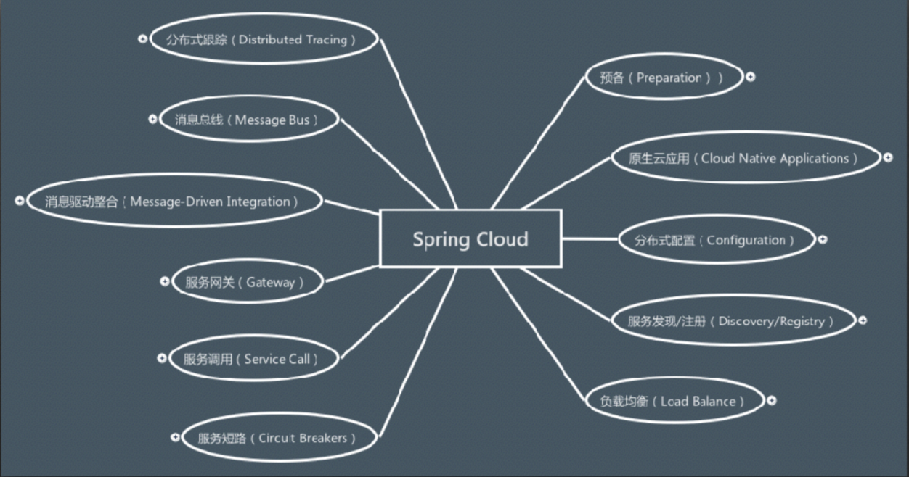

# Spring Cloud

构建分布式系统不用特别的复杂且避免容易出现的错误。

Spring Cloud为最常见的分布式系统模式 提供了一个简单和可访问的编程模型，帮助开发人员构建弹性、可靠和协调的应用程序。SpringCloud构建在 SpringBoot之上，使开发人员很容易开始工作并迅速提高生产力。

## What is Spring Cloud 

  

Spring Cloud provides tools for developers to quickly build some of the common patterns in distributed systems (e.g. configuration management, service discovery, circuit breakers, intelligent routing, micro-proxy, control bus, one-time tokens, global locks, leadership election, distributed sessions, cluster state). Coordination of distributed systems leads to boiler plate patterns, and using Spring Cloud developers can quickly stand up services and applications that implement those patterns. They will work well in any distributed environment, including the developer’s own laptop, bare metal data centres, and managed platforms such as Cloud Foundry.

Spring Cloud 为开发⼈员提供快速构建分布式系统的⼀些通⽤模式，其中包括：配置管理、服务发 现、服务短路、智能路由、微型⽹关、控制总线、⼀次性令牌、全局锁、领导选举、分布式会话和 集群状态。分布式系统间的协调导向样板模式，并且使⽤ Spring Cloud 的开发⼈员能够快速地构建 实现这些模式的服务和应⽤。这些服务和应⽤也将在任何环境下⼯作良好，⽆论是开发者的笔记本、 还是数据中⼼裸机或者管控平台。

