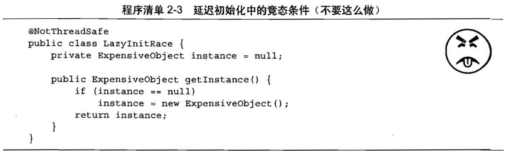
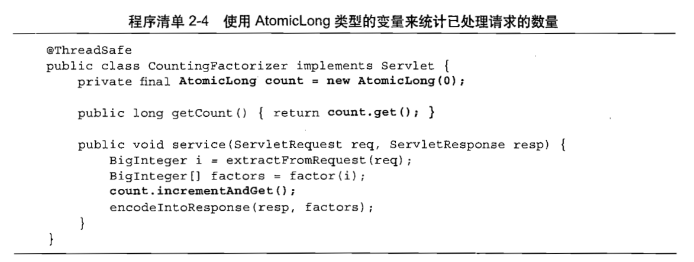

[返回目录](/README.md)

# 原子性

原子性：一个操作或多个操作要么全部执行完成且执行过程中不被中断，要么就不执行。

## 实例

例子：做一个“命中计算器”（Hit Counter）来统计所处理的请求的数量。

线程非安全，++count并非**原子操作**，因此它不会作为一个不可分割的操作来执行。实际上，它包含了三个独立的操作：

1. 读取count值
2. 将值加一
3. 将计算结果写入count

在并发编程中，这种不恰当的执行时序而出现不正确的结果是一种非常重要的情况，称为：”**竞态条件**“（Race Condition）

## 竞态条件

当某个计算的正确性取决于多个线程的交替执行时时序时，那么就会发生竞态条件。换句话说，就是正确的结果要取决于运气。

最常见的竞态条件就是“**先检查后执行（Check-Then-Act）**”操作。即通过一个可能失效的观测结果来决定下一步的动作：某些先观察到的条件为真（例如文件X不存在），然后根据这个观察结果采用相应的动作（创建文件X）,但是，在你官产到这个结果以及开始创建文件之间，观察结果可能变得无效（另一个线程在这期间创建了文件X）,从而导致各种问题（未预期的异常、数据被覆盖、文件被破坏等)。

### 延迟初始化中的竞态条件

使用“**先检查后执行**”的一种常见情况就是延迟初始化。延迟初始化的目的是将对象的初始化操作推迟到实际被使用时才进行，同时要确保只被初始化一次。

在LazyInitRace中包含一个竞态条件，它可能会破坏这个类的正确性。

假定线程A与线程B同时执行getInstance

1. A看到instance 为空，因而创建一个新的对象
2. B在A检查后和创建对象前检查instance，那么它也会得到instance为空。因而也创建一个新的对象

与大多数并发错误一样，静态条件并不总是会产生错误，还需要某种不恰当的执行时序，然而竞态条件也可能导致严重的问题。假定LasyInitRace被用于初始化应用程序范围内的注册表，如果多次调用中返回不同的实例，那么有可能出现以下情况

1. 丢失部分注册信息
2. 多个行为对同一组注册对象表现出不一致的视图

### 复合操作

假定有两个操作A和B,如果从执行A的线程来看，当另一个线程执行B时，要么将B全部执行完，要么完全不执行B,那么A和B对彼此来说是原子的。原子操作是指，对于访问同一个状态的所有操作（包含该操作本身）来说，这个操作时一个以原子方式执行的操作。

要避免**竞态条件问题**，就必须在某个线程修改该变量时，通过某种方式防止其他线程使用这个变量，从而确保其他线程只能在修改操作完成之前或之后修改状态，而不是在修改状态的过程中。

在第一个例子中：UnsaveSequence中的递增操作时原子操作，那么静态条件就不会发生，并且递增操作在每次执行时都会把计数器增加一，为了确保线程安全，使用AtomicLong类型。

在java.util.concurrent.atomic包中包含了一些原子变量类，用于实现在数值和对象应用上的原子状态转换。AtomicLong代替Long,能确保所有对计数器状态的访问都是原子的。

在实际情况中，应尽可能的使用现有**线程安全对象**，来管理类的状态。与非线程安全对象相比，判断线程安全对象的可能性状态以及其他状态转换情况要更为容易，从而也更容易维护和验证线程安全性。

