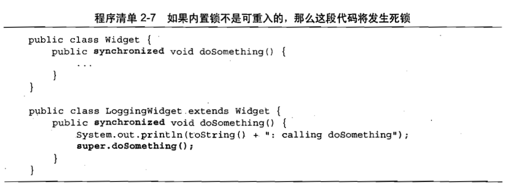

[返回目录](/README.md)

# 锁机制

## 内置锁

Java提供了一种内置的锁机制来支持原子性：**同步代码块**（Synchronized Block）。分为两个部分：

1. 一个作为锁的对象应用
2. 一个作为由这个锁保护的代码块

```java
synchronized (lock){
    //访问或修改由所保护的共享状态
}
```

以关键字synchronized来修饰方法就是一种横跨整个方法体的同步代码块，其中该同步代码块的锁就是方法调用所在的对象。静态的synchronized 方法以Class对象作为锁。

### 互斥性（互斥锁）

每个Java对象都可以用做一个实现同步的锁。这些锁被称为**内置锁**(Intrinsic Lock)或**监视器锁**（Monitor Lock)，线程会在进入同步代码块之前自动获得锁，并且在退出同步代码块时自动释放锁。

Java的内置锁相当于一种互斥体（或者**互斥锁**），意味着**最多只有一个**线程能够持有这个锁，当线程A尝试获取一个由线程B持有的锁时，线程A就必须等待或者阻塞，知道线程B释放这个锁。如果线程B不释放这个锁，那么A也将永远地等下去。[线程的生命周期](/02/thread.md)


## 重入

当某个线程请求一个由其他线程持有的锁时，发出请求的线程就会被阻塞。然而，由于**内置锁是可重入**的，因此如果某个线程试图获得一个已经由它自己持有的锁，那么这个请求就会成功。

“**重入**”意味着获得锁的操作的粒度是“**线程**”,而不是"**调用**“。

#### 重入的实现方式

为每一个锁关联一个**获取计数值**和一个**所有者线程**。

- 当计数值为0时，这个锁就被认为是没有被任何线程持有。
- 当线程请求一个未被持有的锁时，JVM将几下锁的持有者，并且将获取的计数值置为1。
- 当同一个线程再次获取这个锁时，计数值将递增。
- 当线程退出同步代码块时，计数器会相应的递减。
- 当计数器为0时，这个锁将被释放。

## 例子

重入进一步提升了加锁行为的封装性，因此简化了面向对象并发代码的开发。




上述例子中，子类重写了父类的doSomething方法，然后调用父类中的方法，此时如果没有课重入的锁，那么这段代码将产生死锁。

由于widget和LoggingWidget中的doSomethong方法都是synchronized方法，因此每个doSomething方法在执行前都会获取Widget上的锁，如果内置锁不可重入，那么在调用super.doSomething时将无法获得Widget上的锁，因为这个锁已经被持有，从而线程将永远停顿下去，等待一个永远也无法获得的锁，重入则避免了这种死锁情况的发生。