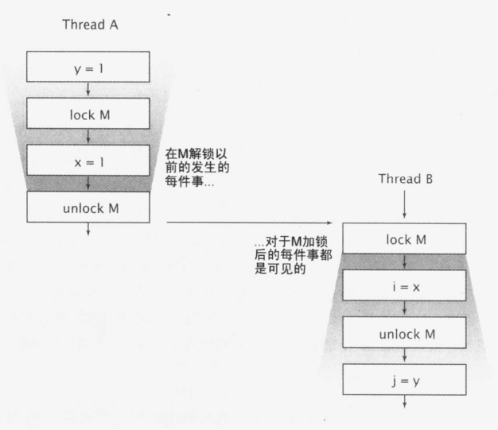

[返回目录](/README.md)

# 对象的共享

第二章介绍了如何通过同步来避免多个线程在同一时刻访问相同的数据，而本章将介绍共享和发布对象，从而使它们能够安全地由多个线程同时访问。

## 同步代码块和同步方法

我们已经知道了，同步代码块和同步方法可以却把以原子的方式执行操作，但一种常见的误解是，**认为关键字synchronized只能用于实现原子性或者确定“临界区（Critical Session）”,**同步还有一个重要的方面： **内存可见性**。

我们希望：

1. 防止某个线程正在使用对象状态，而另一个线程在同时修改该状态。
2. 确保当一个线程修改了对象状态后，其他线程能够看到发生的状态变化。

我们可以通过显示的同步或者类库中的内置同步来保证对象安全地发布。

## 内存可见性

　　**所谓可见性，是指当一条线程修改了共享变量的值，新值对于其他线程来说是可以立即得知的。**

为了确保多个线程之间对内存写入操作的**可见性**，必须使用同步机制。

```java
public class Code_3_1 {
    private static boolean ready;
    private static int number;

    private static class ReaderThread extends Thread{
        @Override
        public void run() {
            while (!ready)
                Thread.yield();
            System.out.println(number);
        }
    }
    public static void main(String[] args){
        new ReaderThread().start();
        number = 42;
        ready = true;
    }
}
```

可能会一直循环下去，因为读线程永远都看不到ready的值。可能输出0，也可能输出42。因为读线程可能看到了写入ready的值，但却没有看到之后写入number的值，这种现象叫做**重排序**。

只要在某个线程中无法检测到重排序的情况（即使在其他线程中可以很明显地看到该线程中的重排序），那么就无法确保线程中的操作将按照程序中指定的顺序来执行。

当主线程首先写入number，然后在没有tongue的情况下写入ready，那么读线程可能与写入的顺序完全相反。

解决方案：

- 只要有数据在多个线程之间共享，就能使用正确的同步。

**在没有同步地情况下，编译器、处理器以及运行时等都可能对操作的执行顺序进行一些意想不到的调整。在缺乏足够同步的多线程程序中，要想对内存操作的执行顺序进行判断，几乎无法得到正确地判断。**

## 过期数据

在不同步的程序中，一个线程可能得到一个变量最新的值，也是可能得到另一个变量先前写入的过期值。

- 过期数据可能会使对象引用中的数据更加复杂，比如链指针在链表中的实现。
- 过期数据还可能引发严重且混乱的错误，比如意外地异常，脏的数据结构，错误的计算和无线的循环

```
@NotThreadSafe
public class MutableInteger{
    private int value;
    public int get(){ return value;}
    public void set(int value){this.value = value;}
}
```

线程不安全，如果一个线程调用了set，一个线程调用get，它可能就看不到更新的数据了，获得到过期值。

```
@ThreadSafe
public class SynchronizedInteger{
    @GuardedBy("this")
    private int value;
    
    public syschronized int get(){ return value;}
    public syschronized void set(int value){ this.value = value;}
}
```

线程安全。

## 非原子的64位操作

当一个线程在没有同步地情况下读取变量，它可能会得到一个过期值。但是至少它可以看到某个线程在那里设定的一个真实数据，而不是一个凭空而来的值。这样的安全保证被称为**最低限的安全（out-of-thin-air safety）。**

最低限的安全适用于绝大多数变量，但是也有例外：

Java内存模型要求，变量的读取操作和写入操作必须是原子操作，但是对于非volatile类型的long和double变量，JVM允许将64位的读操作和写操作分解为两个32位的操作。当读取一个非volatile类型的lang 变量时，如果对该变量的读操作和写操作在不同的线程中执行，那么很有可能读取到某个值的高32位和另一个值得低32位，因此：

**即使不考虑数据失效问题，在多线程程序中使用共享且可变的long和double类型的变量也不安全。**可以使用锁或者volatile来声明它们。

## 锁和可见性

在锁释放前对A可见变量的值，B获得锁之后同样是可见的：




换句话说：**当B执行到与A相同锁监视的同步块时，A在同步块中或之前做的每件事，对B都是可见的。如果没有同步，就没有这样的保证。**

　**所谓可见性，是指当一条线程修改了共享变量的值，新值对于其他线程来说是可以立即得知的。** 

### 当访问变量时，为什么要求所有线程由同一个锁进行同步？

由同一个锁进行同步是

1. **为了保证一个线程对数值进行写入，其他线程也都可见**。
2. **如果一个线程在没有恰当地使用锁的情况下读取变量，那么这个变量很可能是一个过期的数据**。

## Volatile变量

[好文章参考](https://www.cnblogs.com/chengxiao/p/6528109.html)

Java提供了一种轻量级同步机制：volatile变量。

1. volatile变量确保变量的更新以一种可预见的方式告知其他线程
2. 当一个域被声明为volatile类型后，编译器在运行时会监视这个变量：它是共享的。
3. volatile变量不会和其他内存操作一起被重排序。
4. volatile变量不会缓存在寄存器或者缓存在对其他处理器隐藏的地方。

所以，读取一个volatile变量,总会返回某一个线程所写入的最新值。

### 为什么叫它轻量级的同步机制呢

1. 访问volatile变量的操作不会加锁
2. 不会引起执行线程的阻塞

### 什么时候使用它

只有当volatile变量能够简化实现和同步策略的验证时，才使用它们。

当验证正确性必须推断可见性问题时，应该避免使用volatile变量。

正确使用volatile变量的方式包括：

1. 用于确保它们所引用的对象状态的可见性。
2. 用于标识重要的生命周期事件（比如初始化或者关闭）的发生。

场景：

1. 写入变量时并不依赖变量的当前值，或者能够确保只有单一的线程修改变量的值。
2. 变量不需要与其他的状态变量共同参与不变约束
3. 访问变量时，没有其他原因，需要加锁

## 总结

volatile变量对可见性的影响所产生的价值，远远超过变量本身：线程A像volatile变量写入值，随后线程B读取该变量，所有A执行写操作前可见的变量的值，在B读取了volatile变量后，成为对B的可见的。

从内存可见性的角度看：

1. **写入volatile变量就像是退出同步块**
2. **读取volatile变量就像是进入同步块**

但是依赖volatile变量来控制状态可见性的代码，比使用锁的代码更脆弱，更难以理解。


**加锁可以保证可见性和原子性，volatile只能保证可见性。**