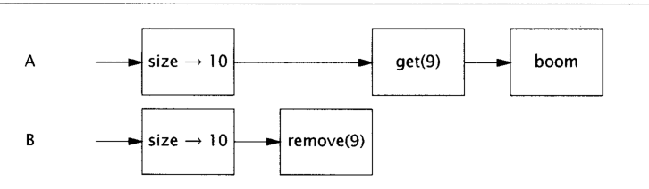

# 同步容器

同步容器包括两个部分：使用了synchronized 

- Vector
- Hashtable

这两个类是由Collections.synchronizedXXX工厂创建的，这个类通过封装它们的状态，并对每一个公共方法进行了同步而实现了线程安全，这样只有一个线程能够访问容器的状态

但是有时会返回我们意想不到的结果：

```
public static Object getList(Vector list){
    int lastIndex = list.size() -1;
    return list.get(lastIndex);
}

public static Object removeLast(Vector list){
    int lastIndex = list.size() -1;
    return list.remove(lastIndex);
}
```

线程A获取最后一个元素，同时线程B调用deleteList删除List的最后一个元素，最后getList会抛出一个ArrayIndexOutofBoundsException；



解决办法：加锁

```java
public static Object getList(Vector list){
	synchronized(list){
        int lastIndex = list.size() -1;
    	return list.get(lastIndex);
	}
}

public static Object removeLast(Vector list){
	synchronized(list){
       int lastIndex = list.size() -1;
       return list.remove(lastIndex);
    }
}
//迭代
synchronized (vector){
    for(int i=0; i<vector.size(); i++)
        doSomething(vector.get(i));
}
```

## 快速失败与安全失败

- 快速失败：迭代器发现迭代开始后，容器被修改，会抛出ConcurrentModifcationException,计数器实现

原理：迭代器在遍历时直接访问集合中的内容，并且在遍历过程中使用一个 modCount 变量。集合在被遍历期间如果内容发生变化，就会改变modCount的值。每当迭代器使用hashNext()/next()遍历下一个元素之前，都会检测modCount变量是否为expectedmodCount值，是的话就返回遍历；否则抛出异常，终止遍历。

​      注意：这里异常的抛出条件是检测到 modCount！=expectedmodCount 这个条件。如果集合发生变化时修改modCount值刚好又设置为了expectedmodCount值，则异常不会抛出。因此，不能依赖于这个异常是否抛出而进行并发操作的编程，这个异常只建议用于检测并发修改的bug。

- 安全失败：采用安全失败机制的集合容器，在遍历时不是直接在集合内容上访问的，而是先复制原有集合内容，在拷贝的集合上进行遍历。 

  原理：由于迭代时是对原集合的拷贝进行遍历，所以在遍历过程中对原集合所作的修改并不能被迭代器检测到，所以不会触发Concurrent Modification Exception。

  缺点：基于拷贝内容的优点是避免了Concurrent Modification Exception，但同样地，迭代器并不能访问到修改后的内容，即：迭代器遍历的是开始遍历那一刻拿到的集合拷贝，在遍历期间原集合发生的修改迭代器是不知道的。

## 隐藏迭代器

尽管锁可以避免迭代器抛出ConcurrentModificationException。但是你必须还要记得，在一个可能发生迭代的容器中，各处都需要使用锁。比较棘手的是一些隐藏迭代器：

```java
public class HiddenIterator{
    @GuardedBy(this)
    private final Set<Integer> set = new HashSet<Integer>();
    
    public synchronized void add(Integer i ){
        set.add(i);
    }
    
    public synchronized void remove(Integer i){
        set.remove(i);
    }
    
    public void addTenThings(){
        Random r = new Random();
        for(int i = 0; i<10 ;i++){
            add(r.nextInt());
        }
        System.out.println("DEBUG : added ten elements to " + set);
    }
    
}
```

在HiddenIterator这个类中没有显式的迭代，但是粗体字的代码承担与迭代相同的功能。字符串的拼接操作经过编译转换成调用StringBuilder.apppend(Object)来完成，它会调用容器的toString方法。标准容器中的toString的实现会通过迭代容器中的每个元素来获得关于容器内容的良好表现。

addTenThings可能会抛出ConcurrentModificationException。因为容器时由toString进行迭代的，这些发生在生产调试信息的过程中。当然，真正的问题在于HiddenIterator不是线程安全的。

在调用println时，必须在使用set之前请求到HiddenIterator的锁，但是调试和记录日志的代码通常不会这么做，真正的教训是，状态和保护她的同步之间差距越大，人们越容易忘记在访问状态时使用正确的同步

如果将HashSet包装成synchronizedSet,封装了同步，这种错误就不会发生。

容器的hashCode 和equals方法会简介的调用迭代，比如当容器本身作为一个元素时，护着作为另一个容器的key时，类似的，containsAll、removeAll、retainAll方法，以及把容器作为参数的构造函数，都会对容器进行迭代，所有这些对迭代的间接调用，都可能会引起ConcurrentModificationException.