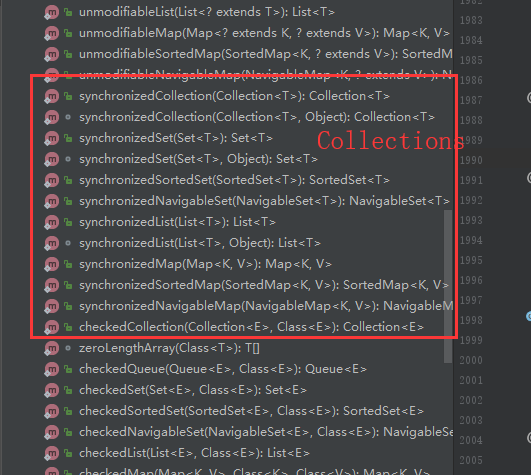

[返回根目录](/README.md)

[返回目录](../README.md)

# ConcurrentHashMap

## 同步容器类的性能局限性

- Vector
- Hashtable
- Collections.synchronizedXXX工厂方法创建的容器

同步容器在每个操作的执行期间都持有一个锁，所以有一些操作：HashMap.get或者List.contains，可能涉及到比预想更多的工作量：为寻找一个特定对象而去遍历整个HashMap或者List:

在遍历时，为了寻找特定对象，必须调用大量候选对象的equals（计算量大），在哈希容器中，如果hashCode没能很好地分散哈希值，元素很可能不均衡地分布到整个容器中（最极端的情况是，不好的HashCode会将一个哈希表转化为一个线性链表），遍历+调用equals方法，花费很多时间，在这段时间内，其他线程是不能访问这个容器。

## 介绍

ConcurrentHashMap和HashMap一样是一个哈希表，但是他们使用了完全不同的锁策略，可以提供更好的并发性和伸缩性。

- HashMap的锁策略：**公共锁** ： 只能单线程读，单线程写。
- ConcurrentHashMap的锁策略：**分离锁** ：任意数量的读线程可以并发访问Map，读者和写者也可以并发访问Map,并且有限数量的写线程还可以并发修改Map，提高吞吐量。

ConCurrentHashMap：提供了不会抛出ConcurrentModificationException的迭代器，因此不需要在容器迭代中加锁。该迭代器具有弱一致性，非**及时失败**（**fail-fast** ），

**弱一致性**的迭代器可以容许并发修改，当迭代器被创建时，它会遍历已有的元素，并且可以（但不保证）感应到迭代器被创建后，对容器的修改。

在遍历过程中，如果已经遍历的数组上的内容变化了，迭代器不会抛出ConcurrentModificationException异常。如果未遍历的数组上的内容发生了变化，则有可能反映到迭代过程中。这就是ConcurrentHashMap迭代器弱一致的表现。 

## 原理