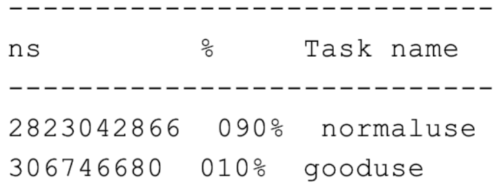

# 010-正确使用ConcurrentHashMap

[TOC]

## 简介

ConcurrentHashMap 只能保证提供的**原子性读写**操作是线程安全的。

## 1.ConcurrentHashMap操作原子性导致线程安全问题

ConcurrentHashMap 对外提供的方法或能 力的限制:

- 使用了 ConcurrentHashMap，不代表对它的多个操作之间的状态是一致的，是没有其 他线程在操作它的，如果需要确保需要手动加锁。
- 诸如 size、isEmpty 和 containsValue 等聚合方法，在并发情况下可能会反映 ConcurrentHashMap 的中间状态。因此在并发情况下，这些方法的返回值只能用作参考，而不能用于流程控制。显然，利用 size 方法计算差异值，是一个流程控制。
- 诸如 putAll 这样的聚合方法也不能确保原子性，在 putAll 的过程中去获取数据可能会 获取到部分数据。

```java
@RestController
@RequestMapping("concurrenthashmapmisuse")
@Slf4j
public class ConcurrentHashMapMisuseController {
 		//线程个数
    private static int THREAD_COUNT = 10;
  	//总元素数量
    private static int ITEM_COUNT = 1000;
  
//帮助方法，用来获得一个指定元素数量模拟数据的ConcurrentHashMap
    private ConcurrentHashMap<String, Long> getData(int count) {
        return LongStream.rangeClosed(1, count)
                .boxed()
                .collect(Collectors.toConcurrentMap(i -> UUID.randomUUID().toString(), Function.identity(),
                        (o1, o2) -> o1, ConcurrentHashMap::new));
    }

}
```

#### 错误写法

```java
@GetMapping("wrong")
public String wrong() throws InterruptedException {
    ConcurrentHashMap<String, Long> concurrentHashMap = getData(ITEM_COUNT - 100);
    log.info("init size:{}", concurrentHashMap.size());
		//初始900个元素
    ForkJoinPool forkJoinPool = new ForkJoinPool(THREAD_COUNT);
  	//使用线程池并发处理逻辑
    forkJoinPool.execute(() -> IntStream.rangeClosed(1, 10).parallel().forEach(i -> {
      	//先根据map的大小计算需要设置多少值
        int gap = ITEM_COUNT - concurrentHashMap.size();
        log.info("gap size:{}", gap);
      	//设置值
        concurrentHashMap.putAll(getData(gap));
    }));
    forkJoinPool.shutdown();
    forkJoinPool.awaitTermination(1, TimeUnit.HOURS);

    log.info("finish size:{}", concurrentHashMap.size());
    return "OK";
}
```
#### 正确写法

```java
@GetMapping("right")
public String right() throws InterruptedException {
  ConcurrentHashMap<String, Long> concurrentHashMap = getData(ITEM_COUNT - 100);
  log.info("init size:{}", concurrentHashMap.size());

  ForkJoinPool forkJoinPool = new ForkJoinPool(THREAD_COUNT);
  forkJoinPool.execute(() -> IntStream.rangeClosed(1, 10).parallel().forEach(i -> {
    //使用 synchronized 锁锁住
    synchronized (concurrentHashMap) {
      int gap = ITEM_COUNT - concurrentHashMap.size();
      log.info("gap size:{}", gap);
      concurrentHashMap.putAll(getData(gap));
    }
  }));
  forkJoinPool.shutdown();
  forkJoinPool.awaitTermination(1, TimeUnit.HOURS);

  log.info("finish size:{}", concurrentHashMap.size());
  return "OK";
}
```

## 2. 没有充分了解ConcurrentHashMap的特性，从而无法发挥其威力

没有充分了解并发工具的特性，从而无法发挥其威力

我们来看一个使用 Map 来统计 Key 出现次数的场景吧，这个逻辑在业务代码中非常常 见。
使用 ConcurrentHashMap 来统计，Key 的范围是 10。
使用最多 10 个并发，循环操作 1000 万次，每次操作累加随机的 Key。 如果 Key 不存在的话，首次设置值为 1。

```java
//循环次数
private static int LOOP_COUNT = 10000000;
//线程数量
private static int THREAD_COUNT = 10;
//元素数量
private static int ITEM_COUNT = 1000;
private Map<String, Long> normaluse() throws InterruptedException {
    ConcurrentHashMap<String, Long> freqs = new ConcurrentHashMap<>(ITEM_COUNT)
    ForkJoinPool forkJoinPool = new ForkJoinPool(THREAD_COUNT);
    forkJoinPool.execute(() -> IntStream.rangeClosed(1, LOOP_COUNT).parallel()
//获得一个随机的Key
String key = "item" + ThreadLocalRandom.current().nextInt(ITEM_COUNT);
                synchronized (freqs) {
                    if (freqs.containsKey(key)) {
												//Key存在则+1
                        freqs.put(key, freqs.get(key) + 1);
                    } else {
											//Key不存在则初始化为1
                        freqs.put(key, 1L);
                    }
} }
    ));
    forkJoinPool.shutdown();
    forkJoinPool.awaitTermination(1, TimeUnit.HOURS);
    return freqs;
}
```

我们吸取之前的教训，直接通过锁的方式锁住 Map，然后做判断、读取现在的累计值、加 1、保存累加后值的逻辑。这段代码在功能上没有问题，但无法充分发挥 ConcurrentHashMap 的威力，改进后的代码如下:

```java
private Map<String, Long> gooduse() throws InterruptedException {
  ConcurrentHashMap<String, LongAdder> freqs = new ConcurrentHashMap<>(ITEM_COUNT);
  ForkJoinPool forkJoinPool = new ForkJoinPool(THREAD_COUNT);
  forkJoinPool.execute(() -> IntStream.rangeClosed(1, LOOP_COUNT).parallel().forEach(i -> {
    String key = "item" + ThreadLocalRandom.current().nextInt(ITEM_COUNT);
    //利用computeIfAbsent()方法来实例化LongAdder，然后利用LongAdder来进行
    freqs.computeIfAbsent(key, k -> new LongAdder()).increment();
  }));
  forkJoinPool.shutdown();
  forkJoinPool.awaitTermination(1, TimeUnit.HOURS);
  //因为我们的Value是LongAdder而不是Long，所以需要做一次转换才能返回
  return freqs.entrySet().stream()
    .collect(Collectors.toMap(
      e -> e.getKey(),
      e -> e.getValue().longValue())
            );
}
```

在这段改进后的代码中，我们巧妙利用了下面两点:

- 使用 ConcurrentHashMap 的原子性方法 computeIfAbsent 来做复合逻辑操作，判断 Key 是否存在 Value，如果不存在则把 Lambda 表达式运行后的结果放入 Map 作为 Value，也就是新创建一个 LongAdder 对象，最后返回 Value。
- 由于 computeIfAbsent 方法返回的 Value 是 LongAdder，是一个线程安全的累加器， 因此可以直接调用其 increment 方法进行累加。
- 这样在确保线程安全的情况下达到极致性能，把之前 7 行代码替换为了 1 行。
  我们通过一个简单的测试比较一下修改前后两段代码的性能:

```java
@GetMapping("good")
public String good() throws InterruptedException {
    StopWatch stopWatch = new StopWatch();
    stopWatch.start("normaluse");
    Map<String, Long> normaluse = normaluse();
    stopWatch.stop();
    Assert.isTrue(normaluse.size() == ITEM_COUNT, "normaluse size error");
    Assert.isTrue(normaluse.entrySet().stream()
                    .mapToLong(item -> item.getValue()).reduce(0, Long::sum) == LOOP_COUNT
            , "normaluse count error");
    stopWatch.start("gooduse");
    Map<String, Long> gooduse = gooduse();
    stopWatch.stop();
    Assert.isTrue(gooduse.size() == ITEM_COUNT, "gooduse size error");
    Assert.isTrue(gooduse.entrySet().stream()
                    .mapToLong(item -> item.getValue())
                    .reduce(0, Long::sum) == LOOP_COUNT
            , "gooduse count error");
    log.info(stopWatch.prettyPrint());
    return "OK";
}
```

这段测试代码并无特殊之处，使用 StopWatch 来测试两段代码的性能，最后跟了一个断言 判断 Map 中元素的个数以及所有 Value 的和，是否符合预期来校验代码的正确性。测试 结果如下:



可以看到，优化后的代码，相比使用锁来操作 ConcurrentHashMap 的方式，性能提升 了 10 倍。
你可能会问，computeIfAbsent 为什么如此高效呢?

答案就在源码最核心的部分，也就是 Java 自带的 Unsafe 实现的 CAS。它在虚拟机层面确 保了写入数据的原子性，比加锁的效率高得多:

