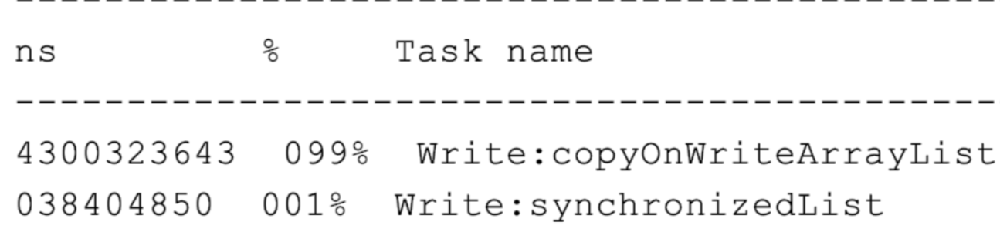
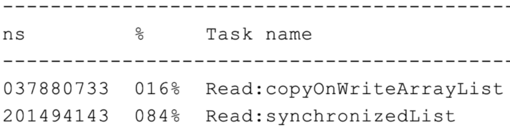

# 020-正确使用CopyOnWriteArrayList

[TOC]

除了 ConcurrentHashMap 这样通用的并发工具类之外，我们的工具包中还有些针对特殊 场景实现的生面孔。一般来说，针对通用场景的通用解决方案，在所有场景下性能都还可 以，属于“万金油”;而针对特殊场景的特殊实现，会有比通用解决方案更高的性能，但一 定要在它针对的场景下使用，否则可能会产生性能问题甚至是 Bug。
之前在排查一个生产性能问题时，我们发现一段简单的非数据库操作的业务逻辑，消耗了超 出预期的时间，在修改数据时操作本地缓存比回写数据库慢许多。查看代码发现，开发同学 使用了 CopyOnWriteArrayList 来缓存大量的数据，而数据变化又比较频繁。

CopyOnWrite 是一个时髦的技术，不管是 Linux 还是 Redis 都会用到。在 Java 中， CopyOnWriteArrayList 虽然是一个线程安全的 ArrayList，但因为其实现方式是，每次 修改数据时都会复制一份数据出来，所以有明显的适用场景，即读多写少或者说希望无锁读 的场景。
如果我们要使用 CopyOnWriteArrayList，那一定是因为场景需要而不是因为足够酷炫。如 果读写比例均衡或者有大量写操作的话，使用 CopyOnWriteArrayList 的性能会非常糟 糕。

我们写一段测试代码，来比较下使用 CopyOnWriteArrayList 和普通加锁方式 ArrayList 的读写性能吧。在这段代码中我们针对并发读和并发写分别写了一个测试方法，测试两者一 定次数的写或读操作的耗时。

```java
@RestController
@RequestMapping("copyonwritelistmisuse")
@Slf4j
public class CopyOnWriteListMisuseController {

    @GetMapping("write")
    public Map testWrite() {
        List<Integer> copyOnWriteArrayList = new CopyOnWriteArrayList<>();
        List<Integer> synchronizedList = Collections.synchronizedList(new ArrayList<>());
        StopWatch stopWatch = new StopWatch();
        int loopCount = 100000;
        stopWatch.start("Write:copyOnWriteArrayList");
        IntStream.rangeClosed(1, loopCount).parallel().forEach(__ -> copyOnWriteArrayList.add(ThreadLocalRandom.current().nextInt(loopCount)));
        stopWatch.stop();
        stopWatch.start("Write:synchronizedList");
        IntStream.rangeClosed(1, loopCount).parallel().forEach(__ -> synchronizedList.add(ThreadLocalRandom.current().nextInt(loopCount)));
        stopWatch.stop();
        log.info(stopWatch.prettyPrint());
        Map result = new HashMap();
        result.put("copyOnWriteArrayList", copyOnWriteArrayList.size());
        result.put("synchronizedList", synchronizedList.size());
        return result;
    }

    private void addAll(List<Integer> list) {
        list.addAll(IntStream.rangeClosed(1, 1000000).boxed().collect(Collectors.toList()));
    }
}
```

```java
@GetMapping("read")
public Map testRead() {
  List<Integer> copyOnWriteArrayList = new CopyOnWriteArrayList<>();
  List<Integer> synchronizedList = Collections.synchronizedList(new ArrayList<>());
  addAll(copyOnWriteArrayList);
  addAll(synchronizedList);
  StopWatch stopWatch = new StopWatch();
  int loopCount = 1000000;
  int count = copyOnWriteArrayList.size();
  stopWatch.start("Read:copyOnWriteArrayList");
  IntStream.rangeClosed(1, loopCount).parallel().forEach(__ -> copyOnWriteArrayList.get(ThreadLocalRandom.current().nextInt(count)));
  stopWatch.stop();
  stopWatch.start("Read:synchronizedList");
  IntStream.range(0, loopCount).parallel().forEach(__ -> synchronizedList.get(ThreadLocalRandom.current().nextInt(count)));
  stopWatch.stop();
  log.info(stopWatch.prettyPrint());
  Map result = new HashMap();
  result.put("copyOnWriteArrayList", copyOnWriteArrayList.size());
  result.put("synchronizedList", synchronizedList.size());
  return result;
}
```
运行程序可以看到，大量写的场景(10 万次 add 操作)，CopyOnWriteArray 几乎比同 步的 ArrayList 慢一百倍:



而在大量读的场景下(100 万次 get 操作)，CopyOnWriteArray 又比同步的 ArrayList 快五倍以上:



你可能会问，为何在大量写的场景下，CopyOnWriteArrayList 会这么慢呢?
答案就在源码中。以 add 方法为例，每次 add 时，都会用 Arrays.copyOf 创建一个新数 组，频繁 add 时内存的申请释放消耗会很大:

```java
public boolean add(E e) {
    final ReentrantLock lock = this.lock;
    lock.lock();
    try {
        Object[] elements = getArray();
        int len = elements.length;
        //复制新数组
        Object[] newElements = Arrays.copyOf(elements, len + 1);
        newElements[len] = e;
        setArray(newElements);
        return true;
    } finally {
        lock.unlock();
    }
}
```