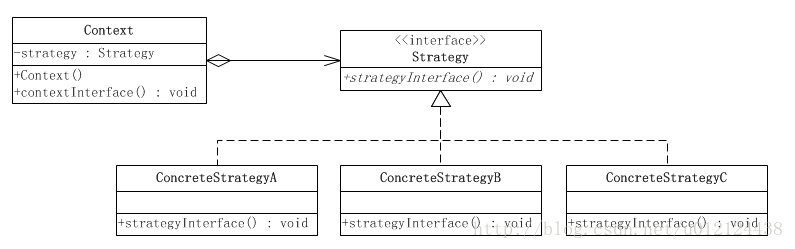

[返回根目录](/README.md)

[返回目录](../README.md)

# Strategy Pattern (策略模式)

定义一系列算法，将每一个算法封装起来，并让他们可以互相替换，策略模式让算法可以独立于使用它的其他用户变化

## 结构



## 角色

- **Context（环境类）**，环境类时用算法的角色，它在解决某个问题（即实现某个功能）时可以采用多种策略。在环境类中维持一个队抽象策略类的引用实例，用于定义所采用的策略
- **Strategy(抽象策略类)**，抽象策略类为锁支持的算法生命了抽象方法，用于所使用的策略
- **ConcreteStrategy(具体策略类)**,具体策略类实现了在抽象类中声明的算法，在运行时，具体策略类对象将覆盖在环境类中定义的抽象策略类对象，使用一种具体的算法实现某个业务功能。

## 实现

AbstractStrategy

```
public abstract class AbstractStrategy{
	/*
     * 申明抽象算法
     */
    public abstract void algroithm();
}
```

ConcreteStrategyA 

```
public ConcreteStrategyA extends AbstractStrategy{
    public void algroithm(){
        //算法A
    }
}
```

Concrete

```java
class Context{
    private AbstractStrategy strategy;
    
    public void setStrategy(AbstractStrategy strategy){
        this.strategy = strategy;
    }
    public void algorithm(){
        strategy.algorithm();
    }
}
```

测试

```
Context context = new Context();
AbstractStrategy strategy1 = new ConcreteStrategyA();
context.setStrategy(strategy1);
context.algorithm();
```

[返回根目录](/README.md)

[返回目录](../README.md)
