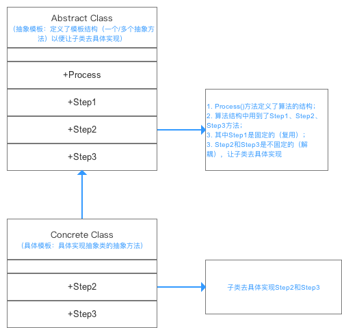

[返回根目录](/README.md)

[返回目录](../README.md)

# 模板方法模式（Template Method Pattern）

[转载](https://blog.csdn.net/carson_ho/article/details/54910518)

定义一个操作中算法的框架，而将一些步骤延迟到子类中中，模板方法模式使得子类不改变一个算法的结构即可重新定义该算法的某些特定步骤。

## 类图




**b. 使用步骤** 
**步骤1：** 创建抽象模板结构（Abstract Class）：炒菜的步骤

```
public  abstract class Abstract Class {  
//模板方法，用来控制炒菜的流程 （炒菜的流程是一样的-复用）
//申明为final，不希望子类覆盖这个方法，防止更改流程的执行顺序 
        final void cookProcess(){  
        //第一步：倒油
        this.pourOil()；
        //第二步：热油
         this.HeatOil();
        //第三步：倒蔬菜
         this.pourVegetable();
        //第四步：倒调味料
         this.pourSauce（）；
        //第五步：翻炒
         this.fry();
    }  

//定义结构里哪些方法是所有过程都是一样的可复用的，哪些是需要子类进行实现的

//第一步：倒油是一样的，所以直接实现
void pourOil(){  
        System.out.println("倒油");  
    }  

//第二步：热油是一样的，所以直接实现
    void  HeatOil(){  
        System.out.println("热油");  
    }  

//第三步：倒蔬菜是不一样的（一个下包菜，一个是下菜心）
//所以声明为抽象方法，具体由子类实现 
    abstract void  pourVegetable()；

//第四步：倒调味料是不一样的（一个下辣椒，一个是下蒜蓉）
//所以声明为抽象方法，具体由子类实现 
    abstract void  pourSauce（）；


//第五步：翻炒是一样的，所以直接实现
    void fry();{  
        System.out.println("炒啊炒啊炒到熟啊");  
    }  
}
```

**步骤2：** 创建具体模板（Concrete Class）,即”手撕包菜“和”蒜蓉炒菜心“的具体步骤

```
//炒手撕包菜的类
  public class ConcreteClass_BaoCai extend  Abstract Class{
    @Override
    public void  pourVegetable(){  
        System.out.println(”下锅的蔬菜是包菜“);  
    }  
    @Override
    public void  pourSauce（）{  
        System.out.println(”下锅的酱料是辣椒“);  
    }  
}
//炒蒜蓉菜心的类
  public class ConcreteClass_CaiXin extend  Abstract Class{
    @Override
    public void  pourVegetable(){  
        System.out.println(”下锅的蔬菜是菜心“);  
    }  
    @Override
    public void  pourSauce（）{  
        System.out.println(”下锅的酱料是蒜蓉“);  
    }  
}
```

**步骤3：** 客户端调用-炒菜了

```
public class Template Method{
  public static void main(String[] args){

//炒 - 手撕包菜
    ConcreteClass_BaoCai BaoCai = new ConcreteClass_BaoCai（）；
    BaoCai.cookProcess()；

//炒 - 蒜蓉菜心
  ConcreteClass_ CaiXin = new ConcreteClass_CaiXin（）；
    CaiXin.cookProcess()；
    }

}
```

```
倒油
热油
下锅的蔬菜是包菜
下锅的酱料是辣椒
炒啊炒啊炒到熟
倒油
热油
下锅的蔬菜是菜心
下锅的酱料是蒜蓉
炒啊炒啊炒到熟
```

# 3. 优缺点

在全面解析完模板方法模式后，我来分析下其优缺点：

#### 3.1 优点

- 提高代码复用性 
  将相同部分的代码放在抽象的父类中
- 提高了拓展性 
  将不同的代码放入不同的子类中，通过对子类的扩展增加新的行为
- 实现了反向控制 
  通过一个父类调用其子类的操作，通过对子类的扩展增加新的行为，实现了反向控制 & 符合“开闭原则”

#### 3.2 缺点

引入了抽象类，每一个不同的实现都需要一个子类来实现，导致类的个数增加，从而增加了系统实现的复杂度

# 4. 应用场景

- 一次性实现一个算法的不变的部分，并将可变的行为留给子类来实现；
- 各子类中公共的行为应被提取出来并集中到一个公共父类中以避免代码重复；
- 控制子类的扩展。 

[返回根目录](/README.md)

[返回目录](../README.md)