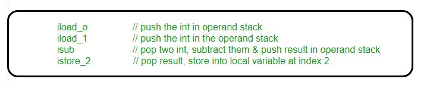
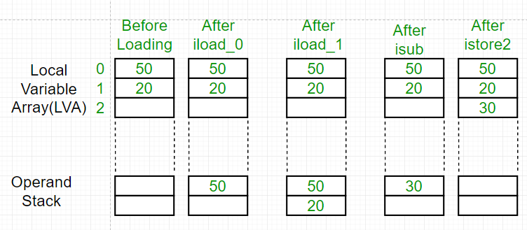

# Java虚拟机栈


#### 是什么

**虚拟机栈描述了 Java 方法执行的内存模型,每一个方法从调用直至执行完成,就会对应着一个栈帧在虚拟机栈中从入栈到出栈的过程,每个方法执行都会创建一个栈帧用于**

- 存储局部变量	
  - 存放编译器可知的各种基本数据类型(boolean,byte,char,short,int,float,long,double)
  - 引用对象 reference 类型,通常是指向对象起始位置的指针
- 操作数栈
- 动态链接
- 方法出口
- 等等信息

#### 解决了什么问题

虚拟机在执行 java的时候,方法的相关东东存在哪? 虚拟机怎么执行一个 java 方法的?

#### 怎么解决的?

每一个方法从调用直至执行完成,就会对应着一个栈帧在虚拟机栈中从入栈到出栈的过程,里面存储了方法的各种信息

#### 值得注意的是

- 和程序计数器一样是线程私有的
- 生命周期和线程相同

#### 抛出异常

- 如果线程请求的栈深度大于虚拟机允许的深度 - StackOverflowError 
- 如果虚拟机栈可以动态拓展,但是无法申请到足够的内存 - OutOfMemoryError 异常

## 本地方法栈

本地方法栈和虚拟机栈非常类似,区别:

- 本地方法栈执行 native 方法
- 虚拟机栈执行 java 方法

hotpot 两者是合二为一的

## 详解

> https://www.geeksforgeeks.org/java-virtual-machine-jvm-stack-area/

- JVM 在创建线程的时候,自动为这个线程分配一个独立的虚拟机栈
- 可以是多块不连续的内存空间

JVM 只对方法栈做两件事

- push frames,  压栈帧
- pop frames, 弹栈帧

该线程执行的每个方法调用都存储在相应的运行时堆栈中，包括参数、局部变量、中间计算和其他数据.

完成一个方法后，从堆栈中删除相应的条目。在完成所有方法调用之后，堆栈将变为空堆栈，而JVM将在终止线程之前销毁这个空堆栈。

堆栈中存储的数据对相应的线程可用，而对其余线程不可用。

因此，**我们可以说本地数据是线程安全的**。栈中的每个条目称为栈帧或激活记录。

#### 栈帧内容

- 局部变量表
- 操作数栈
- 帧数据

当JVM调用Java方法时，首先检查类数据，以确定方法在局部变量数组和操作数堆栈中所需的单词数(**局部变量数组和操作数堆栈的大小，以每个单独方法的单词量度量**)。它为调用的方法创建大小适当的堆栈框架，并将其推入Java堆栈。

#### - 局部变量表 LVA

**1. Local Variable Array (LVA):**

- The local variables part of stack frame is organized as a zero-based array of words.
- It contains all parameters and local variables of the method.
- Each slot or entry in the array is of 4 Bytes.
- Values of type int, float, and reference occupy 1 entry or slot in the array i.e. 4 bytes.
- Values of double and long occupy 2 consecutive entries in the array i.e. 8 bytes total.
- **Byte, short and char values will be converted to int type before storing** and occupy 1 slot i.e. 4 Bytes.
- But the way of storing Boolean values is varied from JVM to JVM. But most of the JVM gives 1 slot for Boolean values in the local variable array.
- The parameters are placed into the local variable array first, in the order in which they are declared.
- **For Example:** Let us consider a class Example having a method **bike()** then local variable array will be as shown in below diagram:

```java
// Class Declaration
class Example
{
  public void bike(int i, long l, float f, 
               double d, Object o, byte b)
  {
    
  } 
}     
```


#### 2.**Operand Stack (OS):**

- JVM uses operand stack as work space like rough work or we can say for storing intermediate calculation’s result.
- Operand stack is organized as array of words like local variable array. But this is not accessed by using index like local variable array rather it is accessed by some instructions that can push the value to the operand stack and some instructions that can pop values from operand stack and some instructions that can perform required operations.
- **For Example:** Here is how a JVM will use this below code that would subtract two local variables that contain two ints and store the int result in a third local variable:



So here first two instructions *iload_0* and *iload_1* will push the values in operand stack from local variable array. And instruction *isub* will subtract these two values and stores the result back to the operand stack and after *istore_2* the result will pop out from the operand stack and will store into local variable array at position 2.



**Frame Data (FD):**

- It contains all symbolic reference (*constant pool resolution)* and normal method return related to that particular method.
- It also contains a reference to Exception table which provide the corresponding catch block information in the case of exceptions.