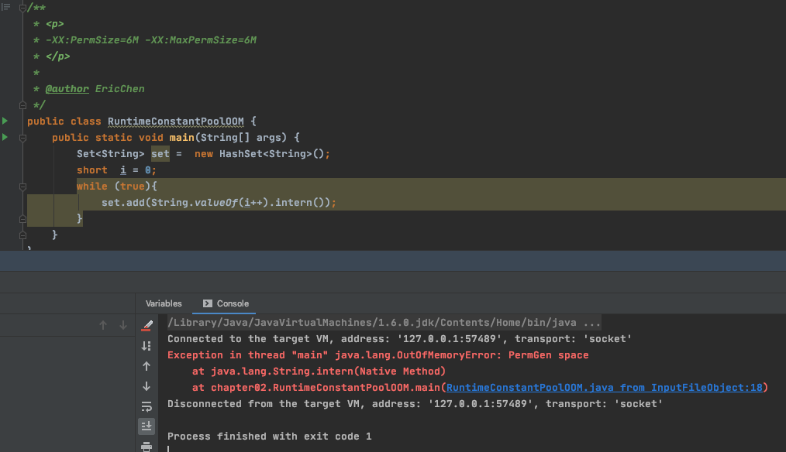

# 各类溢出的模拟


- [堆内存溢出](#堆内存溢出)
- [虚拟机栈和本地方法溢出](#虚拟机栈和本地方法溢出)
- [方法区和运行时常量池溢出](#方法区和运行时常量池溢出)
- [堆外内存直接溢出](#堆外内存直接溢出)

## 堆内存溢出

Java堆内存中存储的是对象的实例,只要不断创建对象并保证 GC roots 到对象之间有可达路径来避免垃圾回收机制清除这些对象

```java
/**
 * <p>
 * JVM 堆内存溢出测试, VM Args = -Xms20m -Xmx20m -XX:+HeapDumpOnOutOfMemoryError -XX:HeapDumpPath=/Users/ec/study/Notes/04-java/00-code/note-java
 * </p>
 *
 * @author EricChen 2020/05/02 16:55
 */
public class ExampleOfHeapOOM {
    static class OOMObject {

    }

    public static void main(String[] args) {
        List<OOMObject> list = new ArrayList<>();
        for (; ; ) {
            list.add(new OOMObject());
        }
    }
}
```


```
Exception in thread "main" java.lang.OutOfMemoryError: Java heap space
	at java.util.Arrays.copyOf(Arrays.java:3210)
	at java.util.Arrays.copyOf(Arrays.java:3181)
	at java.util.ArrayList.grow(ArrayList.java:265)
	at java.util.ArrayList.ensureExplicitCapacity(ArrayList.java:239)
	at java.util.ArrayList.ensureCapacityInternal(ArrayList.java:231)
	at java.util.ArrayList.add(ArrayList.java:462)
	at cn.eccto.study.java.jvm.ExampleOfHeapOOM.main(ExampleOfHeapOOM.java:21)
```

#### MAT排查

通过 MAT查看泄漏对象到 GC roots 的引用链路,于是就能够找到泄漏对象是通过怎么样的路径和 GCroots相关联并导致垃圾回收器无法回收的


#### 支配树


## 虚拟机栈和本地方法栈溢出

由于在 HotSpot 虚拟机中并不区分虚拟机栈和本地方法栈

- 修改本地方法栈大小(Hotpot 无效): `-Xoss`
- 修改虚拟机栈`-Xss`

Java 虚拟机规范定义了两种异常

- 如果线程请求的栈深度大于虚拟机所允许的最大深度,将抛出 StackOverflowError
- 如果虚拟机在拓展栈时没有足够的内存空间,就会抛出 OutOfMemory 错误

```java
/**
 * <p>
 * -Xss160k
 * </p>
 *
 * @author EricChen
 */
public class JavaVMStracjSOF {

    private int stackLength =1;
    public void stackLeak(){
        stackLength ++;
        stackLeak();
    }

    public static void main(String[] args) throws Throwable {
        JavaVMStracjSOF oom = new JavaVMStracjSOF();
        try{
            oom.stackLeak();
        }catch (Throwable e){
            System.out.println("stack length:" + oom.stackLength);
            throw e;
        }
    }
}

```


#### 实验

- 使用 -Xss 参数减少占内存容量,结果:抛出StackOverflowError,异常出现时,出现的堆栈深度相应缩小

- 定义了大量的本地变量,增大此方法帧中的本地变量表的长度:结果: 抛出StackOverflowError,异常出现时,出现的堆栈深度相应缩小


## 创建线程导致内存溢出异常

在单个线程下,无论是由于栈帧太大或者虚拟机栈容量太小,当内存无法分配的时候,虚拟机抛出的都是 StackOverFlowError 异常

栈是每个线程私有的

```java
/**
 * <p>
 * 创建线程导致内存溢出异常
 * 原因:
 * </p>
 *
 * @author EricChen 2020/05/02 17:51
 */
public class ThreadJVMOOM {

    private void dontStop() {
        while (true) {

        }
    }

    private void stackLeakByThread(){
        while (true) {
            new Thread(new Runnable() {
                @Override
                public void run() {
                    dontStop();
                }
            }).start();
        }
    }

    public static void main(String[] args) {
        ThreadJVMOOM threadJVMOOM = new ThreadJVMOOM();
        threadJVMOOM.stackLeakByThread();
    }
}

```


## 堆外内存直接溢出

```java
/**
 * <p>
 * 直接内存可以通过-XX MaxDirectMemorySize 指定,如果不指定,和 Xmx 一直
 * </p>
 *
 * @author EricChen 2020/05/02 17:57
 */
public class DirectMemoryOOM {

    private static final int _1MB = 1024 * 1024;

    public static void main(String[] args) throws IllegalAccessException {
        //直接通过反射获取到 Unsafe 实例进行内存分配
        Field field = Unsafe.class.getDeclaredFields()[0];
        field.setAccessible(true);
        Unsafe unsafe = (Unsafe) field.get(null);
        while (true) {
            unsafe.allocateMemory(_1MB);
        }
    }
}
```

## 方法区和运行时常量池溢出

运行时常量池是方法区的一部分,所以这两个区域的溢出测试可以放在一起执行

hotSpot 从 JDK 7开始逐步"去永久代"的计划,并在 JDK8 中完全使用元空间来代替永久代

- JDK6 或者更早之前的 HotSpot 虚拟机中,常量池都是分配在永久代中

  > -XX: PermSize 和 -XX: MaxPermSize 限制永久代的大小

- JDK7 起,原本存放在永久代的字符串常量池被移动到了 java 堆中,所以参数无意义

String::intern()是一个本地方法,它的作用就是如果字符串常量池中已经包含了等于此 String 对象的字符串.则返回这个对象的引用

否则,会将此 String 对象包含的字符串添加到常量池中,并返回此 String 对象的引用

```java
/**
 * <p>
 * -XX:PermSize=6M -XX:MaxPermSize=6M
 * </p>
 *
 * @author EricChen
 */
public class RuntimeConstantPoolOOM {
    public static void main(String[] args) {
        Set<String> set =  new HashSet<String>();
        short  i = 0;
        while (true){
            set.add(String.valueOf(i++).intern());
        }
    }
}
```

输出:



运行结果可以看出

- PermGen space 永久代内存溢出,说明 JDK6 运行时常量池确实属于方法区( JDK6 的 HotSpot 虚拟机中的永久代)

