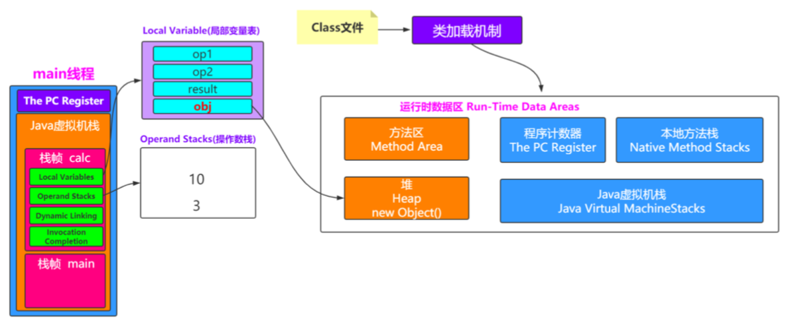
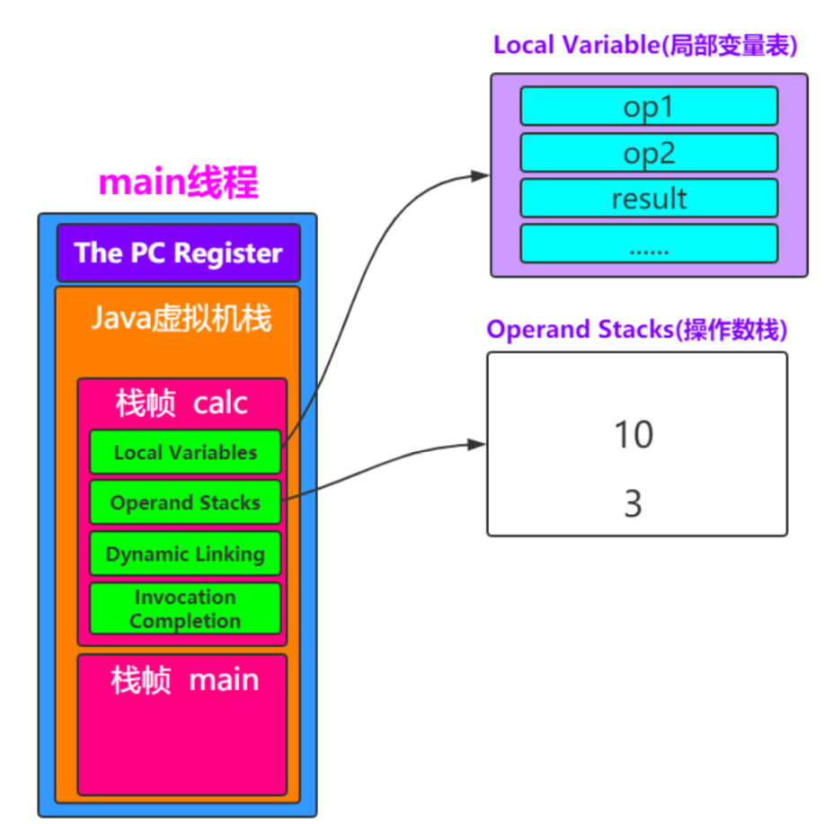
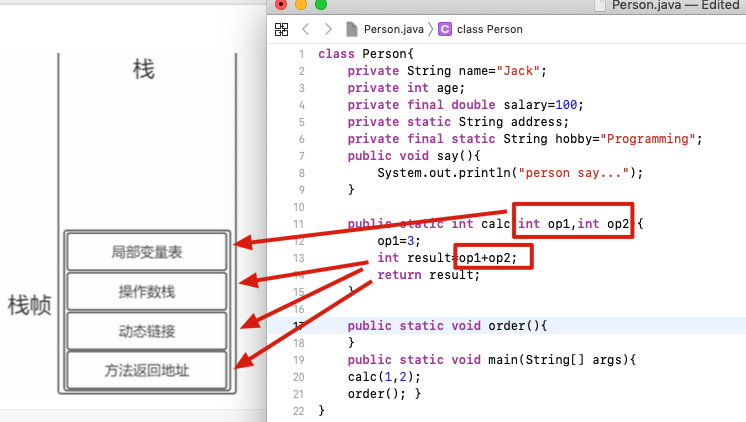

# 02-Java虚拟机栈

[TOC]

## 目录

[TOC]

## 图示


## 虚拟机栈是什么

- 虚拟机栈描述了 **Java 方法执行**的内存模型,每一个方法从调用直至执行完成,就会对应着一个栈帧在虚拟机栈中从入栈到出栈的过程

## 虚拟机栈里存储的是什么

当每个方法被执行的时候,Java虚拟机都会创建一个栈帧,用于存储局部变量表, 操作数栈, 动态连接, 方法出口 等信息

## 栈帧详情

| 栈帧存储的项目                            | 简介                                                         |
| ----------------------------------------- | ------------------------------------------------------------ |
| [局部变量表(LocalVariables)](#局部变量表) | 存放编译器可知的各种基本数据类型 (boolean, byte, char, short, int, float, long, double)<br />引用对象 reference 类型,通常是指向对象起始位置的指针 |
| [操作数栈(Operand Stack)](#操作数栈)      |                                                              |
| [动态链接](#动态链接)                     |                                                              |
| [方法返回地址](#方法返回地址)             |                                                              |
| [帧数据](#帧数据)                         |                                                              |
| [附加信息](#附加信息)                     |                                                              |

#### 局部变量表

局部变量表(Local Variables Table): 是一组变量值的存储空间,用于存放参数和方法内部定义的局部变量

Java程序在被编译成为Class文件的时候,就在方法的Code属性max_locals数据项中确定了该方法所需要分配的局部变量表的最大容量





#### 动态链接

##### 每个栈帧都包含一个执行运行时常量池中该栈帧所属方法的引用，持有这个引用是为了支持方法调用过程中的动态连接（Dynamic Linking）。

Class 文件中存放了大量的符号引用，字节码中的方法调用指令就是以常量池中指向方法的符号引用作为参数。这些符号引用

- 一部分会在类加载阶段或第一次使用时转化为直接引用，这种转化称为**静态解析**。

- 另一部分将在每一次运行期间转化为直接引用，这部分称为**动态连接**。

#### 操作数栈

操作数栈:以压栈和出栈的方式存储操作数的

代码calc方法的第一行

```
op1=3;// 把3赋值给局部变量 对应的指令 0: iconst_3  将int类型常量3压入[操作数栈]
```

既然要赋值给局部变量,那么肯定得有这个值吧,所以虚拟机要将 3 压到操作数栈里

#### 方法返回地址

方法返回地址:当一个方法开始执行后,只有两种方式可以退出，

- 一种是遇到方法返回的字节码指令;
- 一种是遇见异常，并且 这个异常没有在方法体内得到处理。

## 图示





## 反编译后代码实例

```java
class Person{
    private String name="Jack";
    private int age;
    private final double salary=100;
    private static String address;
    private final static String hobby="Programming";
    public void say(){
        System.out.println("person say...");
    }
    public static int calc(int op1,int op2){
        op1=3;
        int result=op1+op2;
        return result;
    }
    public static void order(){
    }
    public static void main(String[] args){
    calc(1,2);
    order(); }
}
```

```java
javap -c Person 查看反编译后的文件
```

 [编译指令宝典](https://docs.oracle.com/javase/specs/jvms/se8/html/index.html)

```java
Compiled from "Person.java"
class Person {
  Person();
		....
  public static int calc(int, int);
    Code:
       0: iconst_3  //将int类型常量3压入[操作数栈]
       1: istore_0  //将int类型值存入[局部变量0]
       2: iload_0   //从[局部变量0]中装载int类型值入栈
       3: iload_1   //从[局部变量1]中装载int类型值入栈
       4: iadd      //将栈顶元素弹出栈，执行int类型的加法，结果入栈
       5: istore_2  //将栈顶int类型值保存到[局部变量2]中
       6: iload_2   //从[局部变量2]中装载int类型值入栈
       7: ireturn   //从方法中返回int类型的数据

}
```

## 解决了什么问题

虚拟机在执行 java的时候,方法的相关东东存在哪? 虚拟机怎么执行一个 java 方法的?

## 怎么解决的

每一个方法从调用直至执行完成,就会对应着一个栈帧在虚拟机栈中从入栈到出栈的过程,里面存储了方法的各种信息

## 值得注意的是

- 和程序计数器一样是线程私有的
- 生命周期和线程相同

## 抛出异常

- 如果线程请求的栈深度大于虚拟机允许的深度 - StackOverflowError 
- 如果虚拟机栈可以动态拓展,但是无法申请到足够的内存 - OutOfMemoryError 异常

## 本地方法栈

本地方法栈和虚拟机栈非常类似,区别:

- 本地方法栈执行 native 方法
- 虚拟机栈执行 java 方法

hotpot 两者是合二为一的

## 详解

> https://www.geeksforgeeks.org/java-virtual-machine-jvm-stack-area/

- JVM 在创建线程的时候,自动为这个线程分配一个独立的虚拟机栈
- 可以是多块不连续的内存空间

JVM 只对方法栈做两件事

- push frames,  压栈帧
- pop frames, 弹栈帧

该线程执行的每个方法调用都存储在相应的运行时堆栈中，包括参数、局部变量、中间计算和其他数据.

完成一个方法后，从堆栈中删除相应的条目。在完成所有方法调用之后，堆栈将变为空堆栈，而JVM将在终止线程之前销毁这个空堆栈。

堆栈中存储的数据对相应的线程可用，而对其余线程不可用。

因此，**我们可以说本地数据是线程安全的**。栈中的每个条目称为栈帧或激活记录。

