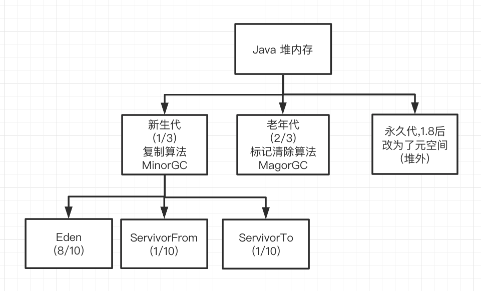

# Java 堆

所有线程共享的区域

#### 是什么

Java 堆 (heap) 是 java 虚拟机管理的内存的最大的一块,所有线程共享,唯一目的是:**存放对象实例和数组**

从内存回收来看

现在收集器基本都是采用分代收集算法,所以 Java堆中还可以细分为

- 新生代
- 老年代

再细致一点可以划分为

- Eden 空间
- From Survior 空间
- To Survior 空间

从分配内存角度看

堆可以划分出多个线程私有的分配缓冲区(TLAB) , 可以提升独享分配的效率

#### 值得注意的是

- Java 堆可以处于物理上不连续的内存空间中,只要逻辑上是连续的即可,
- 主流的虚拟机都可拓展,使用-Xmx 和 -Xms 控制 ,如果内存不足会抛出 `OutOfMemoryError`

## 存的是什么

存放的是对象实例和数组

目前来说,由于即时编译技术的进步,尤其是**逃逸分析**技术日渐强大,栈上分配,标量替换优化手段已经导致一些微妙的变化悄然发生, 所以说 Java 对象实例都分配在对上也渐渐不是那么绝对了

#### 

