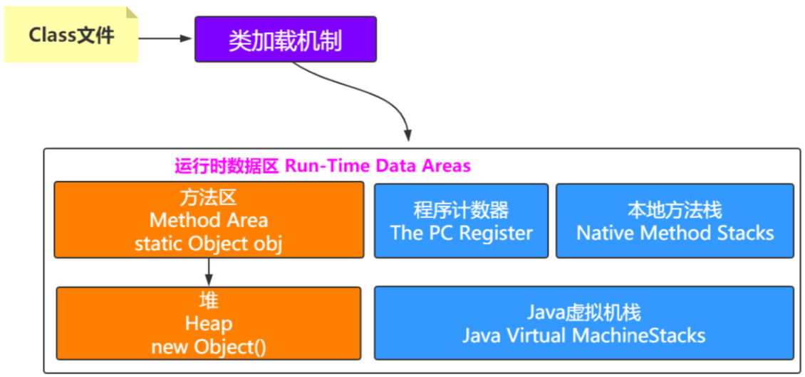

# 04-方法区

[TOC]

## 图示


## 是什么?

方法区(Method Area)与 Java 堆一样,是各个线程共享的内存区域,它用于存储

- 已经被虚拟机加载的类型信息
- 常量
- 静态变量
- 即时编译器编译后的代码等数据

## 值得注意的是

- 根据 Java 虚拟机规范,当方法区无法满足内存分配需求时,会抛出 OutOfMemoryError 异常

## 方法区的实现

- 在JDK1.6 及 之前版本，HotSpot使用“永久代（permanent generation）”的概念作为实现

> 即将GC分代收集扩展至方法区。这种实现比较偷懒，可以不必为方法区编写专门的内存管理，但带来的后果是容易碰到内存溢出的问题（因为永久代有 -XX: MaxPermSize的上限）

- JDK1.7，HotSpot逐渐改变方法区的实现方式，原本永久代的字符串常量池,静态变量等移出,JDK1.7 中移除了方法区并使用metaspace（元数据空间）作为替代实现。metaspace占用系统内存，也就是说，只要不碰触到系统内存上限，方法区会有足够的内存空间。但这不意味着我们不对方法区进行限制，如果方法区无限膨胀，最终会导致系统崩溃。

> 我们思考一个问题，为什么使用“永久代”并将GC分代收集扩展至方法区这种实现方式不好，会导致OOM？
>
> 首先要明白方法区的内存回收目标是什么，方法区存储了类的元数据信息和各种常量，它的内存回收目标理应当是对这些类型的卸载和常量的回收。但由于这些数据被类的实例引用，卸载条件变得复杂且严格，回收不当会导致堆中的类实例失去元数据信息和常量信息。因此，回收方法区内存不是一件简单高效的事情，往往GC在做无用功。另外随着应用规模的变大，各种框架的引入，尤其是使用了字节码生成技术的框架，会导致方法区内存占用越来越大，最终OOM。

## 运行时常量池

**运行时常量池是方法区的一部分**

Class 文件中除了有类的版本,字段,方法,接口等描述信息之外

还有一项信息时常量池,用于存放编译期间生成的各种**字面量**和**符号引用** , 这部分内容将在类加载后进入方法区的运行时常量池中存放

**值的注意的是**

- Java 虚拟机对 Class 文件的一部分(包括常量池)的格式都有严格规定,每一个字节用于存储哪种数据都必须符合规范上的要求才会被虚拟机认可,装载,运行

- Java 虚拟机对于运行时常量池没有做任何细节上的要求,不同的提供商可以按需定制
- 一般来说,除了保存Class 文件中描述的符号引用外,还会把翻译出来的直接引用也存储在运行时常量池

运行时常量池对于 Class 文件常量池的另一个重要特征是具备动态性,Java语言并不要求常量一定只有编译器才能产生,也就是并非阈值入 Class 文件中常量池的内容才能进入方法区运行时常量池,运行期间也可以放心的常量入池

这种特性被开发人员利用的比较多的就是 String类的 Intern()方法


我们了解到类的字节码在加载时会被解析并生成不同的东西存入方法区。类的字节码中不仅包含了类的版本、字段、方法、接口等描述信息，还包含了一个常量池。常量池用于存放在字节码中使用到的所有字面量和符号引用（如字符串字面量），在类加载时，它们进入方法区的运行时常量池存放。

运行时常量池是方法区中一个比较特殊的部分，具备动态性，也就是说，除了类加载时将常量池写入其中，java程序运行期间也可以向其中写入常量：

```
//使用StringBuilder在堆上创建字符串abc，再使用intern将其放入运行时常量池
String str = new StringBuilder("abc");
str.intern();
//直接使用字符串字面量xyz，其被放入运行时常量池
String str2 = "xyz";
```

- 字面量
- 符号引用

#### 什么是字面量

在计算机科学中, 字面量(literal)是用于表达源代码中一个固定值的表示法(notation). 几乎所有计算机编程语言都具有对基本值的字面量表示, 诸如: 整数, 浮点数以及字符串; 而有很多也对布尔类型和字符类型的值也支持字面量表示; 还有一些甚至对枚举类型的元素以及像数组, 记录和对象等复合类型的值也支持字面量表示法.
很抽象, 举个例子就明白了.

> int i = 1;把整数1赋值给int型变量i，整数1就是Java字面量，
> String s = "abc";中的abc也是字面量。

#### 什么是符号引用

符号引用以一组符号来描述所引用的目标, 符号可以是任何形式的字面量, 只要使用时能够无歧义的定位到目标即可. 例如, 在Java中, 一个Java类将会编译成一个class文件. 在编译时, Java类并不知道所引用的类的实际地址, 因此只能使用符号引用来代替. 比如org.simple.People类引用了org.simple.Language类, 在编译时People类并不知道Language类的实际内存地址, 因此只能使用符号org.simple.Language来表示Language类的地址.

### 方法区异常

我们了解到方法区的2种实现方式最终都会有一个最大值上限，因此若方法区（含运行时常量池）占用内存到达其最大值，且无法再申请到内存时，便会抛出 **OutOfMemoryError** 

在下面的例子中，我们将使用cglib字节码生成框架不断生成新的类，最终使方法区内存占用满，抛出**OutOfMemoryError** ：

```java
public class JavaMethodAreaOOM {
    public static void main(String[] args) {
        while (true) {
            Enhancer enhancer = new Enhancer();
            enhancer.setSuperclass(OOMObject.class);
            enhancer.setUseCache(false);
            enhancer.setCallback((MethodInterceptor) (o, method, objects, methodProxy) -> methodProxy.invokeSuper(objects, args));
            enhancer.create();
        }
    }
    static class OOMObject {

    }
}
```

报错信息为：

```java
Caused by: java.lang.OutOfMemoryError: PermGen space at java.lang.ClassLoader.defineClass1(Native Method)
···
```

## 方法区指向堆

方法区中会存放静态变量，常量等数据。如果是下面这种情况，就是典型的方法区中元素指向堆中的对象。

```
private static Object obj=new Object();
```




## 堆指向方法区

对中的对象中的对象指针指向的是方法区