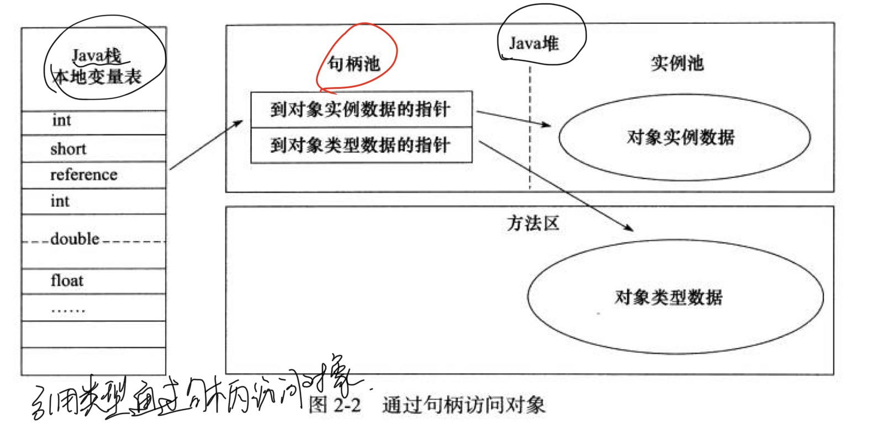

# 08-对象的访问定位

[TOC]

## 简介

Java 程序需要通过栈上的 reference 数据来操作堆上的具体对象

由于 reference类型在 Java 虚拟机中指规范了一个指向对象的对象引用,并没有定义这个引用应该通过什么方式去定位,访问堆中的对象, 

目前主流的访问方式有

- 句柄访问
- 指针访问

## 句柄访问

Java 堆中将会划分出一块内存作为句柄池,reference 中存储的就是对象的句柄信息,句柄中包含了对象实例数据与类型数据各自的内存信息

## 指针访问

如果直接使用的是指针访问,那么 Java 堆中的对象的布局中就必须考虑如何放置访问类型数据的相关信息

- reference 中存储的直接就是对象地址

## 比较

- 句柄访问 , 优势是 reference 中存储的是稳定的句柄地址,如果对象被移动 (垃圾收集时移动对象是非常普遍的行为)时,只会改变句柄中实例的数据指针,而 reference 对象不需要更改
- 直接指针访问最大的好处就是速度更快,节省了一次指针定位的时间开销,由于对象访问在 Java 中非常频繁,因此这类开销积少成多后可以是一项非常可观的执行成本

## 最后

HotSpot 使用的是直接使用**指针访问**对象的的数据

