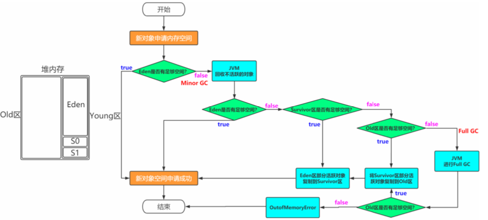

# 对象的一辈子

我是一个普通的Java对象,我出生在Eden区,

在Eden区我还看到和我长的很像的小兄弟,我们在Eden区中玩了挺长时间。

有 一天Eden区中的人实在是太多了,我就被迫去了Survivor区的“From”区,自从去了Survivor区,我就开始漂了,有时候在 Survivor的“From”区,有时候在Survivor的“To”区,居无定所。

直到我15岁的时候,爸爸说我成人了,该去社会上闯闯 了。 

于是我就去了年老代那边,年老代里,人很多,并且年龄都挺大的,我在这里也认识了很多人。

在年老代里,我生活了20年(每次 GC加一岁),然后被回收。

