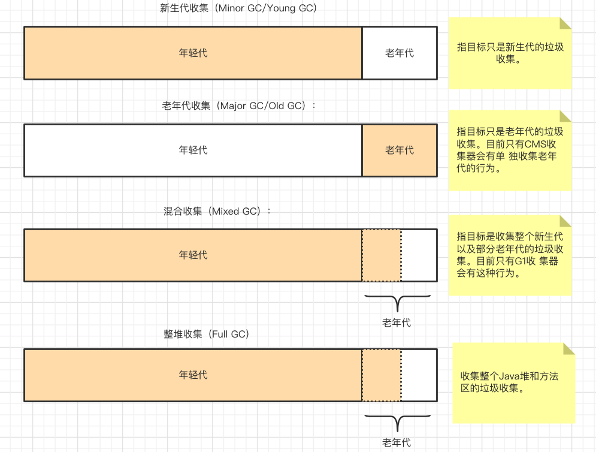

# 002-分代收集理论

[TOC]

## 简介

当前商业虚拟机的垃圾收集器, 大多数都遵循了"分代收集(Generational Collection)" 的理论进行设计,分代收集名为理论，实质是一套符合大多数程序运行实际情况的经验法则，它建立在两个分代假说之上：

1. 弱分代假说（Weak Generational Hypothesis）: 绝大多数对象都是朝生夕灭的。
2. 强分代假说（Strong Generational Hypothesis）: 熬过越多次垃圾收集过程的对象就越难以消亡

## 弱分代假说（Weak Generational Hypothesis）& 强分代假说（Strong Generational Hypothesis）

这两个分代假说共同奠定了多款常用的垃圾收集器的一致的设计原则：收集器应该将Java堆划分 出不同的区域，然后将回收对象依据其年龄（年龄即对象熬过垃圾收集过程的次数）分配到不同的区 域之中存储。显而易见，如果一个区域中大多数对象都是朝生夕灭，难以熬过垃圾收集过程的话，那么把它们集中放在一起，每次回收时只关注如何保留少量存活而不是去标记那些大量将要被回收的对 

象，就能以较低代价回收到大量的空间；如果剩下的都是难以消亡的对象，那把它们集中放在一块， 虚拟机便可以使用较低的频率来回收这个区域，这就同时兼顾了垃圾收集的时间开销和内存的空间有效利用。

在Java堆划分出不同的区域之后，垃圾收集器才可以每次只回收其中某一个或者某些部分的区域 ——因而才有了“Minor GC”“Major GC”“Full GC”这样的回收类型的划分；也才能够针对不同的区域安排与里面存储对象存亡特征相匹配的垃圾收集算法——因而发展出了“标记-复制算法”“标记-清除算法”“标记-整理算法”等针对性的垃圾收集算法。

把分代收集理论具体放到现在的商用Java虚拟机里，设计者一般至少会把Java堆划分为新生代 （Young Generation）和老年代（Old Generation）两个区域[2]。顾名思义，在新生代中，每次垃圾收集时都发现有大批对象死去，而每次回收后存活的少量对象，将会逐步晋升到老年代中存放。

如果读者 有兴趣阅读HotSpot虚拟机源码的话，会发现里面存在着一些名为“*Generation”的实现， 如“DefNewGeneration”和“ParNewGeneration”等，这些就是HotSpot的“分代式垃圾收集器框架”。原本HotSpot鼓励开发者尽量在这个框架内开发新的垃圾收集器，但除了最早期的两组四款收集器之外，后来的开发者并没有继续遵循。导致此事的原因有很多，最根本的是分代收集理论仍在不断发展之中， 如何实现也有许多细节可以改进，被既定的代码框架约束反而不便。其实我们只要仔细思考一下，也 

很容易发现分代收集并非只是简单划分一下内存区域那么容易，它至少存在一个明显的困难：对象不是孤立的，对象之间会存在跨代引用。 

假如要现在进行一次只局限于新生代区域内的收集（Minor GC），但新生代中的对象是完全有可能被老年代所引用的，为了找出该区域中的存活对象，不得不在固定的GC Roots之外，再额外遍历整

个老年代中所有对象来确保可达性分析结果的正确性，反过来也是一样[3]。遍历整个老年代所有对象的方案虽然理论上可行，但无疑会为内存回收带来很大的性能负担。为了解决这个问题，就需要对分代收集理论添加第三条经验法则：

## 3.跨代引用假说（Intergenerational Reference Hypothesis）

这其实是可根据前两条假说逻辑推理得出的隐含推论：**存在互相引用关系的两个对象，是应该倾向于同时生存或者同时消亡的。**

举个例子，如果某个新生代对象存在跨代引用，由于老年代对象难以消亡，该引用会使得新生代对象在收集时同样得以存活，进而在年龄增长之后晋升到老年代中，这时跨代引用也随即被消除了。 

依据这条假说，我们就不应再为了少量的跨代引用去扫描整个老年代，也不必浪费空间专门记录每一个对象是否存在及存在哪些跨代引用，只需在新生代上建立一个全局的数据结构（该结构被称为“记忆集”，Remembered Set），这个结构把老年代划分成若干小块，标识出老年代的哪一块内存会存在跨代引用。

此后当发生Minor GC时，只有包含了跨代引用的小块内存里的对象才会被加入到GC Roots进行扫描。虽然这种方法需要在对象改变引用关系（如将自己或者某个属性赋值）时维护记录数据的正确性，会增加一些运行时的开销，但比起收集时扫描整个老年代来说仍然是划算的。 

## 收集的分类

