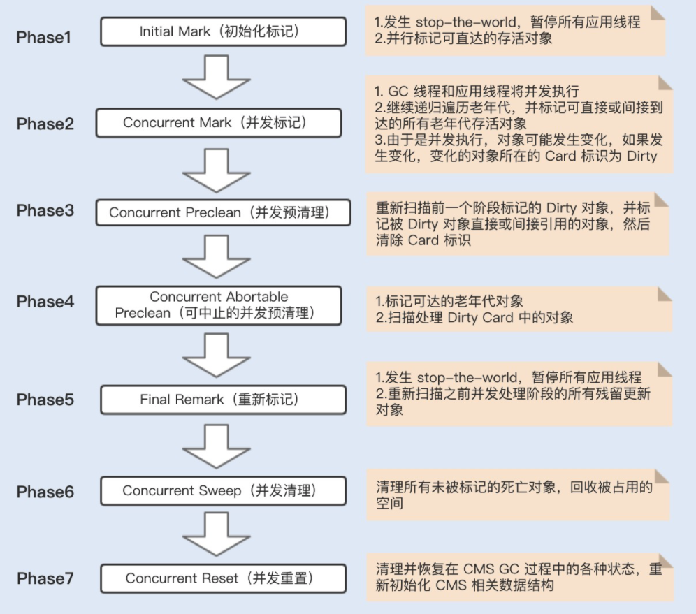

# 040-老年代-CMS垃圾收集器

[TOC]

## 1. CMS代表什么

**CMS回收器主要关注系统停顿时间**。CMS是Concurrent Mark Sweep的缩写，意为并发标记清除，从名称上就可以得知，它使用的是标记清除法，同时它又是一个使用多线程并行回收的垃圾回收器。

CMS = Concurrent Mark Sweep  收集器是一种以**获取最短回收时间为目标**的收集器,关注点是**停顿时间**

## 2. 为什么要有CMS收集器

目前很大一部分 Java 应用集中在互联网网站或者基于浏览器的 B/S系统的服务端上,这类应用通常都会较为关注服务器的响应速度,希望停顿时间尽可能短,以给用户带来良好的交互体验

CMS 收集器就非常符合这类需求

## 总结

1. CMS收集器只收集老年代，其以吞吐量为代价换取收集速度。
2. CMS收集过程分为：初始标记、并发标记、预清理阶段、可终止预清理、重新标记和并发清理阶段。其中初始标记和重新标记是STW的。CMS大部分时间都花费在重新标记阶段，可以让虚拟机先进行一次Young GC，减少停顿时间。CMS无法解决"浮动垃圾"问题。
3. 由于CMS的收集线程和用户线程并发，可能在收集过程中出现"concurrent mode failure"，解决方法是让CMS尽早GC。在一定次数的Full GC之后让CMS对内存做一次压缩，减少内存碎片，防止年轻代对象晋升到老年代时因为内存碎片问题导致晋升失败。

## CMS 优缺点

优点

- 并发收集,低停顿

缺点

- 对处理器资源敏感
- 无法处理浮动垃圾

## 主要工作步骤

