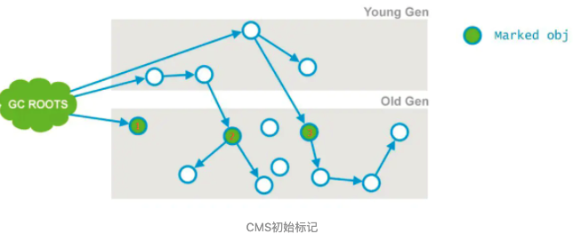

# 020-CMS工作步骤-1-初始标记

[TOC]

## 1. 初始标记

初始标记和重新标记这两步依然需要 Stop The World , 初始标记只是标记一下 GC Roots 能直接关联到的对象,速度很快

1. 标记老年代中所有的GC Roots对象，如下图节点1；
2. 标记GC Roots 可以直达标记年轻代中活着的对象引用到的老年代的对象（指的是年轻代中还存活的引用类型对象，引用指向老年代中的对象）如下图节点2、3；

## 2.什么对象可以成为GCroot

- 虚拟机栈(栈桢中的本地变量表)中的引用的对象 ；

- 方法区中的类静态属性引用的对象 ；

- 方法区中的常量引用的对象 ；

- 本地方法栈中JNI的引用的对象；

ps：为了加快此阶段处理速度，减少停顿时间，可以开启初始标记并行化，-XX:+CMSParallelInitialMarkEnabled，同时调大并行标记的线程数，线程数不要超过cpu的核数。

