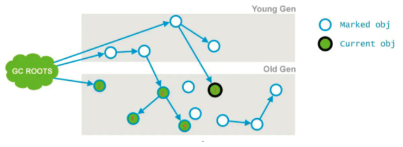

# 021-CMS工作步骤-2-并发标记

[TOC]

## 并发标记

从“初始标记”阶段标记的对象开始找出所有存活的对象;

- CC Roots 的直接关联对象开始遍历整个对象图的过程,整个过程耗时较长但是不需要停顿用户线程,可以和垃圾收集器一起并发运行

因为是并发运行的，在运行期间会发生

- 新生代的对象晋升到老年代
- 直接在老年代分配对象
- 更新老年代对象的引用关系等等，

对于这些对象，都是需要进行重新标记的，否则有些对象就会被遗漏，发生漏标的情况。

为了提高重新标记的效率，该阶段会把上述**对象所在的Card标识为Dirty**，后续只需扫描这些Dirty Card的对象，避免扫描整个老年代；

并发标记阶段只负责将引用发生改变的Card标记为Dirty状态，不负责处理；

如下图所示，也就是节点1、2、3，最终找到了节点4和5。并发标记的特点是和应用程序线程同时运行。并不是老年代的所有存活对象都会被标记，因为标记的同时应用程序会改变一些对象的引用等。

由于这个阶段是和用户线程并发的，可能会导致 concurrent mode failure。

