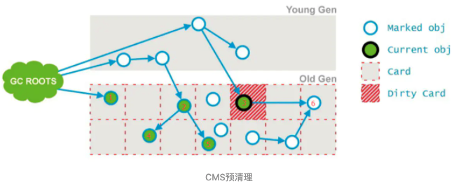
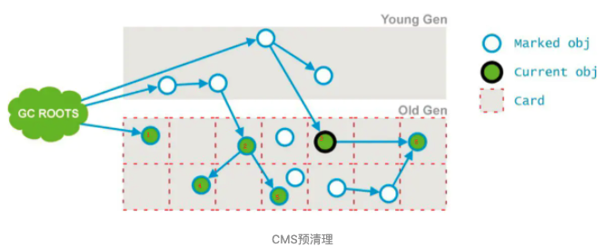

# 022-CMS工作步骤-3-预清理

[TOC]

## 简介

清理前准备以及控制停顿时间

## 预清理要做的事

前一个阶段已经说明，不能标记出老年代全部的存活对象，是因为标记的同时应用程序会改变一些对象引用，这个阶段就是用来处理前一个阶段因为引用关系改变导致没有标记到的存活对象的，它会扫描所有标记为Dirty的Card

如下图所示，在并发清理阶段，节点3的引用指向了6；则会把节点3的card标记为Dirty；

最后将6标记为存活,如下图所示：

这个阶段的停顿时间通常会比初始标记时间长一点,但是远比并发标记阶段时间短