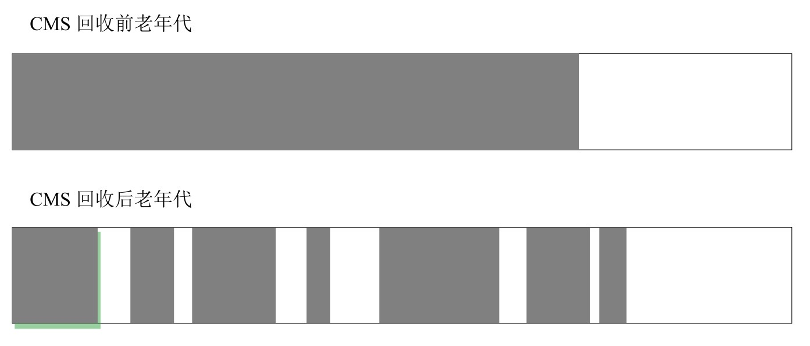

# 041-CMS垃圾收集器-常用配置

[TOC]

## 1. 启用CMS回收器的参数

```
-XX:+UseConcMarkSweepGC
```

## 2. 配置CMS多线程数

CMS是多线程回收器，设置合理的工作线程数量对系统性能有重要的影响。

CMS默认启动的并发线程数是 (ParallelGCThreads+3)/4。

ParallelGCThreads表示GC并行时使用的线程数量，如果新生代使用ParNew，那么ParallelGCThreads也就是新生代GC的线程数量。这意味着有4个ParallelGCThreads时，只有1个并发线程，而有两个并发线程时，有5~8个ParallelGCThreads线程。

并发线程数量也可以通过

```
-XX:ConcGCThreads
```

或者

```
-XX:ParallelCMSThreads
```

参数手工设定。

当CPU资源比较紧张时，受到CMS回收器线程的影响，应用系统的性能在垃圾回收阶段可能会非常糟糕

注意：并发是指收集器和应用线程交替执行，并行是指应用程序停止，同时由多个线程一起执行GC。因此并行回收器不是并发的，因为并行回收器执行时，应用程序完全挂起，不存在交替执行。

## 3. CMS垃圾回收器回收阈值

由于CMS回收器不是独占式的回收器，在CMS回收过程中，应用程序仍然在不停地工作。

在应用程序工作过程中，又会不断地产生垃圾。这些新生成的垃圾在当前CMS回收过程中是无法清除的。同时，因为应用程序没有中断，所以在CMS回收过程中，还应该确保应用程序有足够的内存可用。

因此，CMS回收器不会等待堆内存饱和时才进行垃圾回收，而是当堆内存使用率达到某一阈值时便开始进行回收，以确保应用程序在CMS工作过程中，依然有足够的空间支持应用程序运行。

这个回收阈值可以使用参数`-XX:CMSInitiatingOccupancyFraction`来指定，默认是68，即当老年代的空间使用率达到68%时，会执行一次CMS回收。

- **如果应用程序的内存使用率增长很快，在CMS的执行过程中，已经出现了内存不足的情况，CMS回收就会失败，虚拟机将启动老年代串行回收器进行垃圾回收。此时，应用程序将完全中断，直到垃圾回收完成，这时，应用程序的停顿时间可能会较长。**

## 4. 指定老年代使用率

注意：通过 -XX:CMSInitiatingOccupancyFraction 可以指定当老年代空间使用率达到多少时进行一次CMS垃圾回收。
根据应用程序的特点，可以对参数-XX:CMSInitiatingOccupancyFraction进行调优。

- 如果内存增长缓慢，则可以设置一个稍大的值，大的阈值可以有效降低CMS的触发频率，减少老年代回收的次数，可以较为明显地改善应用程序性能。
- 反之，如果应用程序内存使用率增长很快，则应该降低这个阈值，以避免频繁触发老年代串行回收器。

CMS是一个基于标记清除法的回收器 , 标记清除法将会产生大量内存碎片，离散的可用空间无法分配给较大的对象。

## 5. 回收后内存压缩



在这种情况下，即使堆内存仍然有较大的剩余空间，也可能会被迫进行一次垃圾回收，以换取一块可用的连续内存。这种现象对系统性能是相当不利的，为了解决这个问题，CMS回收器还提供了几个用于内存压缩整理的参数。

- **-XX:+UseCMSCompactAtFullCollection** 参数可以使CMS在垃圾收集完成后，进行一次内存碎片整理，内存碎片的整理不是并发进行的。
- **-XX:CMSFullGCsBeforeCompaction** 参数可以用于设定进行多少次CMS回收后，进行一次内存压缩

