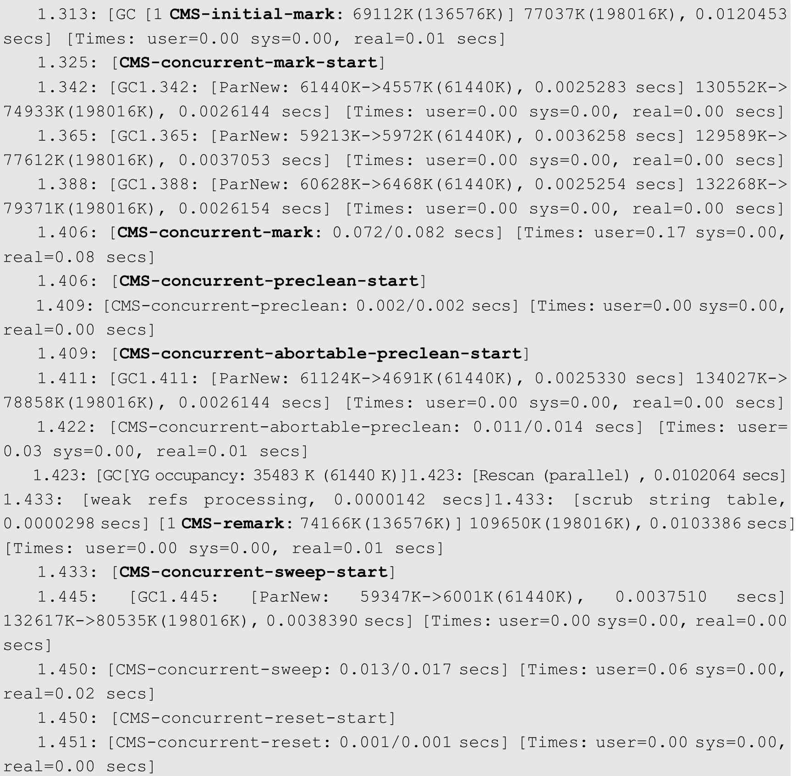
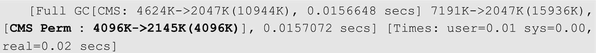
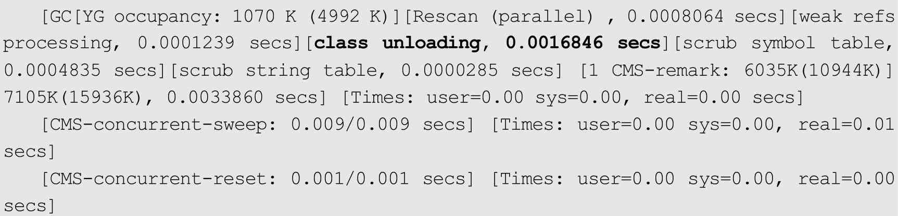

# 042-CMS垃圾收集器-日志分析

[TOC]

## CMS日志分析

在CMS回收器工作过程中，包括初始化标记、并发标记、预清理、重新标记、并发清理和重发重置等几个重要阶段。

在日志中，还可以看到CMS的耗时及堆内存信息。

- 在1.409秒发生abortable-preclean，表示CMS开始等待一次新生代GC。

- 在1.411秒ParNew回收器开始工作，在1.422秒abortable-preclean终止。之后，CMS根据之前新生代GC的情况，将重新标记的时间放在一个最不可能和下一次新生代GC重叠的时刻，即两次新生代GC的中间点，这里为1.423秒处。

除此之外，CMS回收器在运行时还可能输出如下日志

这说明CMS回收器并发回收失败。这很可能是应用程序在运行过程中老年代空间不够导致的。

如果在CMS工作过程中，出现非常频繁的并发模式失败，就应该考虑进行调整，尽可能预留一个较大的老年代空间。

或者可以设置一个较小的-XX:CMSInitiatingOccupancyFraction参数，降低CMS触发的阈值，使CMS在执行过程中仍然有较大的老年代空闲空间供应用程序使用。
注意：CMS回收器是一个关注停顿的垃圾回收器。同时CMS回收器在部分工作流程中，可以与用户程序同时运行，从而减少应用程序的停顿时间。

## 有关Class的回收

在使用CMS回收器时，如果需要回收Perm区，那么默认情况下，还需要触发一次Full GC，如下所示：

如果希望使用CMS回收器回收Perm区，则必须打开-XX:+CMSClassUnloadingEnabled开关。使用-XX:+CMSClassUnloadingEnabled后，如果条件允许，系统会使用CMS的机制回收Perm区的Class数据，日志如下：



