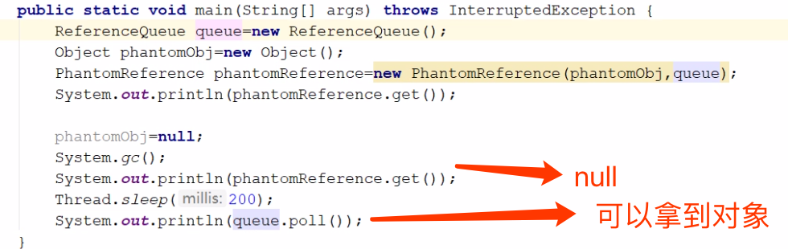

# 对象引用

- [强引用](#强引用)
- [软引用-可以被回收的引用](#软引用-可以被回收的引用)
- [弱引用-发现即回收](#弱引用-发现即回收)
- [虚引用-对象回收跟踪](#虚引用-对象回收跟踪)

## 表格

| 对象引用                | 实现类           | 特征                                                         |
| ----------------------- | ---------------- | ------------------------------------------------------------ |
| 强引用                  |                  | 有强引用的对象一定为可达性状态,所以不会被 垃圾回收期回收,强引用是造成Java内存泄漏的主要原因 |
| 软引用-可以被回收的引用 | SoftReference    | 如果一个对象只有软引用,则在系统空间不足的时候会被回收        |
| 弱引用-发现即回收       | WeakReference    | 如果一个对象只有弱引用,则在垃圾回收过程中一定会被回收        |
| 虚引用-对象回收跟踪     | PhantomReference | 虚引用和引用队列联合使用,主要用于跟踪对象的垃圾回收状态      |

## 强引用

强引用就是程序中一班使用的引用类型,强引用的对象时可触及的,不会被回收的

比如

```java
StringBuffer str = new StringBuffer("Hello World");
```

假设以上代码是在函数体内运行的, 那么

- 局部变量 str 就会被分配到栈上 , 指向StringBuffer 实例所在的堆空间

- 对象 StringBuffer 实例将被分配到堆上

我们通过str 操作 StringBuffer实例,那么str就是StringBuffer实例的强引用

强引用有以下特点

- 强引用可以直接访问目标对象
- 强引用所指向的对象在任何时候都不会被系统回收,虚拟机宁愿抛出OOM , 也不会回收强引用锁指向的对象
- 强引用可能会导致内存泄漏

## 软引用-可以被回收的引用

软引用是比强引用弱一点的引用类型, 如果一个对象只持有软引用,那么当堆空间不足时,就会被回收

```
java.lang.ref.SoftReference
```

软引用对象不会引起内存溢出

```java
public class SoftReferenceExample {
    public static void main(String[] args) {
        User user = new User(1, "123");
        //通过强引用建立软引用
        SoftReference<User> userSoftRef = new SoftReference<User>(user);
        //去除强引用
        user = null;
        System.out.println(userSoftRef.get());
        //进行一次垃圾收集
        System.gc();
        System.out.println("After GC");
        //获取回收之后软引用对象
        System.out.println(userSoftRef.get());
        //分配一块较大的空间,让系统资源认为内存紧张,
        byte[] b = new byte[1024 * 950 * 7];
        //进行一次GC,实际上是多余的,因为在分配大数据是,系统会自动进行GC,这里为了更清楚说明
        System.gc();
        //从软引用获取数据
        System.out.println("-"+userSoftRef.get());
    }
}
```

- 垃圾收集不一定会清除软引用
- 内存紧张时会清除软引用


## 弱引用-发现即回收

```java
java.lang.ref.WeakReference
```

弱引用是一种比软引用还弱的引用类型 , 在系统GC时, 只要发现弱引用 , 不管系统对空间使用情况如何,都会将对象进行回收

但是, 由于垃圾回收期的线程通常优先级很低,并不一定能很快的发现持有弱引用的对象 , 在这种情况下, 弱引用对象可以存在较长的事件,一旦一个弱引用被垃圾收集器回收,便会加入一个注册的引用队列(这一点和软引用很像)

#### 软引用和弱引用都是和的工作

软引用和弱引用 都非常是和保存一些可有可无的缓存数据,如果这么做,当系统内存不足的时候,缓存数据就会被清除,不会导致内存溢出,而当内存资源充足时,这些缓存数据又可以存在相当长的事件,从而起到让系统加速的作用

## 虚引用-对象回收跟踪

```
java.lang.ref.PhantomReference
```

虚引用是所有引用类型中最弱的一个,一个持有虚引用的对象,和没有引用几乎是一样的,随时都可能被垃圾收集器收集

当试图通过虚引用的get方法取得强引用时,总会失败, 而且虚引用必须和引用队列一起使用,它的作用在于跟踪垃圾收集过程

## 实例

虚引用的回收机制跟弱引用差不多，但是它被回收之前，会被放入 ReferenceQueue 中。注意 哦，其它引用是被JVM回收后才被传入 ReferenceQueue 中的。由于这个机制，所以虚引用大多被 用于引用销毁前的处理工作。还有就是，虚引用创建的时候，必须带有 ReferenceQueue ，使用 例子:

```java
PhantomReference<String> prf = new PhantomReference<String>(newString("str"), new ReferenceQueue<>());
```

可用场景: 对象销毁前的一些操作，比如说资源释放等。 Object.finalize() 虽然也可以做这类动作，但是这个方式即不安全又低效

我们可以判断这个队列是否有虚引用来了解被引用的对象是不是将要被回收,我们可以用来做为一个



