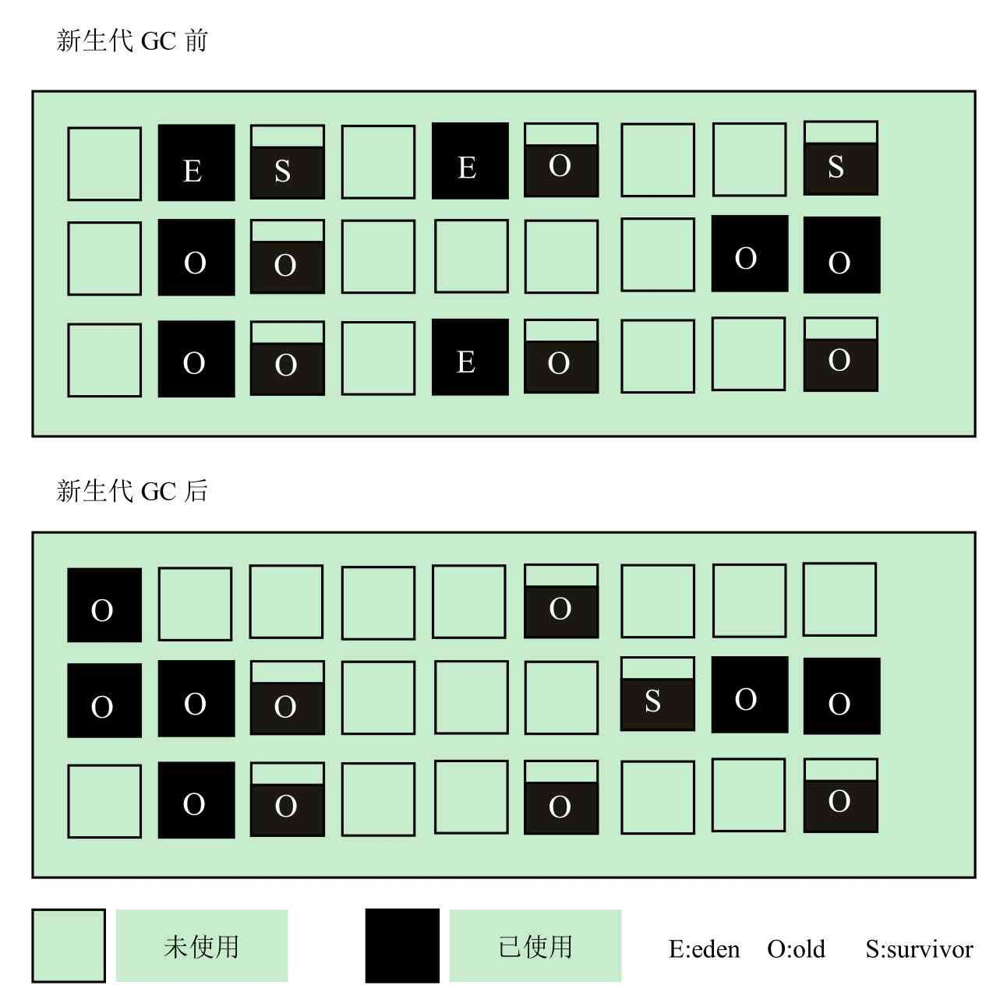

# 020-G1垃圾收集器的收集过程

[TOC]

## G1的主要收集过程

G1将堆进行分区，划分为一个个的区域，每次回收的时候，只回收其中几个区域，以此来控制垃圾回收产生的一次停顿的时间。

- [新生代GC](#新生代GC)
- [并发标记周期](#并发标记周期)
- [混合回收](071-G1垃圾收集器-混合回收.md) 
- [如果需要,会触发FullGC](072-G1垃圾收集器-fullGC.md) 

## YoungGC

新生代GC的主要工作是回收eden区和survivor区。

一旦eden区被占满，新生代GC就会启动。

新生代GC前、后的堆数据示例如图所示，

- 其中E表示eden区
- S表示survivor区
- O表示老年代



可以看到，新生代GC只处理eden区和survivor区，回收后所有的eden区都应该被清空，而survivor区会被回收一部分数据，但是应该至少仍然存在一个survivor区，类比其他的新生代回收器，这一点似乎并没有太大变化。

另一个重要的变化是，老年代的区域增多，因为部分survivor区或者eden区的对象可能会晋升到老年代。

如果开启了 PrintGCDetails 选项,就可以得到类似如下的GC日志

```
2020-09-10T16:44:18.677-0800: 1.312: [GC pause (Metadata GC Threshold) (young) (initial-mark), 0.0104708 secs]
   [Eden: 82.0M(300.0M)->0.0B(290.0M) Survivors: 6144.0K->16.0M Heap: 89.7M(512.0M)->17.7M(512.0M)]
```

和其他回收器的日志相比，G1的日志内容非常丰富。

当然我们最关心的依然是GC的停顿时间及回收情况。从日志中可以看到，

- eden区原本占用300MB空间，回收后被清空，
- survivor区从6144k增长到了16.0MB，这是因为部分对象被从eden区复制到survivor区，整个堆合计为512MB，堆内存从回收前的89.7MB下降到17.7MB。

## 值得注意的是

G1收集器除了并发标记之外,其余阶段也是要完全暂停用户线程的 

所以 **G1收集器并非纯粹追求低延迟,官方给它设定的目标是在延迟可控的情况下获得尽可能高的吞吐量,所以才能撑起<全功能收集器>的重任和期望**

G1中 堆被划分为一组大小相等的(Region)，每个区域都是连续的虚拟内存范围。

- G1执行一个并发全局标记阶段，来确定堆中对象的是否存活。
- 标记阶段完成后，G1知道哪些区域大部分是空的。它首先在这些区域进行收集，这通常会产生大量的自由空间。

这就是为什么这种垃圾收集方法被称为垃圾优先的原因。顾名思义，G1将其收集和压缩活动集中在堆中可能充满可回收对象(即垃圾)的区域。

- G1使用一个暂停预测机制来满足用户定义的暂停时间目标，并根据指定的暂停时间目标选择要收集的区域数。

被G1确定为可以回收的区域是通过疏散来收集垃圾的。G1将对象从堆的一个或多个区域复制到堆上的单个区域，并在这个过程中压缩和释放内存。此疏散在多处理器上并行执行，以减少暂停时间并提高吞吐量。因此，对于每次垃圾收集，G1都在用户定义的暂停时间内持续工作以减少碎片。这超出了前面两种方法的能力。CMS(并发标记清除)垃圾收集不执行压缩。ParallelOld垃圾收集只执行整堆压缩，这会导致相当长的暂停时间。

需要注意的是，G1不是一个实时收集器。它满足设定的暂停时间目标的概率很高，但不是绝对确定的。基于以前收集的数据，G1估计在用户指定的目标时间内可以收集多少区域。因此，收集器对于收集区域的成本有一个相当准确的模型，它使用这个模型来确定要收集哪些区域和多少区域，同时保持在暂停时间目标内。

## G1和CMS的对比

- G1 是标记整理算法, CMS是标记清除算法 减少了空间碎片

- G1计划作为并发标记-清除收集器(CMS)的长期替代品。
- 与CMS相比，G1是一个更好的解决方案。一个不同之处在于G1是一个压缩收集器。
- G1非常紧凑，完全避免了使用细粒度的空闲列表进行分配，而是依赖于区域。
- 这大大简化了收集器的各个部分，并在很大程度上消除了潜在的碎片问题。
- 此外，G1比CMS收集器提供了更多可预测的垃圾收集暂停，并允许用户指定所需的暂停目标。

