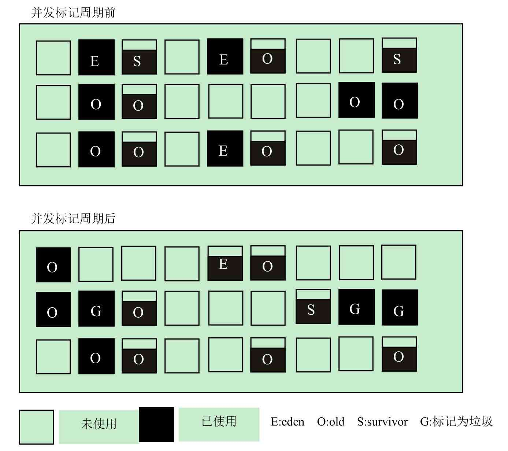

## 071-G1垃圾收集器-回收周期

[TOC]

## 回收周期图示

## 回收步骤

G1的并发阶段和CMS有点类似，它们都是为了降低一次停顿时间，而将可以和应用程序并发的部分单独提取出来执行。
并发标记周期可以分为以下几步。

1. 初始标记(STW)
2. 并发标记
3. 重新标记(STW)
4. 筛选回收(STW)

## 1.初始标记

标记从根节点直接可达的对象。这个阶段会伴随一次新生代GC，它是会产生全局停顿的，应用程序线程在这个阶段必须停止执行。

- 根区域扫描：由于初始标记必然会伴随一次新生代GC，所以在初始化标记后，eden区被清空，并且存活对象被移入survivor区。

在这个阶段，将扫描由survivor区直接可达的老年代区域，并标记这些直接可达的对象。

这个过程是可以和应用程序并发执行的。但是根区域扫描不能和新生代 GC 同时执行（因为根区域扫描依赖 survivor 区的对象，而新生代GC会修改这个区域），因此如果恰巧在此时需要进行新生代GC，就需要等待根区域扫描结束后才能进行。如果发生这种情况，这次新生代GC的时间就会延长。

## 2.并发标记

和CMS类似，并发标记将会扫描并查找整个堆的存活对象，并做好标记。这是一个并发的过程，并且这个过程可以被一次新生代GC打断。

## 3.重新标记

和CMS一样，重新标记也是会产生应用程序停顿的。

由于在并发标记过程中，应用程序依然在运行，因此标记结果可能需要进行修正，所以在此对上一次的标记结果进行补充。在G1中，这个过程使用SATB（Snapshot-At-The-Beginning）算法完成，即G1会在标记之初为存活对象创建一个快照，这个快照有助于加速重新标记的速度。

## 4.筛选回收

- 独占清理：这个阶段是会引起停顿的。它将计算各个区域的存活对象和 GC 回收比例，并进行排序，识别可供混合回收的区域。在这个阶段，还会更新记忆集（Remebered Set）。该阶段给出了需要被混合回收的区域并进行了标记，在混合回收阶段需要这些信息。

- 并发清理：这里会识别并清理完全空闲的区域。它是并发的清理，不会引起停顿。
  

上图显示了并发标记周期前后堆的可能情况。

由于并发标记周期包含一次新生代GC，故新生会被整理，但由于并发标记周期执行时，应用程序依然在运行，所以并发标记周期结束后，又会有新的eden区的空间被使用。并发标记周期执行前后最大的不同是在该阶段后，系统增加了一些标记为G的区域。

这些区域被标记，是因为它们内部的垃圾比例较高，希望在后续的混合GC中进行收集（注意在并发标记周期中并未正式收集这些区域）。

这些将要被回收的区域会被G1记录在一个称为Collection Sets（回收集）的集合中。