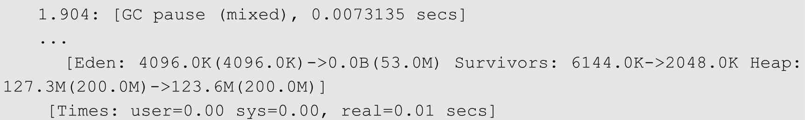
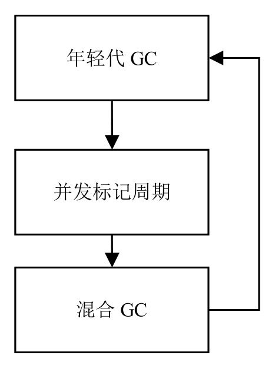

# 072-G1垃圾收集器-混合回收

[TOC]

在并发标记周期中，虽然有部分对象被回收，但是总体上说，回收的比例是相当低的。

**但是在并发标记周期后，G1已经明确知道哪些区域含有比较多的垃圾对象，在混合回收阶段就可以专门针对这些区域进行回收。**

当然，G1会优先回收垃圾比例较高的区域，因为回收这些区域的性价比也比较高。这也正是G1名字的由来。G1垃圾回收器的全称为Garbage First Garbage Collector，直译为垃圾优先的垃圾回收器，这里的垃圾优先（Garbage First）指的就是回收时优先选取垃圾比例最高的区域。

这个阶段叫作混合回收，是因为在这个阶段既会执行正常的年轻代GC，又会选取一些被标记的老年代区域进行回收，它同时处理了新生代和老年代，下图中, 

- 因为新生代GC的原因，eden区必然被清空，
- 有两块被标记为G的垃圾比例最高的区域被清理。
- 被清理区域中的存活对象会被移到其他区域，这样做的好处是可以减少空间碎片。

## 混合回收的日志

混合GC会执行多次，直到回收了足够多的内存空间，然后它会触发一次新生代GC。新生代GC后，又可能会发生一次并发标记周期的处理，最后又会引起混合GC的执行。

## 